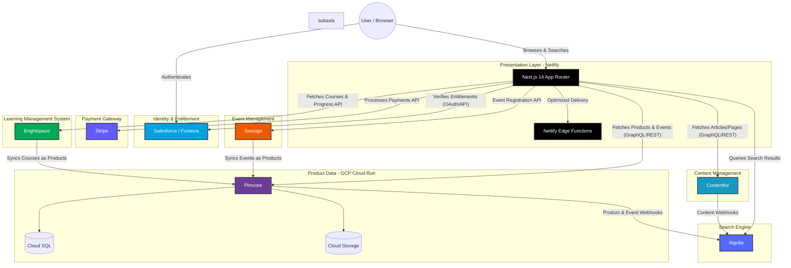

# BSAVA MACH Migration Architecture

## High-Level Architecture Diagram
This diagram outlines the headless, composable MACH (Microservices, API-first, Cloud-native, Headless) architecture for the BSAVA website migration.

## System Roles & Data Flows

### 1. Presentation Layer (Next.js 14 on Netlify)
- **Role**: The decoupled frontend connecting all headless APIs. Renders the UI using Tailwind CSS and TypeScript.
- **Data Flow**: Aggregates data from Contentful and PIMcore. Uses Netlify Edge Functions for fast, personalized delivery (e.g., checking geolocation or lightweight auth checks before rendering gated content).

### 2. Content Management (Contentful)
- **Role**: Manages all unstructured content (pages, blogs, articles).
- **Data Flow**: Exposes Content Delivery API (GraphQL/REST) to Next.js. Sends webhooks to Algolia whenever content is published or unpublished to keep the search index fresh.

### 3. Product Information & Digital Assets (PIMcore on GCP)
- **Role**: The single source of truth for structured data (product catalogs, events, publications) and Digital Asset Management (DAM). Events are ingested from Swoogo and treated as products.
- **Deployment**: Hosted on Google Cloud Run with Cloud SQL and Cloud Storage (GCS) to ensure a scalable, serverless containerized environment.
- **Data Flow**: Exposes data to Next.js. Emits webhooks to Algolia upon product/event updates.

### 4. Search & Discovery (Algolia)
- **Role**: Fast, relevant search and filtering across both content and products.
- **Data Flow**: Ingests data directly from Contentful and PIMcore via webhooks. Next.js queries Algolia from the frontend or backend to display search results.

### 5. CRM, Identity & Entitlement (Salesforce / Fonteva)
- **Role**: Manages user accounts, memberships, and gated content access.
- **Data Flow**: Acts as the Identity Provider. When a user requests gated content:
  1. Next.js checks the session.
  2. If unauthenticated, the user is redirected to Salesforce to log in.
  3. Next.js queries Salesforce/Fonteva to verify if the user's membership allows access to the specific content or product.
  4. Only upon successful entitlement check is the content served.

### 6. Event Management (Swoogo)
- **Role**: Manages event creation, registration logic, and attendee ticketing.
- **Data Flow**: Next.js interacts directly with Swoogo APIs for event registration flows. Swoogo syncs event metadata into PIMcore, where the events are stored and structured as products for Algolia indexing and general catalogue listing.

### 7. Payments (Stripe)
- **Role**: The payment gateway for handling financial transactions (e.g., event tickets, store purchases, membership dues).
- **Data Flow**: Integrated into Next.js using Stripe Elements/APIs to securely process payments and confirm transactions.

### 8. Learning Management (Brightspace)
- **Role**: Headless Learning Management System providing online courses, certifications, and progress tracking.
- **Data Flow**: Next.js interacts with Brightspace APIs for enrollment and learning experiences. Courses sync to PIMcore where they are treated as products, enabling indexing in Algolia and consistent discovery across the ecosystem. Entitlement to gated courses is verified via Salesforce.
