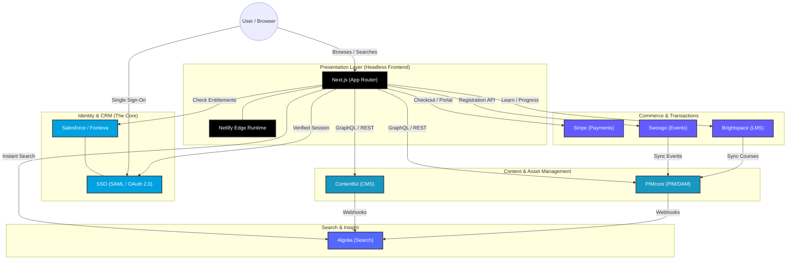
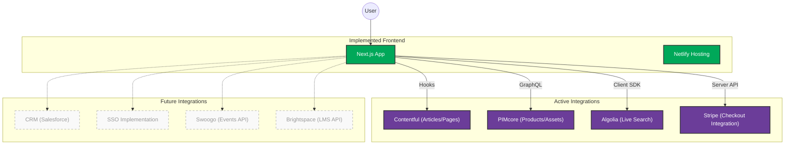

# BSAVA MACH Migration Architecture

This document provides a comprehensive overview of the headless, composable architecture being adopted for the BSAVA platform. It is split into two sections: the **Abstract Target Architecture** (the full ecosystem) and the **Current Implementation Status** (what is currently hooked up in this repository).

---

## 1. Abstract Target Architecture
This diagram outlines the complete ecosystem of headless services that form the BSAVA MACH platform. It highlights the decoupled nature of the services and the central role of **SSO** and **CRM** in managing user identities and entitlements.

### Key Components:
- **Presentation**: Decoupled React-based frontend hosted on Netlify.
- **Identity & CRM**: **Salesforce** acts as the single source of truth for members. **SSO** provides a seamless login experience across the ecosystem.
- **PIM & DAM**: **PIMcore** manages structured product data, including books, memberships, and digital assets.
- **CMS**: **Contentful** manages marketing pages, news, and editorial content.
- **Search**: **Algolia** provides sub-millisecond search across both content and products.

---

## 2. Current Implementation Status
This diagram highlights what has been implemented and connected in the current codebase. Active integrations are highlighted in color, while future/planned integrations are shown in grayscale.

### Summary of Implementation:
1.  **Next.js Frontend**: Fully configured with App Router, Tailwind CSS, and global state management.
2.  **Contentful**: Integrated with a robust fetching library ([contentful.ts](file:///home/timbowden/dev/bsava-com/src/lib/contentful.ts)) for news and page content.
3.  **PIMcore**: Successfully connected via GraphQL/REST ([pimcore.ts](file:///home/timbowden/dev/bsava-com/src/lib/pimcore.ts)) to serve the product catalogue.
4.  **Algolia**: Search UI and client-side indexing hooks are in place.
5.  **Stripe**: Checkout session creation and basic bundling logic are implemented in the API routes.
