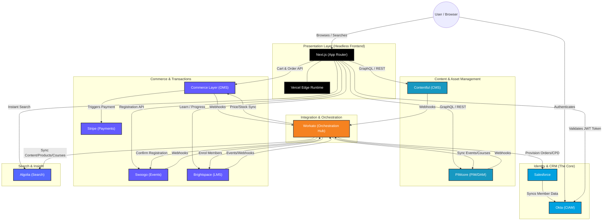
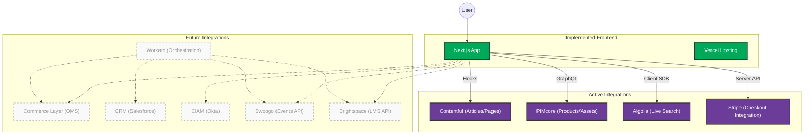
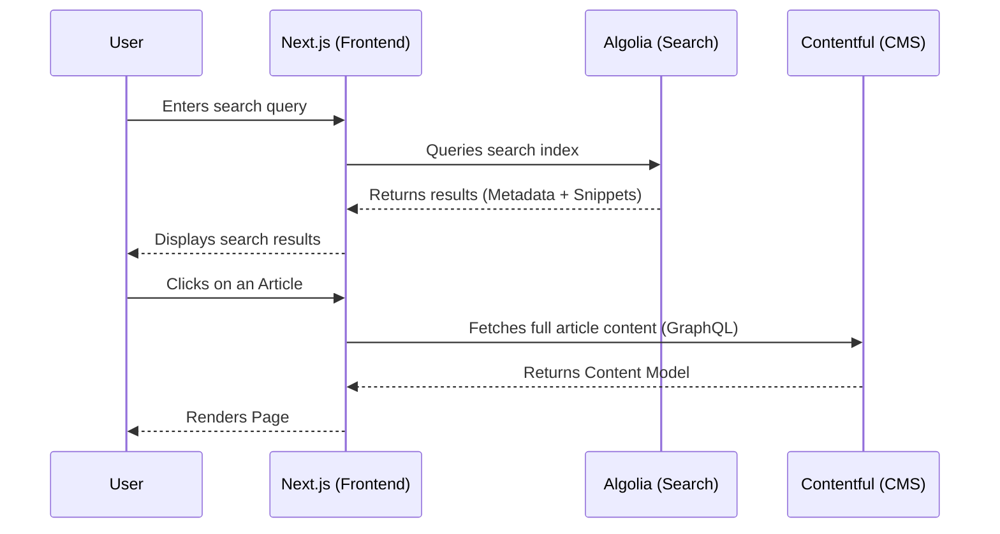
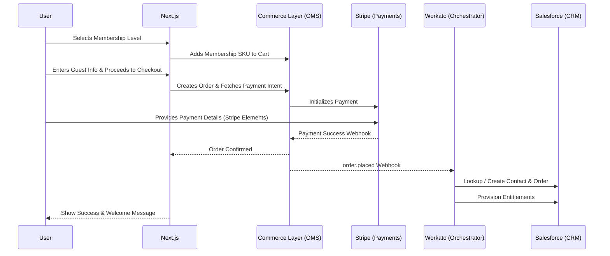
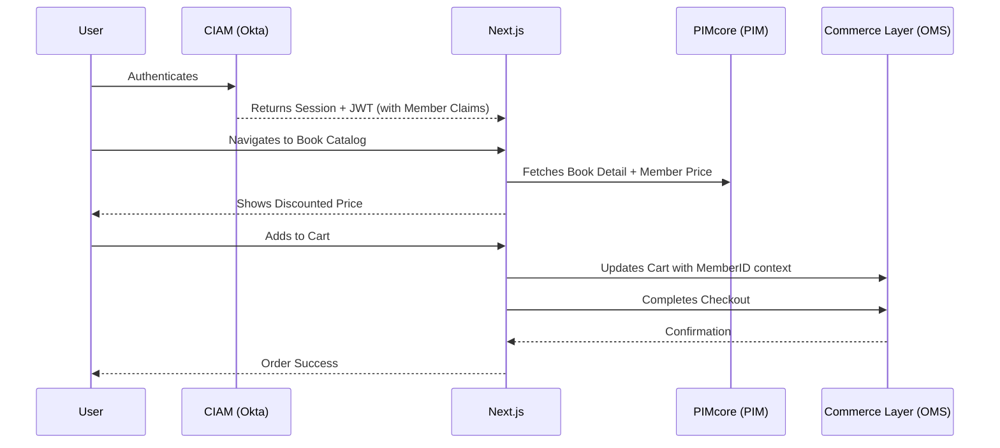
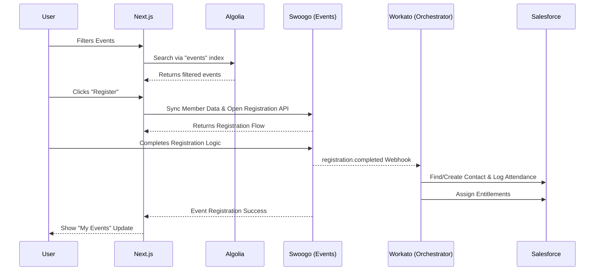
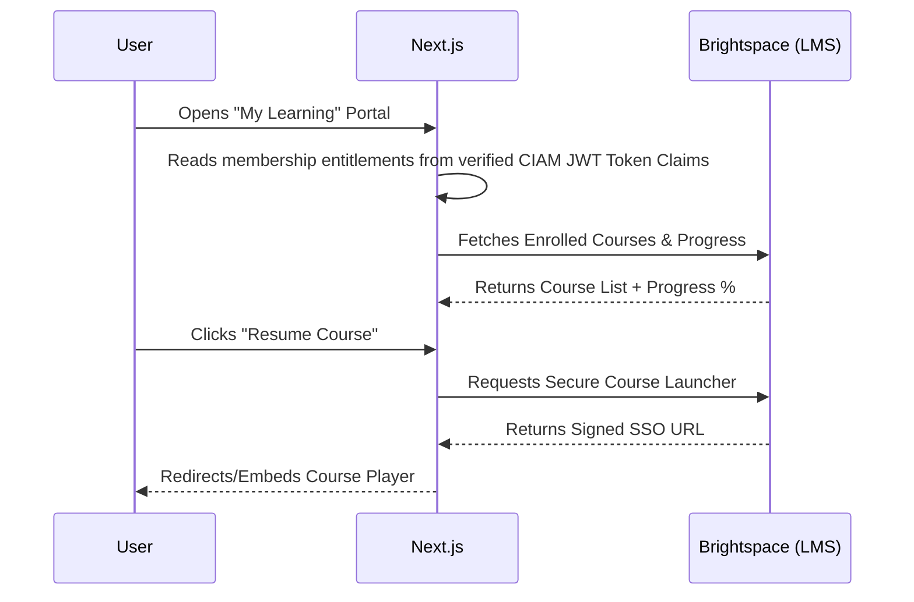

# BSAVA MACH Migration Architecture

This document provides a comprehensive overview of the headless, composable architecture being adopted for the BSAVA platform. It is split into two sections: the **Abstract Target Architecture** (the full ecosystem) and the **Current Implementation Status** (what is currently hooked up in this repository).

---

## 1. Abstract Target Architecture
This diagram outlines the complete ecosystem of headless services that form the BSAVA MACH platform. It highlights the decoupled nature of the services and the central role of **CIAM** and **CRM** in managing user identities and entitlements.

### Key Components:
- **Presentation**: Decoupled React-based frontend hosted on Vercel.
- **Identity & CRM**: **Okta** serves as the central CIAM platform, handling secure user authentication, session management, and issuing JWT tokens at the edge. **Salesforce** remains the core CRM and single source of truth for member records and master data, syncing status to the CIAM platform.
- **Integration**: **Workato** acts as the central integration hub, managing all backend synchronization, event indexing, and back-office automated workflows.
- **PIM & DAM**: **PIMcore** manages structured product data, including books, memberships, and digital assets.
- **CMS**: **Contentful** manages marketing pages, news, and editorial content.
- **Commerce & Transactions**: **Commerce Layer** handles the shopping cart, order management (OMS), and fulfilment logic. 
- **Stripe** handles secure payments. It can also handle charitable donations.
- **Search**: **Algolia** provides sub-millisecond search across both content and products.
- **Learning Management System**: **Brightspace** serves as the Learning Management System (LMS), delivering educational content and tracking user progress.
- **Events Management**: **Swoogo** serves as the Events Management system, handling event registration and attendee management.

---

## 2. Current Implementation Status
This diagram highlights what has been implemented and connected in the current codebase. Active integrations are highlighted in color, while future/planned integrations are shown in grayscale.

### Summary of Implementation:
1.  **Next.js Frontend**: Fully configured with App Router, Tailwind CSS, and global state management.
2.  **Contentful**: Integrated with a robust fetching library ([contentful.ts](file:///home/timbowden/dev/bsava-com/src/lib/contentful.ts)) for news and page content.
3.  **PIMcore**: Successfully connected via GraphQL/REST ([pimcore.ts](file:///home/timbowden/dev/bsava-com/src/lib/pimcore.ts)) to serve the product catalogue.
4.  **Algolia**: Search UI and client-side indexing hooks are in place.
5.  **Stripe**: Checkout session creation and basic bundling logic are implemented in the API routes.
6.  **Workato**: Selected as the central integration engine; recipes are designed and prioritized (Swoogo, Salesforce, Brightspace integrations) to avoid custom integrations in Next.js.

---

## 3. User Journeys & Interaction Flows

These diagrams show how the various components of the MACH architecture interact during specific user scenarios.

### A. Non-Member Searches for Information
A visitor searches the site for clinical resources or news.

### B. Non-Member Purchases Membership
A visitor signs up for a BSAVA membership to access gated benefits.

### C. Member Buys a Book
An authenticated member purchases a physical publication using member pricing.

### D. Member Books an Event
An existing member registers for a CPD event or conference.

### E. Member Studies a Course
A member accesses their learning dashboard to continue an online course.

