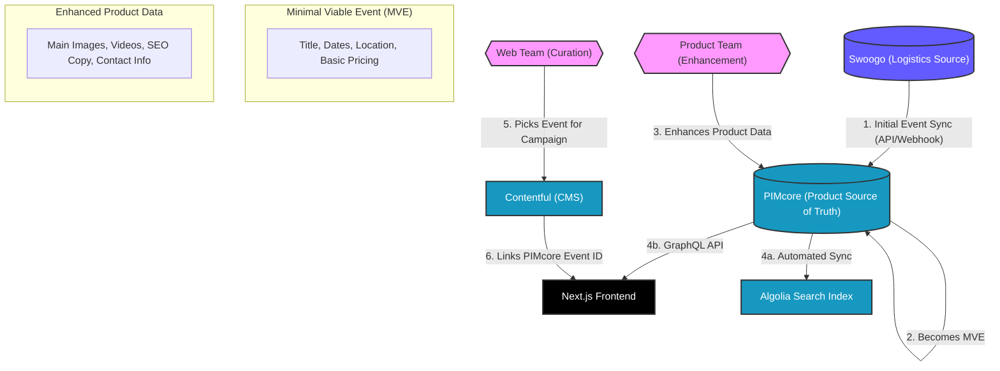
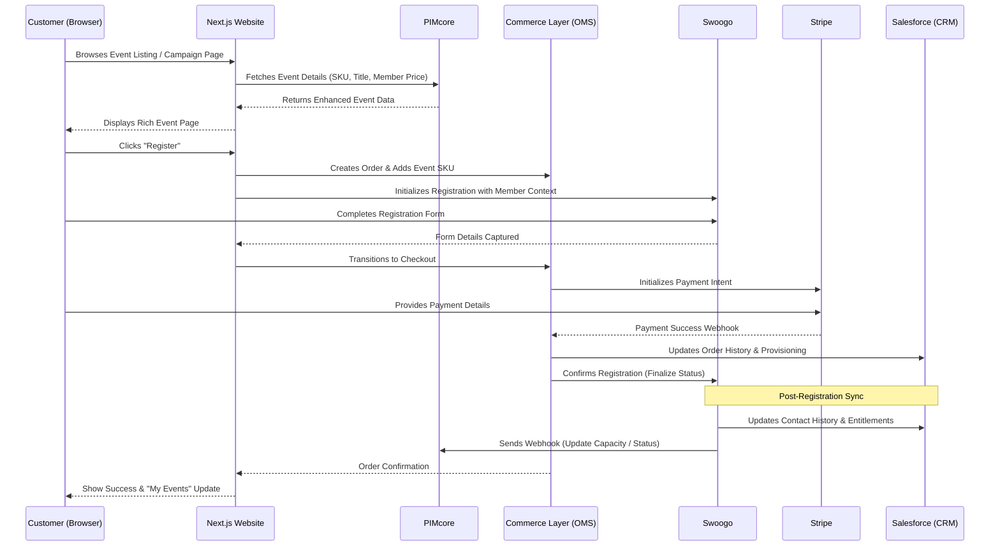

# BSAVA Event Lifecycle & Booking Data Flow

This document details the end-to-end journey of an event at BSAVA, from initial creation in Swoogo to customer registration and downstream data synchronization.

---

## 1. Event Creation & Enhancement Journey

The journey begins with the logistics of the event and ends with a rich, marketing-enhanced product on the BSAVA website.

### Data Flow Overview

### Detailed Stages

1.  **Swoogo Creation**: A BSAVA employee creates a new event in Swoogo. This environment handles the "logistics" (capacity, tickets, sessions).
2.  **MVE Sync**: Once the event reaches a "Minimal Viable Event" (MVE) state (defined by having a title, start/end date, and at least one ticket type), a sync is triggered to **PIMcore**.
3.  **PIMcore Enhancement**: The Product Team uses PIMcore to transform the MVE into a premium marketing product. They add high-quality assets (hero images, promotional videos) and SEO-optimized descriptions.
4.  **Web Team Distribution**:
    *   **Automated Listing**: The event automatically appears in the "Events" directory on the website via a GraphQL query to PIMcore.
    *   **Campaign Usage**: The Web Team creates a specific campaign page (e.g., for "BSAVA Congress") in Contentful. They use the PIMcore integration to "reach in" and select the event, ensuring price and availability remain in sync.

---

## 2. Customer Booking Journey

This journey details the data interactions when a customer discovers and registers for an event.

### Registration Flow

### Data Synchronization Points

-   **Transactional Core (Commerce Layer)**: Commerce Layer acts as the central engine for the booking. While Swoogo captures the delegate details, the checkout, tax calculation, and payment orchestration (via Stripe) are handled by Commerce Layer. This ensures a consistent order history across all BSAVA products (books, memberships, and events).
-   **Entitlements**: Upon successful registration, Swoogo or Commerce Layer notifies **Salesforce**. This ensures that the customer's member record reflects their attendance, which may trigger other entitlements (e.g., access to event-specific resources in Brightspace).
-   **Availability**: If an event sells out in Swoogo, a webhook updates the `status` field in **PIMcore**, which immediately updates the website (Algolia search and detail pages) to show "Sold Out".
