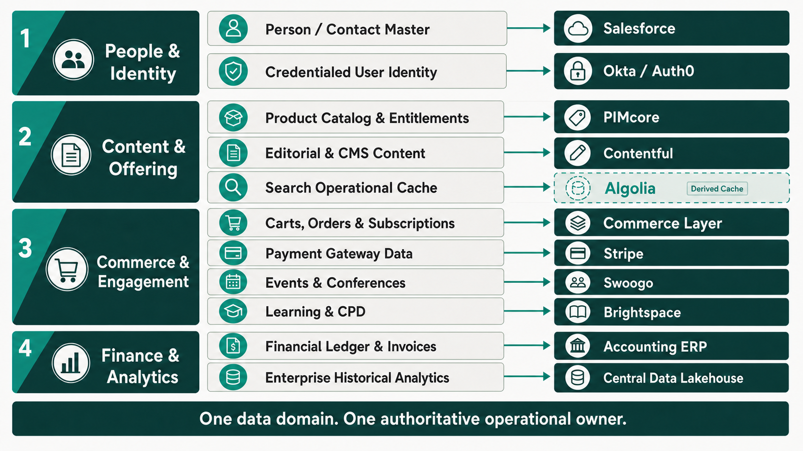
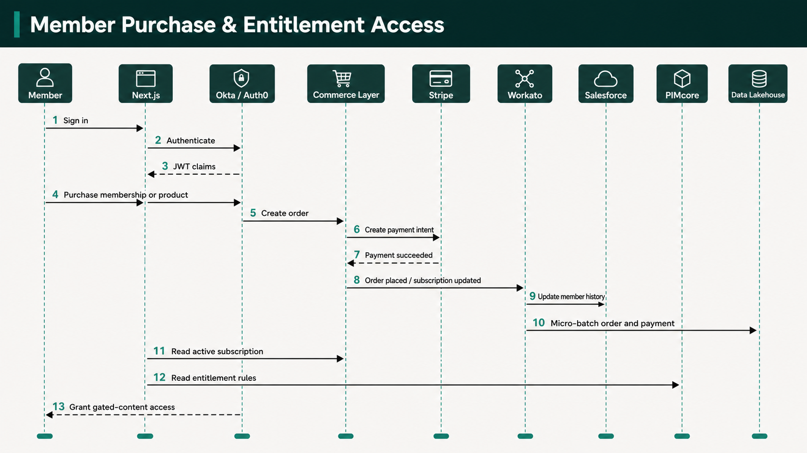
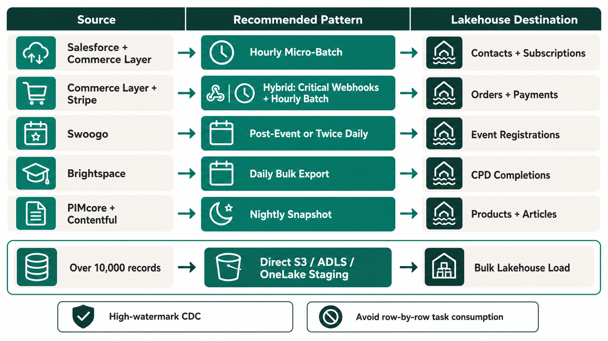
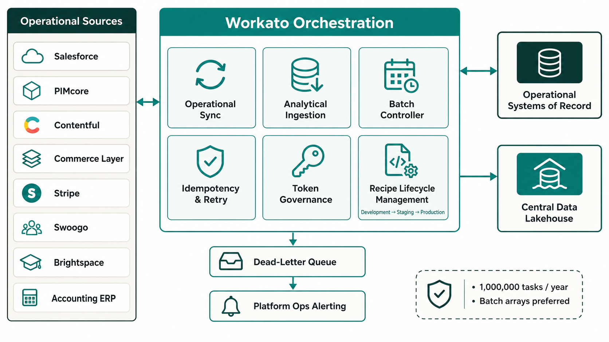
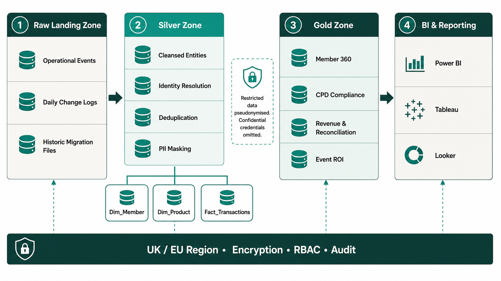
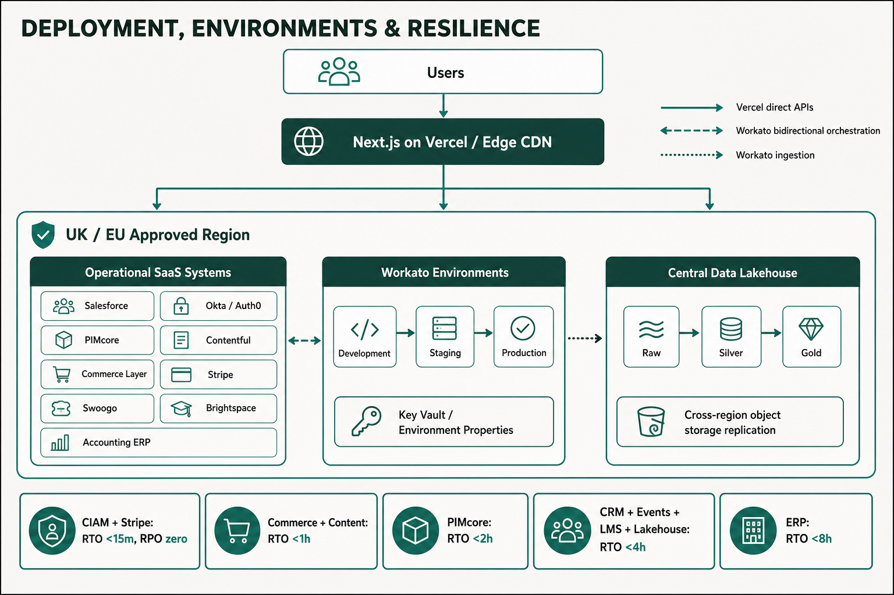
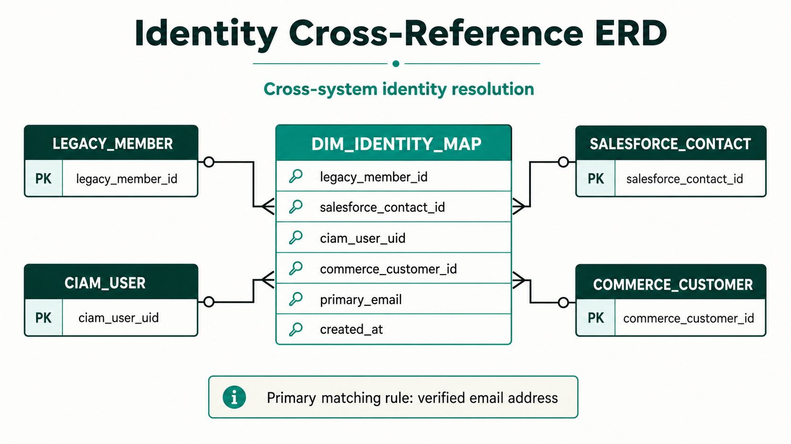

# BSAVA Information Architecture, Data Orchestration & Historic Migration Strategy
## Executive Workshop Strategy Document & Technical Guide

| Document Metadata | Details |
| :--- | :--- |
| **Client** | British Small Animal Veterinary Association (BSAVA) |
| **Author** | Timberyard Architecture & Data Advisory Team |
| **Version** | v1.0.0 |
| **Date** | July 2026 |
| **Status** | Final Client Workshop Deliverable |
| **Target Audience** | BSAVA Executive Leadership, IT Steering Committee, Data & Operations Teams |

---

## Executive Summary & Strategic Context

The British Small Animal Veterinary Association (BSAVA) is executing a comprehensive digital transformation, transitioning from legacy, monolithic IT systems to a modern, composable **MACH (Microservices, API-first, Cloud-native, Headless)** architecture. 

While the headless presentation layer (Next.js), content management (Contentful), product catalog (PIMcore), search engine (Algolia), and payment processing (Stripe) provide a high-performance frontend experience, the true enterprise value of this transformation relies on a robust **Information Architecture (IA)**, clear **Systems of Record (SoR)**, seamless **Data Orchestration (Workato)**, a scalable **Central Data Lakehouse**, and a disciplined **Historic Data Migration Strategy**.


### Key Goals of this Strategy Document:
1. **Define Systems of Record (SoR)**: Establish clear ownership boundaries for every data domain across BSAVA's headless platform to eliminate data duplication, operational latency, and conflicting member states.
2. **Design Workato Data Orchestration**: Specify how Workato acts as the single integration hub—not only for operational system-to-system syncs, but also for streaming clean transactional, behavioral, and log data into the central analytical layer.
3. **Compare Data Lakehouse Storage Platforms**: Perform a detailed, objective comparative analysis of **Snowflake**, **Microsoft Fabric**, and **Databricks** across functionality, architecture, pricing mechanics (Credits vs. Capacity Units vs. DBUs), and Total Cost of Ownership (TCO) tailored to BSAVA.
4. **Deliver a Phased Historic Migration Strategy**: Provide an end-to-end framework to extract, cleanse, and load historic legacy data into both live operational SoRs and the central Data Lakehouse without disrupting active business operations.

---

## 1. Information Architecture (IA) & Systems of Record (SoR) Matrix

In a composable architecture, no single operational application acts as a monolithic database. Instead, specialized best-of-breed platforms own specific data domains. To guarantee data integrity and compliance (including UK GDPR), BSAVA strictly enforces the **Single Source of Truth (SoR)** principle: *Every piece of data must have exactly one authoritative operational owner.*

### 1.1 Data Domain & System of Record Ownership Matrix



| Data Domain / Entity | System of Record (SoR) | Primary Key / Identifier | Key Attributes Owned | Downstream Consuming Systems |
| :--- | :--- | :--- | :--- | :--- |
| **Person / Contact Master** | **Salesforce (CRM)** | `Contact ID` (`003...`) | Demographics, Contact Details, Committee Roles, CRM Interaction History | CIAM (Okta), Commerce Layer, Swoogo, Brightspace, Data Lakehouse |
| **Credentialed User Identity** | **Okta / Auth0 (CIAM)** | `User UID` (`usr_...`) | Password Hashes, MFA Tokens, SSO Sessions, Edge JWT Claims, Security Logs | Next.js Frontend, Brightspace (SSO), Swoogo (SSO) |
| **Product Catalog & Entitlements** | **PIMcore (PIM / DAM)** | `SKU` / `Product ID` | Book Catalog, Membership SKUs, Digital Assets, Entitlement Definitions & Access Rules, Pricing Tiers, Inventory | Next.js Frontend, Algolia, Commerce Layer, Salesforce, Workato |
| **Editorial & CMS Content** | **Contentful (CMS)** | `Content Entry ID` | News Articles, Clinical Guidelines, Landing Pages, Editorial Metadata | Next.js Frontend, Algolia |
| **Carts, Orders & Subscriptions** | **Commerce Layer (OMS)** | `Order ID` (`ord_...`) / `Sub ID` | Active Cart State, Membership Tiers & Subscription States, Order Line Items, Discounts, Delivery Status, Order History | Salesforce, Stripe, PIMcore, Workato, Accounting ERP, Data Lakehouse |
| **Payment Gateway Data** | **Stripe** | `PaymentIntent ID` (`pi_...`) | Credit Card Tokens, Payment Intents, Charges, Refunds, Gateway Payout Logs | Commerce Layer, Accounting ERP, Data Lakehouse |
| **Events & Conferences** | **Swoogo** | `Attendee ID` / `Event ID` | Event Schedules, Ticket Allocations, Delegate Rosters, Speaker Profiles | PIMcore (via Workato), Salesforce, Data Lakehouse |
| **Learning Management & CPD** | **Brightspace (D2L LMS)** | `Student ID` / `Course ID` | Course Catalog, Module Enrolments, Progress %, Quiz Scores, CPD Credit Hours | PIMcore (via Workato), Salesforce, Algolia, Data Lakehouse |
| **Financial Ledger & Invoices**| **Accounting (ERP)** | `Invoice ID` / `Journal ID` | General Ledger, Chart of Accounts, Formal Invoices, Tax Compliance, Payout Rec | Data Lakehouse, Executive Reporting |
| **Search Operational Cache** | **Algolia** | `ObjectID` | Search Indexes, Facets, Filter Attributes, Ranking Rules *(Cache only)* | Next.js Frontend |
| **Enterprise Historical Analytics** | **Data Lakehouse** | Unified `Member_360_ID` | Historical Member Telemetry, Cross-Domain BI, Trend Analysis, Executive KPIs | Power BI / Tableau, Analytics Dashboards |

---

### 1.2 Deep-Dive Operational System Analysis

#### 1. Salesforce (CRM) — Core Customer & Contact History SoR
* **Role**: Serves as the authoritative source of truth for member contact profiles, committee roles, and CRM interaction history. Note: **Membership Tiers** are managed in **Commerce Layer**, and **Entitlement Definitions & Access Rules** are governed in **PIMcore**.
* **Data Format & Access**: Relational Salesforce Objects (`Contact`, `Account`, `Committee_Role__c`). Accessible via REST, SOAP, and Bulk API 2.0.
* **Native Reporting Capabilities**: Strong operational reports and dashboards for active sales pipelines and contact lists. 
* **Analytical Limitations**: Limited in handling high-frequency behavioral telemetry (e.g., website clickstreams, course playback progress) and multi-year cross-domain trend queries due to storage governor limits and API costs.

#### 2. Okta / Auth0 (CIAM) — Identity & Session Governance
* **Role**: Master repository for user credentials, authentication security rules, and edge JWT token issuance.
* **Data Format & Access**: JSON directory objects accessible via System Log API and Management REST API.
* **Reporting & Analytics Role**: Provides security audits and login telemetry. Authentication logs are streamed to the Data Lakehouse for security monitoring and login behavior analysis.

#### 3. PIMcore (PIM / DAM) — Structured Catalog, Asset & Entitlement SoR
* **Role**: Single source of truth for all sellable products (BSAVA manuals, digital publications, veterinary guidelines), membership packages, and **Entitlement Definitions & Access Rules** (defining which digital assets, clinical publications, or gated resources each product or tier unlocks).
* **Data Format & Access**: Structured relational/document objects accessible via GraphQL and REST APIs.
* **Reporting & Analytics Role**: Master product metadata and entitlement definitions are snapshotted to the Data Lakehouse to enrich transaction and access reports.

#### 4. Contentful (CMS) — Marketing & Editorial Content Master
* **Role**: Authoritative store for un-gated marketing copy, news updates, clinical articles, and media content models.
* **Data Format & Access**: JSON document models accessible via Content Delivery API (CDA) and Content Management API (CMA).
* **Reporting & Analytics Role**: Content metadata is indexed to Algolia for instant site search and streamed to the Data Lakehouse to track content engagement performance.

#### 5. Commerce Layer (OMS) & Stripe — Order, Membership Tier & Payment Processing
* **Role**: Commerce Layer manages **Membership Tiers**, active subscription states, order fulfillment workflows, and cart states. Stripe securely executes credit card authorizations, subscriptions, and payout settlements.
* **Data Format & Access**: Webhooks (`order.placed`, `subscription.updated`, `payment_intent.succeeded`) and REST APIs.
* **Reporting & Analytics Role**: Order headers, line items, subscription states, tax breakdowns, and payment gateway logs are ingested into the Data Lakehouse for daily financial reconciliation and sales analytics.



#### 6. Swoogo — Events Management Platform
* **Role**: Manages congress and CPD event creation, ticket pricing, delegate registrations, and attendance rosters.
* **Data Format & Access**: REST API and Webhooks (`event.updated`, `registration.completed`).
* **Reporting & Analytics Role**: Event delegate profiles and attendance records are synced to Salesforce for contact history and streamed to the Data Lakehouse for event ROI analysis.

#### 7. Brightspace (D2L LMS) — Learning & CPD Accreditation
* **Role**: Master platform for online veterinary courses, educational modules, learning progress, and CPD credit records.
* **Data Format & Access**: Data Hub (bulk CSV extractions via REST API) and real-time Event Notification Services (ENS).
* **Reporting & Analytics Role**: Course completions and earned CPD hours are synced to Salesforce to update member profiles and streamed to the Data Lakehouse to track educational engagement trends.

#### 8. Accounting (ERP) — Financial Ledger & Compliance
* **Role**: Authoritative ledger for financial accounts, chart of accounts, tax compliance (VAT), and audit-ready invoicing.
* **Data Format & Access**: REST API / Scheduled File Export.
* **Reporting & Analytics Role**: General Ledger entries and monthly trial balances are ingested into the Data Lakehouse for executive revenue reporting and reconciliation against Stripe/Commerce Layer.

---

### 1.3 Data Residency & UK GDPR Compliance

To maintain strict compliance with **UK GDPR** and national data protection regulations, BSAVA enforces explicit geographic binding across all software components:
* **UK / EU Region Provisioning**: All operational Systems of Record (Salesforce, Commerce Layer, PIMcore) and the primary Data Lakehouse cluster must be provisioned exclusively within **UK South (Azure)** or **EU West / London (`eu-west-2`, AWS)** regions. Storage or transit of unmasked member data in US East or unapproved third-country cloud environments is strictly prohibited.
* **Vendor UK Availability**: All three evaluated Data Lakehouse platforms (Snowflake, Microsoft Fabric, Databricks) support fully certified, native UK-region deployments (Azure UK South and AWS London).
* **Steering Committee Approval**: The IT Steering Committee must formally sign off on the chosen cloud region configuration prior to initiating Phase 2 migration data ingestion.

---

### 1.4 Data Classification & PII Masking Policy

To operationalize data privacy and security, data entities across BSAVA's SoR matrix (Section 1.1) are categorized into four standard classification tiers, each governed by specific Lakehouse Silver/Gold zone masking rules:

| Sensitivity Tier | Associated SoR Domains (Section 1.1) | Access & Encryption Control | Data Lakehouse Silver/Gold Zone Masking Policy |
| :--- | :--- | :--- | :--- |
| **Public** | Editorial Content (Contentful), Product Metadata & Entitlement Definitions (PIMcore), Public Event Schedules (Swoogo) | Open read access; standard TLS 1.3 in transit. | Ingested unmasked into Silver and Gold analytical zones. |
| **Internal** | General Ledger Accounts (ERP), Aggregate Course Analytics (Brightspace) | Role-based internal access (RBAC); encrypted at rest. | Available for general BI and executive reporting dashboards. |
| **Restricted** | Member Contacts (Salesforce), Membership Subscription Tiers (Commerce Layer), CPD Transcript Details (Brightspace) | Strictly enforced RBAC; encrypted at rest (AES-256). | **Pseudonymized**: Email and names masked in Silver zone; unmasked in Gold zone via role-gated policies. |
| **Confidential** | CIAM Passwords/Hashes (Okta), Payment Card Tokens (Stripe), Member Safeguarding Notes | Cryptographically isolated; strict least-privilege RBAC. | **Strictly Masked / Omitted**: Passwords/tokens never loaded into Lakehouse. DOB & sensitive notes SHA-256 hashed or tokenized. |

#### Mandatory Field-Level Masking Rules:
1. **Payment Tokens & Financial Identifiers**: Stripe `PaymentIntent` IDs and payment method tokens are tokenized. Raw credit card numbers, CVVs, and banking details are never ingested into the Data Lakehouse.
2. **Date of Birth (DOB) & Contact Details**: Member DOBs are truncated to birth year in the Silver zone. Full email addresses are masked (e.g., `j***@domain.co.uk`) unless queried via an authorized Member 360 security role in the Gold datamart.
3. **Safeguarding & Sensitive Notes**: Free-text notes containing sensitive member correspondence or accessibility requirements are excluded from general lakehouse ingestion or processed via automated regex redactions.

---

## 2. Data Orchestration with Workato for Analytics & Reporting

Workato serves as the central **Integration Platform as a Service (IPaaS)** for BSAVA. To maintain clean architecture, Workato's responsibilities are divided into two distinct processing flows:
1. **Operational Orchestration (System-to-System Sync)**: Direct recipes that synchronize state between operational SoRs (e.g., updating Salesforce when an order is completed in Commerce Layer).
2. **Analytical Data Ingestion (ETL / ELT Pipelines)**: Extracting operational events, change logs, and daily snapshots from SoRs and delivering them into the **Central Data Lakehouse** for business intelligence and reporting.

> [!IMPORTANT]
> **Commercial Context & Token Management Constraint**
> BSAVA operates under a contracted commercial limit of **1,000,000 Workato Tasks/Tokens per year**. 
> 
> Real-time webhook-driven integrations consume **1 Workato task per event payload**. In high-volume scenarios (e.g., thousands of user interactions, course progress updates, order status changes, and catalog updates), streaming raw events via real-time webhooks can rapidly deplete BSAVA's annual token quota. 
> 
> Therefore, **the adoption of real-time webhooks for analytical data ingestion is not yet finalized** and represents a primary decision topic for the upcoming workshop. This section details both the real-time webhook pattern and token-optimized micro-batching / bulk staging alternatives.



---

### 2.1 Ingestion Patterns: Real-Time Webhooks vs. Token-Optimized Micro-Batching

To balance data freshness against BSAVA's **1,000,000 Workato token budget**, three ingestion patterns are evaluated for the client workshop:

| Ingestion Pattern | Trigger Mechanism | Latency | Annual Token Impact | Recommended Use Cases & Decision Status |
| :--- | :--- | :--- | :--- | :--- |
| **Real-Time Streaming** | Operational Webhooks (`HTTP POST`) | < 5 Seconds | **High Risk** (~300k–600k+ tasks/yr if unthrottled) | *Under Review*: Evaluate exclusively for critical operational flows (e.g. instant checkout payment confirmation or security events). **Not recommended for general BI reporting** due to token cost. |
| **Scheduled Micro-Batching** | High-watermark CDC polling (e.g., 30–60 min intervals) | 15–60 Minutes | **Low to Moderate** (~17k–35k tasks/yr) | **Primary Recommendation**: Workato runs once per interval, extracting all changed records (`updated_at > last_run`) in a single batch array, using 1 task per batch run. |
| **Daily Bulk Stage** | Scheduled cron (02:00 UTC) with Direct Storage Copy | 24 Hours | **Minimal** (< 1,000 tasks/yr) | **Recommended for Catalog & Bulk Logs**: Direct API extraction writing bulk CSV/Parquet files into cloud storage staging (S3/ADLS/OneLake stage). |

---

### 2.2 Workato Analytical Recipe Architecture (Token-Optimized Options)

To ensure reporting needs are met while respecting the **1,000,000 Workato task budget**, each analytical recipe is structured with a token-optimized design option:

#### Recipe 1: Member Profile & Subscription Ingestion (Salesforce & Commerce Layer → Data Lakehouse)
* **Real-Time Option**: Salesforce CDC (`ChangeEvent`) and Commerce Layer webhooks triggering on every Contact or Subscription modification (High token usage).
* **Token-Optimized Option (Recommended)**: Scheduled hourly micro-batch querying Salesforce REST API for contacts modified in the last 60 minutes and Commerce Layer API for subscription tier changes. Aggregates modified profiles and active subscription states into a JSON batch payload (1 task per hour = 8,760 tasks/year).
* **Destination**: Ingests into `raw_salesforce_contacts` and `raw_commercelayer_subscriptions`.

#### Recipe 2: Financial Transaction & Order Log Ingestion (Commerce Layer + Stripe → Data Lakehouse)
* **Real-Time Option**: Individual `order.placed` and `charge.succeeded` webhooks.
* **Token-Optimized Option**: Hybrid model—real-time webhooks for high-priority operational order fulfillment, combined with micro-batched hourly order log extractions for analytics, ensuring data lake ingestion runs in bulk arrays.
* **Destination**: Ingests into `raw_commerce_orders` and `raw_stripe_payments`.

#### Recipe 3: Event Attendance & Delegate Analytics (Swoogo → Data Lakehouse)
* **Real-Time Option**: Webhook per delegate check-in during conferences (Risks token spikes during major congress events).
* **Token-Optimized Option (Recommended)**: Post-event bulk sync or twice-daily scheduled poll fetching delegate registration arrays after event sessions conclude.
* **Destination**: Ingests into `raw_swoogo_registrations`.

#### Recipe 4: Learning & CPD Credit Ingestion (Brightspace → Data Lakehouse)
* **Real-Time Option**: Real-time event notifications on course progress.
* **Token-Optimized Option (Recommended)**: Automated daily pull from Brightspace **Data Hub** bulk CSV exports, landing complete course completion and CPD credit files into S3/ADLS for direct Lakehouse loading (365 tasks/year total).
* **Destination**: Ingests into `raw_brightspace_completions`.

#### Recipe 5: Product & Content Catalog Snapshots (PIMcore + Contentful → Data Lakehouse)
* **Strategy**: Nightly scheduled trigger at 01:00 UTC querying PIMcore GraphQL and Contentful API for active catalog metadata.
* **Destination**: Overwrites/appends daily snapshot tables `snap_pimcore_products` and `snap_contentful_articles`.



---

### 2.3 Workato Token Governance & Cost Control Policy

To safeguard BSAVA against unexpected Workato task overages, the integration architecture enforces four cost-governance rules:

1. **Batch Array Processing**:
   - Recipes must process collections of records as a single Workato batch payload rather than looping through individual records with `Repeat for each` steps (which consume 1 task per loop iteration).

2. **Direct Storage Staging (Bypassing IPaaS Row Processing)**:
   - For datasets larger than 10,000 records (e.g. historic migration data or full catalog exports), Workato triggers direct file transfer routines that push bulk GZIP/Parquet files directly into AWS S3 or Azure Blob Storage, allowing the Data Lakehouse to perform bulk native ingestion without consuming Workato row-processing tokens.

3. **Quota Monitoring & Automated Alerts**:
   - An automated Workato administrative recipe polls the Workato Usage API monthly. If task consumption exceeds **80,000 tasks/month** (approaching the 1/12th annual threshold of the 1,000,000 quota), an alert is issued to `#platform-ops` and the IT Steering Committee.

4. **Idempotency & Retry Governance**:
   - Transient API failures trigger exponential backoff retries capped at 3 attempts. Persistent errors payload land in a Dead-Letter Queue (DLQ) rather than spinning in retries that deplete token balances.
   - Workato includes the unique event signature in the Data Lakehouse insert statement. Target staging tables utilize deduplication keys (e.g., `QUALIFY ROW_NUMBER() OVER (PARTITION BY order_id ORDER BY ingested_at DESC) = 1`).

2. **Error Handling & Dead-Letter Queue (DLQ)**:
   - All Workato analytical recipes wrap network calls in `Try-Catch` blocks.
   - Transient failures (e.g., target database maintenance, API rate limits) automatically trigger **exponential backoff with jitter** (up to 5 retries over 30 minutes).
   - Unrecoverable failures payload are written to an AWS S3 / Azure Blob **Dead-Letter Queue (DLQ)** and trigger an automated notification to BSAVA's `#platform-ops` Slack channel.

3. **Environments & Recipe Lifecycle Management**:
   - Workato Recipe Lifecycle Management (LCM) enforces separate environments: `Development` → `Staging` → `Production`.
   - Hardcoded URLs or API credentials are strictly prohibited; environment properties and key vault secrets are injected dynamically.

---

## 3. Comparative Analysis: Data Lakehouse Platforms

To establish a central repository for historical reporting, member 360 analytics, and executive BI, BSAVA requires a modern cloud Data Lakehouse. We have evaluated the three leading industry platforms: **Snowflake**, **Microsoft Fabric**, and **Databricks**.

```
┌──────────────────────────────────────────────────────────────────────────────────────────────────┐
│                                 DATA LAKEHOUSE ARCHITECTURE LAYER                                │
├──────────────────────────────────────────────────────────────────────────────────────────────────┤
│                                                                                                  │
│   RAW LANDING ZONE (S3 / ADLS / OneLake)                                                         │
│   ┌───────────────────────┐  ┌───────────────────────┐  ┌─────────────────────────────────────┐  │
│   │ Raw JSON Events       │  │ Daily Change Logs     │  │ Historic Migration Files            │  │
│   └───────────┬───────────┘  └───────────┬───────────┘  └──────────────────┬──────────────────┘  │
│               │                          │                                 │                     │
│               ▼                          ▼                                 ▼                     │
│   CLEANSED / SILVER ZONE (Star Schema / Normalized Entities)                                     │
│   ┌───────────────────────┐  ┌───────────────────────┐  ┌─────────────────────────────────────┐  │
│   │ Dim_Member (Salesforce│  │ Dim_Product (PIMcore) │  │ Fact_Transactions (Commerce/Stripe) │  │
│   └───────────┬───────────┘  └───────────┬───────────┘  └──────────────────┬──────────────────┘  │
│               │                          │                                 │                     │
│               ▼                          ▼                                 ▼                     │
│   CURATED / GOLD ZONE (Reporting Datamarts & Business Metrics)                                   │
│   ┌───────────────────────────────────────────────────────────────────────────────────────────┐  │
│   │ Member 360 Analytics  |  CPD Credit Compliance  |  Revenue & Event Attendance Dashboard    │  │
│   └───────────────────────────────────────────┬───────────────────────────────────────────────┘  │
└───────────────────────────────────────────────┼──────────────────────────────────────────────────┘
                                                │
                                                ▼
                               ┌────────────────────────────────┐
                               │  BI & VISUALIZATION LAYER      │
                               │  (Power BI / Tableau / Looker) │
                               └────────────────────────────────┘
```

---

### 3.1 Platform Feature & Architecture Comparison

| Evaluation Vector | Snowflake Data Cloud | Microsoft Fabric | Databricks Lakehouse |
| :--- | :--- | :--- | :--- |
| **Core Architecture** | Multi-cluster shared data warehouse with native Apache Iceberg lakehouse support. | Unified SaaS platform combining Data Factory, Synapse, and Power BI on OneLake. | Open lakehouse platform built on Apache Spark, Delta Lake, and Unity Catalog. |
| **Storage Storage Format** | Proprietary micro-partition format or Apache Iceberg (open standard). | Delta Lake (Parquet) natively in OneLake. | Delta Lake (Parquet) natively in cloud storage (S3/ADLS). |
| **BI & Analytics Integration** | Excellent connectivity with Power BI, Tableau, Looker via high-speed JDBC/ODBC. | **Native Direct Lake mode** for Power BI (queries OneLake without import refresh). | Databricks SQL Serverless with native Power BI & Tableau connectors. |
| **Advanced Analytics / ML** | Snowflake Cortex AI & Snowpark (Python/Java/Scala). | Integrated Azure ML & Fabric Data Science notebooks. | **Best-in-Class** MLflow, PySpark, custom AI/ML model training capabilities. |
| **Data Governance & Security** | Horizon Governance (RBAC, row/column masking, tag-based policy). | Microsoft Purview integration across Fabric & OneLake items. | **Unity Catalog** (centralized governance for files, tables, ML models across clouds). |
| **Workato Ingestion Maturity** | **Native Snowflake-Ready Connector** (Bulk stage loading, upserts, Snowpipe). | Native Microsoft Fabric & Azure Data Lake Storage Gen2 connectors. | Native Databricks Connector (supports SQL Warehouses & DBFS landing). |
| **Management Overhead** | **Near-Zero Operations** (Fully managed SaaS; auto-tuning, auto-scaling). | Low-to-Moderate (SaaS UI, but requires capacity allocation & workspace management). | Moderate-to-High (Requires Spark cluster optimization and workspace management). |

*\*Footnote: Cloud list prices change frequently — confirm against each vendor's pricing calculator before presenting final budget figures to the BSAVA steering committee.*

---

### 3.2 Pricing Models & Financial Breakdown

Understanding the pricing model of each vendor is essential to prevent cost overruns for BSAVA.

#### 1. Snowflake Pricing Mechanics
* **Compute Billing**: Uses **Snowflake Credits**. Compute warehouses are billed per second with a **60-second minimum** charge upon startup.
  * Standard Warehouse (1 credit/hr ≈ $2.00–$3.00 depending on region and edition).
  * Enterprise Edition adds multi-cluster warehouses and automatic scale-out.
  * Auto-suspend ensures warehouses shut down immediately when queries complete (e.g., set auto-suspend to 60 seconds).
* **Gen2 Standard Warehouses**: Snowflake Gen2 standard warehouses (GA Nov 2025) carry a ~1.25–1.35x credit multiplier over Gen1, but deliver up to 4.4x faster performance on DML-heavy workloads — highly relevant if BSAVA's migration cleansing workloads are DML-heavy.
* **Cortex AI Credits**: Snowflake introduced a separate **"AI Credits"** pricing currency (flat $2.00/credit, effective April 2026) for Cortex AI features, distinct from standard virtual warehouse compute credits.
* **Storage Billing**: Flat fee per Terabyte per month of compressed data (~$23/TB/month on AWS/Azure).
* **Iceberg Table Cost Advantage**: If BSAVA stores historical data in Apache Iceberg format on AWS S3/Azure ADLS, **Snowflake charges $0 for storage**—BSAVA only pays raw cloud storage costs (~$18/TB/mo) and compute credits when querying.
* **Snowpipe Ingestion**: Charged at a simplified rate of **0.0037 credits per GB** ingested.

#### 2. Microsoft Fabric Pricing Mechanics
* **Compute Billing**: Uses **Capacity Units (CUs)** packaged into **F SKUs** (e.g., F2 up to F2048).
  * Compute pool is shared across all Fabric workloads (Data Factory pipelines, Spark jobs, Data Warehouses, Power BI reports).
  * Billed hourly via Pay-As-You-Go (PAYG) or discounted via 1-year/3-year Reservation commitments.
  * *Example*: Published PAYG rates are ~$0.18/CU-hour. An F8 Capacity (8 CUs) costs approximately **$1,050–$1,150/month** on Pay-As-You-Go, or **~$620–$680/month** under a 1-year reservation (reflecting the commonly cited ~41% 1-year commitment discount).
* **Storage Billing**: OneLake storage is billed separately at standard Azure Blob rates (~$0.023 per GB/month or ~$23/TB/month).
* **Direct Lake Cost Advantage**: Power BI reports read Delta tables directly from OneLake without requiring high-memory Import Mode dataset refreshes, saving significant BI server costs.

#### 3. Databricks Pricing Mechanics
* **Retirement of Standard Tier**: Databricks retired its Standard tier on AWS and GCP in October 2025 (Azure retiring October 2026). Consequently, **Premium tier is now the effective baseline floor** for any new Databricks deployment, offering Unity Catalog governance, fine-grained access control, and enterprise security.
* **Two-Bill System**:
  1. **Databricks DBUs**: You pay Databricks per DBU consumed per second depending on workload tier (e.g., Premium Jobs Compute is ~$0.20/DBU, Premium All-Purpose Compute is ~$0.55/DBU, Serverless SQL is ~$0.70/DBU).
  2. **Cloud Infrastructure Bill**: You pay AWS/Azure directly for the underlying Virtual Machines (EC2/Azure VMs) and Object Storage (S3/ADLS) hosting the Spark clusters.
* **Serverless SQL Option**: Databricks manages cloud infrastructure, simplifying billing into a single higher DBU rate.

---

### 3.3 Comparative Summary & TCO Matrix for BSAVA

| Dimension | Snowflake | Microsoft Fabric | Databricks |
| :--- | :--- | :--- | :--- |
| **Est. Monthly Cost (Baseline BSAVA Workload)** | **Low to Moderate** (~$600 – $1,200/mo) | **Low to Moderate** (~$620 – $1,150/mo for F8) | **Moderate to High** (~$1,100 – $2,000/mo Premium floor incl. Infra) |
| **Predictability of Pricing** | Highly predictable (Credits pause when idle; Gen2 DML efficiency; distinct Cortex AI credits). | Fixed capacity cost (F SKU capped per month; ~41% 1-yr reservation discount). | Variable (Premium tier floor; depends on Spark cluster runtimes & VM rates). |
| **Best Suited For...** | Standard SQL BI, cross-domain reporting, near-zero DBA admin effort. | Organizations committed to **Power BI** and the Microsoft Azure ecosystem. | Organizations with dedicated Data Engineering teams doing heavy ML/AI. |
| **Ease of Workato Integration** | **Extremely Easy** (Snowflake Bulk stage connector). | Easy (Fabric REST & ADLS connectors). | Moderate (JDBC / SQL Warehouse endpoint). |

*\*Footnote: Cloud list prices change frequently — confirm against each vendor's pricing calculator before presenting final budget figures to the BSAVA steering committee.*

---

### 3.4 Strategic Recommendation for BSAVA

> [!TIP]
> **Primary Recommendation: Microsoft Fabric or Snowflake**
> 
> 1. **Option A — Microsoft Fabric (If BSAVA standardizes on Power BI)**:
>    - If BSAVA utilizes Power BI for executive reporting, **Microsoft Fabric** is the most cost-effective and seamless platform. The **Direct Lake** technology allows Power BI to query OneLake Delta tables instantly without memory caching or nightly import refreshes.
> 
> 2. **Option B — Snowflake Data Cloud (If BSAVA prioritizes simplicity & multi-BI tool flexibility)**:
>    - If BSAVA wants a pure, low-maintenance SQL data warehouse that seamlessly integrates with Workato and any BI tool (Tableau, Power BI, Looker) with zero infrastructure management, **Snowflake** is the ideal solution. Using **Apache Iceberg tables** keeps long-term storage costs at raw cloud rates.
> 
> *Databricks is deemed over-engineered for BSAVA's current scope unless advanced predictive data science or complex machine learning models become a core requirement.*

---

### 3.5 Cost Governance & FinOps Cadence

To ensure predictable cloud spending and prevent unbudgeted cost overruns across Workato and the Data Lakehouse, BSAVA will establish a formal monthly **FinOps & Consumption Review**:

1. **Workato Consumption Audits**:
   - Monthly review of recipe task consumption against BSAVA's annual Workato task allocation.
   - High-frequency webhooks will be audited to ensure payloads land in micro-batches rather than triggering redundant API executions.

2. **Lakehouse Compute & Capacity Audits**:
   - **Snowflake**: Enforce automatic warehouse auto-suspend set strictly to 60 seconds of inactivity. Perform monthly audits of warehouse sizing (e.g., restricting migration ETL jobs to Medium warehouses while daily BI queries run on X-Small warehouses).
   - **Microsoft Fabric**: Perform daily capacity smoothing checks in the Fabric Capacity Metrics App to identify burst spikes, background queue delays, or throttling risks on the F8 SKU.
   - **Databricks**: Monitor cluster auto-scaling limits and enforce maximum run-times on interactive All-Purpose clusters.

3. **Automated Alerting Thresholds**:
   - Configure cloud budget alerts at 50%, 80%, and 100% of the allocated monthly lakehouse compute budget.
   - Automated Slack notifications sent to `#platform-ops` when monthly consumption exceeds expected run-rates by > 15%.

---

### 3.6 Disaster Recovery & RTO/RPO Targets

To guarantee operational resilience and compliance, the following **Recovery Time Objective (RTO)** and **Recovery Point Objective (RPO)** targets are defined for all Systems of Record and the Central Data Lakehouse:



| System / Platform | Role | Disaster Recovery Strategy | Target RTO | Target RPO |
| :--- | :--- | :--- | :--- | :--- |
| **Salesforce (CRM)** | Customer & Contact History SoR | Native multi-region failover & daily automated metadata/data backups | < 4 Hours | < 1 Hour |
| **Okta / Auth0 (CIAM)** | Identity & Authentication | High-availability multi-tenant cloud mesh with cross-region redundancy | < 15 Minutes | Zero (< 1 Sec) |
| **PIMcore (PIM / DAM)** | Product Catalog, Asset & Entitlement SoR | Multi-AZ database cluster with automated snapshot replication | < 2 Hours | < 15 Minutes |
| **Contentful (CMS)** | Editorial Content Master | Global Edge CDN distribution with multi-region platform failover | < 1 Hour | < 15 Minutes |
| **Commerce Layer (OMS)** | Cart, Order & Membership Tier SoR | Multi-region serverless deployment with automated database backups | < 1 Hour | < 5 Minutes |
| **Stripe** | Payment Processing | Globally distributed PCI-DSS Level 1 infrastructure | < 15 Minutes | Zero (< 1 Sec) |
| **Swoogo** | Event & Delegate Management | SaaS cloud redundancy with continuous snapshot backup | < 4 Hours | < 1 Hour |
| **Brightspace (LMS)** | Learning & CPD Accreditation | Cloud hosted multi-zone deployment with daily Data Hub extracts | < 4 Hours | < 1 Hour |
| **Accounting (ERP)** | Financial Ledger | Scheduled cloud backup with offsite cold storage archiving | < 8 Hours | < 24 Hours |
| **Central Data Lakehouse** | Enterprise Analytics & BI | Cloud object storage cross-region replication (S3/ADLS) & time-travel point-in-time recovery | < 4 Hours | < 1 Hour |

---

## 4. Historic Data Migration Strategy (Phased Plan)

Migrating legacy historical data (from BSAVA's legacy CRM, membership databases, and historical transaction logs) into the modern composable architecture presents a major challenge:
- **Operational Need**: Active contacts, open orders, current product catalogs, and active course enrolments must be loaded into their respective operational SoRs (Salesforce, PIMcore, Swoogo, Brightspace).
- **Analytical Need**: Multi-year historical reporting, past financial audits, inactive member histories, and legacy CPD hours must be preserved *without bloating operational SoRs*.

To solve this, BSAVA adopts a **Dual-Path Historic Migration Strategy**:

```
                                  ┌─────────────────────────────────────────┐
                                  │      LEGACY SOURCE DATA REPOSITORY      │
                                  │  (Legacy CRM, SQL DBs, Historic CSVs)   │
                                  └────────────────────┬────────────────────┘
                                                       │
                                 Phase 1: Discovery &  │ Profiling
                                                       ▼
                                  ┌─────────────────────────────────────────┐
                                  │     WORKATO MIGRATION STAGING BUCKET    │
                                  └───────────┬─────────────────┬───────────┘
                                              │                 │
             PATH A: Operational Data Load    │                 │    PATH B: Full Historical Archive Load
             (Active Records & Entities Only) │                 │    (100% Raw Legacy History)
                                              ▼                 ▼
                          ┌───────────────────────────┐ ┌───────────────────────────┐
                          │ Operational SoR Ingestion │ │ Data Lakehouse Raw Zone   │
                          │ - Salesforce (Active Mbrs)│ │ - raw_legacy_contacts     │
                          │ - PIMcore (Active SKUs)   │ │ - raw_legacy_orders       │
                          │ - Brightspace (Active Crs)│ │ - raw_legacy_cpd_hours    │
                          └─────────────┬─────────────┘ └─────────────┬─────────────┘
                                        │                             │
                                        │   Phase 4: Reconciliation   │
                                        └──────────────┬──────────────┘
                                                       ▼
                                  ┌─────────────────────────────────────────┐
                                  │    UNIFIED MEMBER 360 & BI DATAMART     │
                                  │  (Joined Operational + Historic Delta)  │
                                  └─────────────────────────────────────────┘
```

---

### 4.1 Phased Execution Roadmap

#### Phase 1: Discovery, Data Quality Profiling & Schema Mapping (Weeks 1–3)
* **Tasks**:
  1. Profile legacy databases to identify active vs. inactive contact records, duplicate email addresses, corrupted transaction logs, and orphaned membership records.
  2. Produce an **Entity Field Mapping Document** mapping legacy table fields to destination SoR schemas (e.g., Legacy `MEMB_MAST` → Salesforce `Contact` + Commerce Layer `Subscription` + PIMcore `Entitlement`).
  3. Define deduplication and identity resolution rules (Primary Key: Verified Email Address).

#### Phase 2: Raw Historic Snapshot to Data Lakehouse (Weeks 4–5)
* **Tasks**:
  1. Extract 100% of raw legacy tables into Parquet/JSON files.
  2. Load raw files directly into the **Central Data Lakehouse** (`raw_legacy_` schemas).
  3. *Outcome*: Guarantees that historical reporting continuity (e.g., 10-year membership trends, historic financial reporting) is preserved immediately, even for contacts who will not be migrated into Salesforce.

#### Phase 3: Operational Cleansing, Transformation & SoR Population (Weeks 6–9)
* **Tasks**:
  1. Filter legacy dataset to extract only **Active Entities**:
     - Contacts with active memberships or transactions within the last 36 months.
     - Active product SKUs, current event schedules, and active course catalogs.
  2. Execute Workato migration recipes to populate target operational SoRs in sequence:
     - **Step 3.1**: Load PIMcore with Product Catalog, Assets, and Entitlement Access Rules.
     - **Step 3.2**: Load Salesforce with Member Accounts, Contacts, and Committee Roles.
     - **Step 3.3**: Load Commerce Layer with Active Membership Subscriptions & Tiers.
     - **Step 3.4**: Load Brightspace with Student Profiles & Course History.
     - **Step 3.5**: Load Swoogo with Upcoming Event Registrations.
  3. Log cross-system mapping keys during insertion (e.g., mapping `Legacy_ID_123` to `Salesforce_Contact_ID_003XXX`).

#### Phase 4: Cross-System Identity Resolution & Cross-Reference Mapping (Weeks 10–11)


* **Tasks**:
  1. Populate a centralized `Identity_Cross_Reference` table in the Data Lakehouse:
     ```sql
     CREATE TABLE diember 
         legacy_member_id   VARCHAR,
         salesforce_contact_id VARCHAR,
         ciAM_user_uid      VARCHAR,
         commerce_customer_id VARCHAR,
         primary_email      VARCHAR,
         created_at         TIMESTAMP
     );
     ```
  2. Execute automated reconciliation scripts to verify that every active member in Salesforce maps to an identity in CIAM (Okta) and historical order records in the Data Lakehouse.

#### Phase 5: Parallel Run, Automated Audit & Final Cutover (Weeks 12–13)
* **Tasks**:
  1. Execute parallel reporting runs comparing legacy report outputs against the Data Lakehouse BI dashboards.
  2. Validate financial balances: Total legacy revenue matches Commerce Layer/Stripe + Historical Data Lake total to within £0.00 variance.
  3. Perform cutover: Decommission legacy write access, enable live Workato production recipes, and transition business teams to the new MACH platform.

* **Rollback Criteria & Contingency Plan for Phase 5 Cutover**:
  - **Reconciliation Failure Trigger**: If the mandatory £0.00 financial reconciliation variance between legacy systems and Commerce Layer / Stripe / Data Lakehouse is **not achieved on the first attempt** (or if entitlement discrepancy exceeds 0.01%), cutover execution is immediately halted.
  - **Parallel Run Extension**: The cutover date is formally deferred, and the parallel run window is extended by **2 to 4 weeks** while data engineering teams reconcile variances.
  - **Operational Fallback Protocol**: Legacy systems remain in active read-write mode. Live Workato production recipes will be switched back to passive read-only extraction mode to prevent half-committed operational state in modern SoRs.
  - **Escalation Path**: Incident report and reconciliation delta analysis presented to the IT Steering Committee within 24 hours for sign-off on remediation steps before scheduling a re-cutover attempt.

---

### 4.2 Data Cleansing & Migration Governance Rules

1. **Deduplication Rule**:
   - If legacy records contain multiple contacts sharing the same verified email address, merge attributes into the most recently active record. Retain legacy IDs in an array attribute (`legacy_ids_merged`) in Salesforce and Data Lakehouse.

2. **Inactive Member Archival Rule**:
   - Members with no activity for > 5 years are **not** migrated into Salesforce (saving Salesforce license and storage costs). They reside exclusively in the Data Lakehouse raw zone to comply with retention policies while remaining available for historical reporting.

3. **CPD Credit Preservation**:
   - Historical CPD hours are written directly to Salesforce Contact summary fields (`Historic_CPD_Hours__c`) and detailed in the Data Lakehouse `fact_cpd_history` table for complete member transcripts.

---

## 5. Client Workshop Agenda & Actionable Next Steps

To finalize decisions with BSAVA leadership and technical stakeholders, we propose the following 1-day executive workshop agenda:

### Proposed Workshop Agenda

| Session Topic | Objective / Key Decisions Required |
| :--- | :--- |
| **Information Architecture & SoR Approval** | Review Data Ownership Matrix. Formally sign off on Salesforce, PIMcore, Swoogo, and Brightspace SoR boundaries. |
| **Workato Data Orchestration Architecture** | Review operational vs. analytical recipes, token management & cost control, error handling (DLQ), and Workato environment setup. |
| **Data Lakehouse Platform Selection** | Evaluate **Snowflake vs. Microsoft Fabric**. Review BI integration strategy (Power BI vs. alternative) and approve cloud budget. |
| **Historic Data Migration Strategy** | Review 5-Phase Roadmap, active member filtering thresholds, and financial reconciliation criteria. |
| **Roadmap, Milestones & Action Items** | Confirm project team roles, sign off on migration timelines, and establish weekly governance steering calls. |

---

### Actionable Next Steps Prior to Workshop:
1. **BSAVA IT Team**: Provide sample data extracts (anonymized CSVs) of legacy CRM contact and transaction tables for migration profiling.
2. **BSAVA BI Team**: Confirm preferred enterprise BI visualization tool (Power BI vs. Tableau) to finalize the Data Lakehouse recommendation (Fabric vs. Snowflake).
3. **Timberyard Architecture Team**: Finalize Workato recipe staging templates for Phase 2 raw historic data landing.

---
*End of Strategy Document.*
