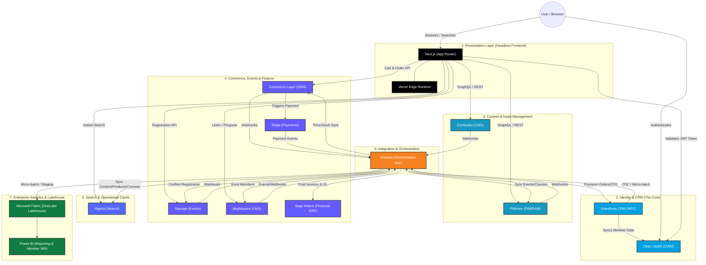
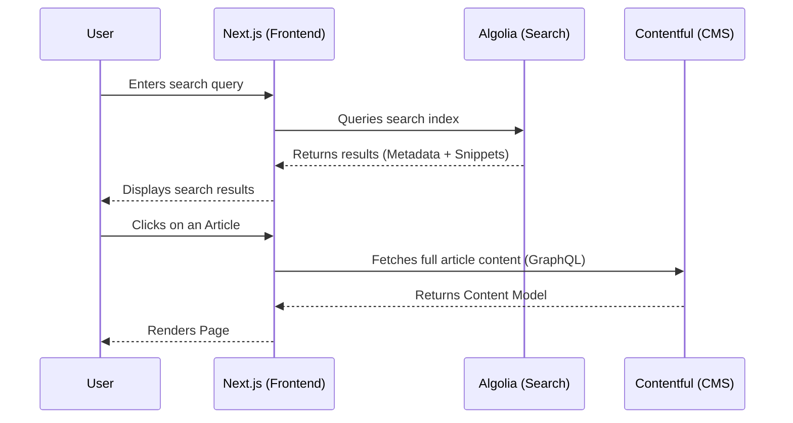
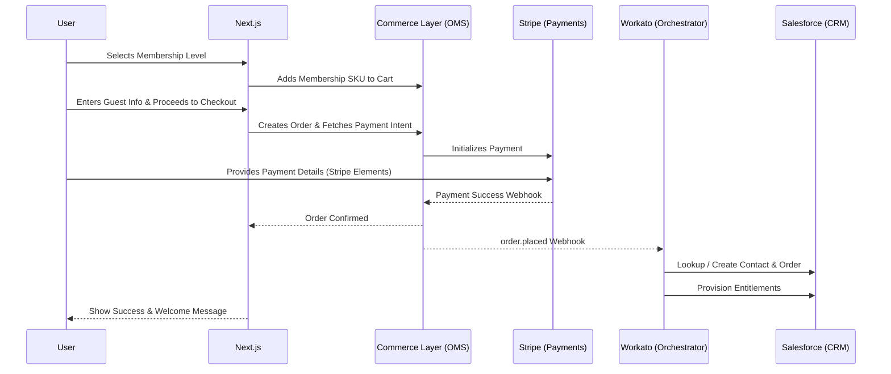
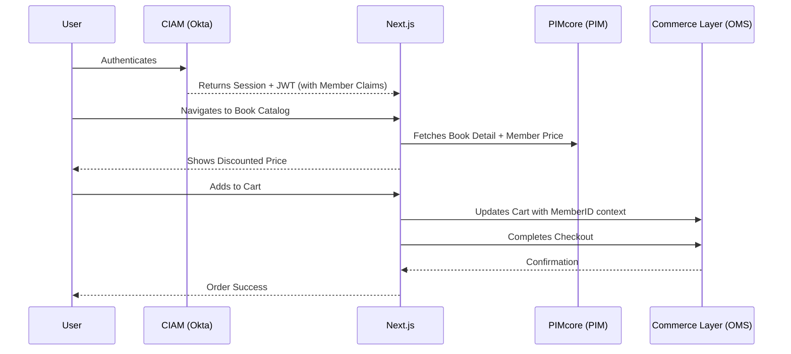
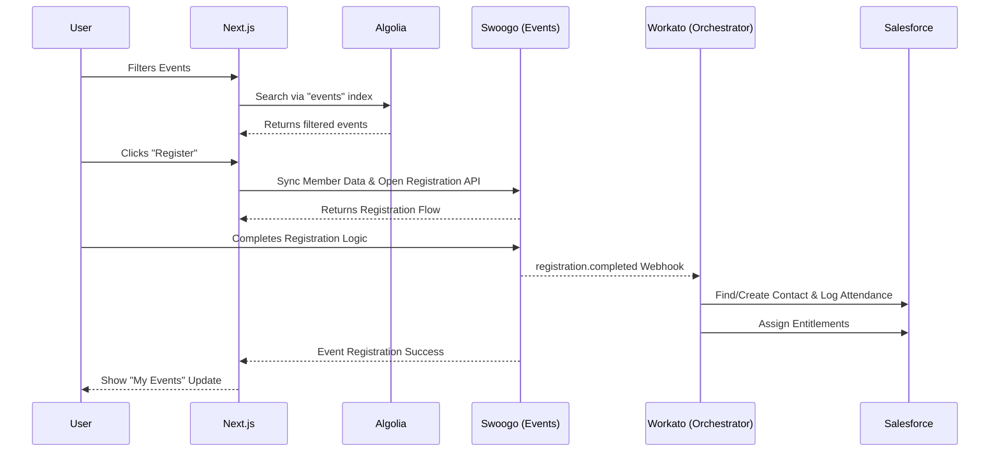
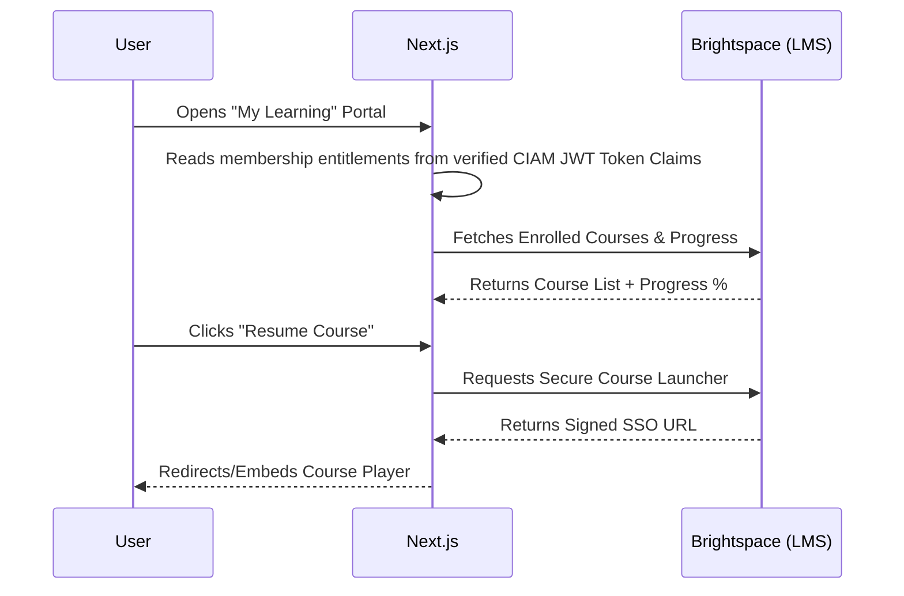

# BSAVA MACH Migration Architecture

This document provides a comprehensive overview of the headless, composable architecture being adopted for the BSAVA platform. It is split into two sections: the **Abstract Target Architecture** (the full ecosystem) and the **Current Implementation Status** (what is currently hooked up in this repository).

---

## 1. Abstract Target Architecture
This diagram outlines the complete ecosystem of headless services that form the BSAVA MACH platform. It highlights the decoupled nature of the services and the central role of **CIAM** and **CRM** in managing user identities and entitlements.

### Key Systems of Record & Components:
- **Presentation**: Decoupled React-based Next.js frontend running on Edge Middleware.
- **Identity & Sessions (CIAM)**: **Okta / Auth0** serves as the central CIAM platform, handling secure user authentication, credential lifecycles, and issuing signed JWT tokens verified at the edge.
- **Person / Contact Master (CRM)**: **Salesforce (Nonprofit Cloud)** remains the core constituent CRM and master source of truth for member records, committee roles, and interaction history.
- **Product Catalog & Entitlements (PIM/DAM)**: **PIMcore** manages structured product objects (books, memberships, digital assets) and entitlement rules.
- **Editorial Copy & CMS**: **Contentful** manages marketing pages, clinical guidelines, and editorial content.
- **Carts, Orders & Subscriptions (OMS)**: **Commerce Layer** handles active cart states, order calculations, and subscription tier lifecycles.
- **Payment Processing**: **Stripe** handles card tokenisation, hosted checkout sessions, and payment gateways (reducing PCI DSS compliance scope to SAQ A).
- **Events & Conferences**: **Swoogo** handles event registration rosters, delegate check-ins, and conference schedules.
- **Learning & CPD (LMS)**: **Brightspace (D2L)** manages e-learning courses, assessment scores, and Continuing Professional Development (CPD) credit hours.
- **Financial Ledger & Invoices (ERP)**: **Sage Intacct** serves as the cloud financial system of record, maintaining the multi-dimensional general ledger, fund accounting, statutory VAT invoices, and audit controls.
- **Search Operational Cache**: **Algolia** provides sub-50ms instant search across products, articles, and courses (read-only cache, updated via Workato).
- **Enterprise Historical Analytics & BI**: **Microsoft Fabric (OneLake)** acts as the unified enterprise lakehouse implementing a Medallion Architecture (Bronze raw, Silver cleansed/masked, Gold datamarts) connected to **Power BI** for Member 360 and executive reporting.
- **Integration & Orchestration**: **Workato** acts as the central IPaaS orchestration hub, executing token-governed sync flows (real-time webhooks, micro-batching, direct storage staging).

---

## 2. User Journeys & Interaction Flows

These diagrams show how the various components of the MACH architecture interact during specific user scenarios.

### A. Non-Member Searches for Information
A visitor searches the site for clinical resources or news.

### B. Non-Member Purchases Membership
A visitor signs up for a BSAVA membership to access gated benefits.

### C. Member Buys a Book
An authenticated member purchases a physical publication using member pricing.

### D. Member Books an Event
An existing member registers for a CPD event or conference.

### E. Member Studies a Course
A member accesses their learning dashboard to continue an online course.

