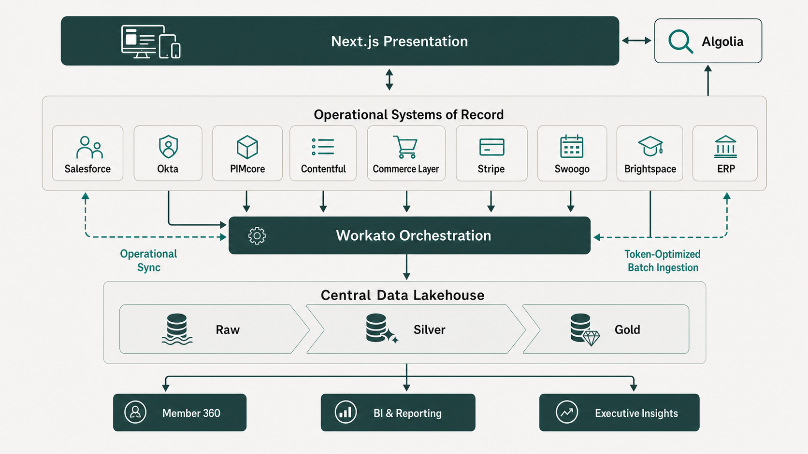
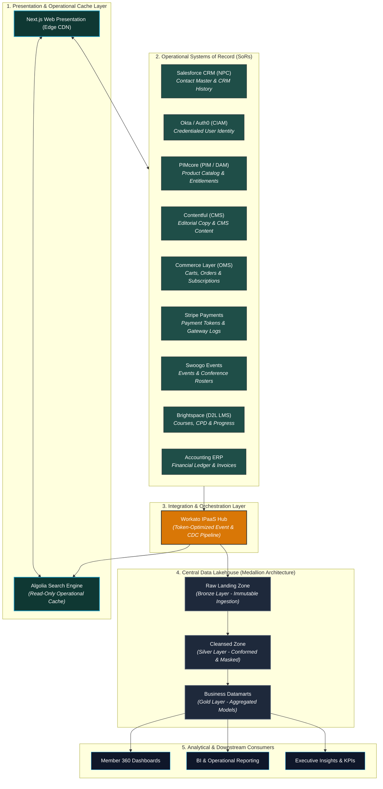

# BSAVA Systems of Record (SoR) Architecture Whitepaper
## Enterprise Composable MACH Ecosystem, Domain Ownership & Medallion Analytics Blueprint

| Document Metadata | Details |
| :--- | :--- |
| **Client** | British Small Animal Veterinary Association (BSAVA) |
| **Author** | Timberyard Solutions Architecture & Advisory Team |
| **Version** | v2.0.0 (Enhanced Industry Whitepaper Baseline) |
| **Date** | August 2026 |
| **Status** | Approved Architectural Specification |
| **Target Stack** | Headless Composable MACH (Microservices, API-first, Cloud-native, Headless) |

---

## Executive Summary & Architectural Topology

The British Small Animal Veterinary Association (BSAVA) is executing a digital transformation from legacy monolithic IT systems (including legacy Salesforce Fonteva customizations and fragmented spreadsheets) to a modern, composable **MACH** architecture. 

In a composable architecture, no single operational application acts as an all-encompassing, monolithic database. Instead, specialized best-of-breed platforms own specific data domains. To guarantee data integrity, enterprise security, regulatory compliance (UK GDPR), and sub-second page performance at the edge, BSAVA strictly enforces the **Single Source of Truth (SoR)** principle:

> **The Single Source of Truth Principle:** *Every business record type and data entity must have exactly one authoritative operational system of record. Downstream consuming applications may cache, index, or analyze this data, but they must never act as dual masters.*

### High-Level System Topology Diagram

---

## 1. Theoretical Foundations & Industry Whitepaper Citations

BSAVA's Systems of Record architecture is grounded in established computer science literature, enterprise integration patterns, and industry standards from leading technology analyst firms.

### 1.1 Composable Architecture & Decoupled Domain Ownership
The **MACH Alliance** defines composable architecture as a technology ecosystem that is *Microservices-based, API-first, Cloud-native, and Headless*:

> *"In a composable enterprise, software components are modular, pluggable, and replaceable. Best-of-breed platforms own distinct business capabilities rather than relying on a single monolithic vendor suit. Data flow across these services must be orchestrated cleanly via APIs to prevent data duplication and tight coupling."*
> — **MACH Alliance Interoperability Task Force**, *Understanding Composable Architectures* (2024)

By replacing a monolithic custom-coded Salesforce platform with composable microservices, BSAVA eliminates vendor lock-in, increases operational agility, and allows each core domain (e.g., PIM, CMS, LMS, OMS) to scale independently.

### 1.2 Domain-Driven Design (DDD) & Bounded Contexts
The allocation of Systems of Record directly mirrors **Domain-Driven Design (DDD)** principles articulated by Eric Evans and Martin Fowler:

> *"A Bounded Context explicitly defines the boundary within which a domain model applies. Inside the boundary, all terms, schema objects, and data attributes have a unified, unambiguous meaning (the Ubiquitous Language). Attempting to force a single global data model across disparate domains leads to monolithic corruption."*
> — **Martin Fowler**, *Bounded Context Patterns* (Martinfowler.com, 2021)

Applied to BSAVA:
* **Product Catalog & Entitlements** reside strictly within **PIMcore** (Catalog Bounded Context).
* **Constituent Relationships & Committee Roles** reside strictly within **Salesforce** (CRM Bounded Context).
* **Identity Credentials & Sessions** reside strictly within **Okta/Auth0** (Identity Bounded Context).

### 1.3 Enterprise Integration & Single Source of Truth (SSOT)
In *Enterprise Integration Patterns*, Gregor Hohpe and Bobby Woolf establish the requirement for clear data sovereignty in asynchronous ecosystems:

> *"Data redundancy across distributed applications is acceptable only for read performance (caches and read replicas). For state modifications, every entity must have a designated Single Source of Truth (SSOT). Asynchronous event buses must propagate updates outward from the SSOT to dependent consumers without allowing consumers to mutate canonical state directly."*
> — **Gregor Hohpe & Bobby Woolf**, *Enterprise Integration Patterns: Designing, Building, and Deploying Messaging Solutions* (Addison-Wesley)

In BSAVA's architecture, **Workato IPaaS** enforces this principle. For example, when a purchase completes in **Commerce Layer**, Commerce Layer emits an `order.placed` webhook. Workato propagates this event to Salesforce, Swoogo, and Brightspace, ensuring these downstream systems consume the event without altering Commerce Layer's canonical order record.

### 1.4 Medallion Data Lakehouse Architecture
For enterprise analytics and cross-domain reporting, BSAVA implements the **Medallion Architecture**, pioneered by Databricks and adopted across Snowflake and Microsoft Fabric:

> *"The Medallion pattern is a data design pattern that logically organizes data in a lakehouse into three progressive quality layers: Bronze (Raw landing), Silver (Cleansed, deduplicated, and PII-masked), and Gold (Curated business datamarts). This multi-hop architecture guarantees that analytical processing does not impact operational OLTP performance while maintaining complete data lineage."*
> — **Databricks Engineering**, *Architecting Data Lakes with Delta Lake and Medallion Architecture* (2023)

### 1.5 Decoupled Identity & Zero-Trust Edge Governance
Decoupling Customer Identity & Access Management (CIAM) from CRM is supported by **NIST SP 800-63 (Digital Identity Guidelines)** and Okta/Auth0 whitepapers:

> *"Modern web applications operating at the network edge require stateless, cryptographically verifiable tokens (JSON Web Tokens / OIDC). Coupling identity verification directly to a back-office CRM database introduces operational latency, exposes sensitive credentials, and creates single points of failure during authentication bursts."*
> — **Okta / Auth0 Whitepaper**, *Decoupling Customer Identity from Legacy CRM Platforms* (2025)

---

## 2. Master Domain Ownership Matrix

The following table provides the definitive System of Record (SoR) crosswalk for every record type in the BSAVA ecosystem:

| # | Data Domain / Record Type | System of Record (SoR) | Primary Key / Identifier | Key Attributes Owned | Downstream Consuming Systems | Sync Frequency / Latency |
| :--- | :--- | :--- | :--- | :--- | :--- | :--- |
| **1** | **Person / Contact Master** | **Salesforce CRM (NPC)** | `Contact ID` (`003...`) | Demographics, Postal/Email Addresses, Committee Roles, CRM History, Member Transcripts | CIAM (Okta/Entra), Commerce Layer, Swoogo, Brightspace, Data Lakehouse | Real-Time Sync / Hourly Micro-Batch |
| **2** | **Credentialed User Identity** | **Okta / Auth0 or Entra ID (CIAM)** | `User UID` (`usr_...`) | Password Hashes (BCrypt), MFA Tokens, Active SSO Sessions, JWT Claims, Security Audit Logs | Next.js Frontend, Brightspace (SSO), Swoogo (SSO), Workato | Real-Time (< 50ms Edge Validation) |
| **3** | **Product Catalog & Entitlements** | **PIMcore (PIM / DAM)** | `SKU` / `Product ID` | Book Catalog, Membership Packages, Digital Assets (PDFs), Entitlement Rules, Tier Pricing, Inventory | Next.js Frontend, Algolia, Commerce Layer, Salesforce, Workato | Nightly Snapshot (01:00 UTC) / Event Webhooks |
| **4** | **Editorial & CMS Content** | **Contentful (CMS)** | `Content Entry ID` | News Articles, Clinical Guidelines Copy, Landing Pages, Editorial Metadata, Navigation Layouts | Next.js Frontend, Algolia | Event Webhooks (`publish`/`unpublish`) |
| **5** | **Carts, Orders & Subscriptions** | **Commerce Layer (OMS)** | `Order ID` (`ord_...`) / `Sub ID` | Active Cart State, Membership Tiers, Active Subscription States, Line Items, Discounts, Delivery Status | Salesforce, Stripe, PIMcore, Workato, Accounting ERP, Data Lakehouse | Real-Time Checkout / Hourly Micro-Batch |
| **6** | **Payment Gateway Data** | **Stripe** | `PaymentIntent ID` (`pi_...`) | Credit Card Tokens, Payment Intents, Gateway Charges, Refunds, Gateway Payout Logs, 3DS Verification | Commerce Layer, Accounting ERP, Data Lakehouse | Real-Time Webhooks / Hourly Micro-Batch |
| **7** | **Events & Conferences** | **Swoogo** | `Attendee ID` / `Event ID` | Event Schedules, Ticket Allocations, Delegate Rosters, Speaker Profiles, Attendee Check-in Logs | PIMcore (via Workato), Salesforce, Data Lakehouse | Twice-Daily Poll / Event Webhooks |
| **8** | **Learning Management & CPD** | **Brightspace (D2L LMS)** | `Student ID` / `Course ID` | Course Catalog, Module Enrolments, Progress %, Quiz Scores, Earned CPD Credit Hours | PIMcore (via Workato), Salesforce, Algolia, Data Lakehouse | Daily Data Hub Bulk CSV / Event Notifications |
| **9** | **Financial Ledger & Invoices** | **Accounting (ERP)** | `Invoice ID` / `Journal ID` | General Ledger Accounts, Chart of Accounts, Statutory Tax Invoices, VAT Compliance, Reconciliation | Data Lakehouse, Executive Financial Reporting | Nightly Scheduled Export |
| **10** | **Search Operational Cache** | **Algolia** *(Operational Cache)* | `ObjectID` | Search Indices, Facets, Filter Attributes, Ranking Rules *(Read-only cache derived from SoRs)* | Next.js Frontend | Event-Driven Webhooks (< 2 min propagation) |
| **11** | **Enterprise Historical Analytics** | **Central Data Lakehouse** | Unified `Member_360_ID` | Multi-Year Transaction History, Web Telemetry, CPD Engagement Analytics, Executive BI Dashboards | Power BI / Tableau, Executive Dashboards | Hourly / Daily Scheduled Ingestion |

---

## 3. Deep-Dive Component Analysis & Technical Rationale

### 3.1 Salesforce CRM (Nonprofit Cloud) — Contact & Member SoR
* **Role**: Authoritative master for member contact profiles, committee appointments, volunteer roles, and CRM interaction history.
* **Technical Rationale**:
  - **Constituent Relationship Management**: Salesforce NPC provides an out-of-the-box non-profit schema designed specifically for contact relationships, committee assignments, and constituent lifecycles.
  - **Avoidance of Storage / API Governor Limits**: By offloading high-frequency shopping cart state to Commerce Layer and identity sessions to CIAM, Salesforce remains lightweight and avoids expensive storage governor penalties.
* **Architectural Boundaries**: Salesforce does **not** manage active user authentication passwords, nor does it host structured digital assets or catalog pricing rules.

### 3.2 Okta / Auth0 (CIAM) — Identity & Session Governance
* **Role**: Master repository for credential security, multi-factor authentication (MFA), and JSON Web Token (JWT) issuance.
* **Technical Rationale**:
  - **Edge-Native Authentication**: High-performance OpenID Connect (OIDC) implementation issuing short-lived JWT tokens (15-minute access lifespan) carried as Bearer tokens or `httpOnly` secure cookies. Next.js Edge Middleware validates JWT signatures in < 5ms at the CDN edge.
  - **Dynamic Entitlement Claims**: Serverless auth pipeline scripts (Auth0 Actions or Entra Extensions) fetch active membership tier claims from Salesforce/Commerce Layer upon authentication and embed them into signed JWT claims. Downstream applications read this token to unlock gated clinical content without making database trips to Salesforce.

### 3.3 PIMcore (PIM / DAM) — Product Catalog, Asset & Entitlement SoR
* **Role**: Single source of truth for all sellable products (BSAVA manuals, digital publications, veterinary guidelines), membership packages, digital assets, and **Entitlement Definitions & Access Rules**.
* **Technical Rationale**:
  - **Elimination of Distributed Spreadsheets**: Prior to migration, product metadata resided in fragmented Excel files ("Final_Prices_v3.xlsx"). PIMcore enforces strict PHP class definitions and schema validation at the platform level.
  - **Heterogeneous Domain Modeling**: Handles distinct attributes across books (ISBN, edition, zero-rated VAT), memberships (tier entitlement keys), events (temporal start/end dates, venue), and LMS courses (prerequisites, CPD hours).
  - **Centralized Entitlement Rules**: Entitlement rules belong in the product master where access criteria are defined once and syndicated to Commerce Layer, Contentful, and Algolia, avoiding fragmented access logic across frontend code or CMS models.

### 3.4 Contentful (CMS) — Marketing & Editorial Content Master
* **Role**: Authoritative store for un-gated marketing copy, news updates, clinical guidelines articles, author profiles, and page navigation structures.
* **Technical Rationale**:
  - **Editorial Storytelling Focus**: Contentful is purpose-built for non-technical content editors ("Who, What, and Why").
  - **Decoupled Performance**: Delivered via Contentful's Content Delivery API (CDA) over global CDNs, powering Next.js Incremental Static Regeneration (ISR) with zero impact on transactional e-commerce engines.

### 3.5 Commerce Layer (OMS) — Carts, Orders & Subscriptions
* **Role**: Headless Order Management System (OMS) governing active cart state, promotion code applications, subscription billing states, and order fulfillment workflows.
* **Technical Rationale**:
  - **High-Concurrency Checkout**: Provides sub-second API responses for cart mutations and checkout flows, supporting multi-currency calculations and localized tax rules.
  - **Shielding Core Databases**: Offloads ephemeral cart creation and abandonment from Salesforce, preventing CRM database bloat.
  - **Event Orchestration**: Emits `order.placed` and `subscription.updated` webhooks to Workato to trigger downstream fulfillment in Salesforce, Swoogo, and Brightspace.

### 3.6 Stripe — Payment Processing & PCI Isolation
* **Role**: PCI-DSS Level 1 compliant gateway processing credit card authorizations, tokenization, recurring subscription mandates, and payout settlements.
* **Technical Rationale**:
  - **Zero-PCI Scope**: Primary Account Numbers (PANs) and CVVs never touch BSAVA servers. Card tokenization is executed directly between browser clients and Stripe PaymentIntents APIs.
  - **Automated Settlement Reconciliation**: Webhook events (`charge.succeeded`, `payment_intent.succeeded`) allow Workato to perform daily financial balancing between Commerce Layer orders and Accounting ERP journals.

### 3.7 Swoogo — Events & Conferences Platform
* **Role**: Specialized management platform for veterinary congresses, regional workshops, venue seat allocations, delegate rosters, and live check-ins.
* **Technical Rationale**:
  - **Specialized Event Workflows**: Handles complex multi-track event schedules, speaker profiles, and badge printing requirements.
  - **Workato Integration**: Swoogo `event.created` webhooks automatically push Minimal Viable Event (MVE) products into PIMcore for public sale, while `registration.completed` webhooks post attendance records to Salesforce.

### 3.8 Brightspace (D2L LMS) — Learning & CPD Accreditation
* **Role**: Master platform for online veterinary courses, interactive learning modules, SCORM/LTI content, quiz scoring, and Continuing Professional Development (CPD) credit hour records.
* **Technical Rationale**:
  - **Veterinary Accreditation Standard**: Dedicated learning management system providing SCORM/LTI content hosting, interactive learning modules, automated grading, and veterinary CPD accreditation tracking.
  - **Completion Sync**: Progress tracking occurs inside Brightspace. Upon course completion (`course.completed`), Workato updates the member's CPD transcript in Salesforce.

### 3.9 Accounting ERP — Financial Ledger & Compliance
* **Role**: Authoritative ledger for financial accounts, chart of accounts, statutory VAT tax compliance, formal invoices, and audit-ready financial reporting.
* **Technical Rationale**:
  - **Double-Entry Governance**: Guarantees statutory accounting compliance and financial audit trails.
  - **Period-End Isolation**: Prevents frontend order mutations from altering closed accounting periods.

### 3.10 Algolia — Operational Search Cache (Read-Only)
* **Role**: High-speed, sub-50ms search and filter engine for products, articles, and courses.
* **Technical Rationale**:
  - **Read-Only Cache Topology**: Algolia holds **no persistent master data**. It is an operational index cache derived from PIMcore, Contentful, and Brightspace via Workato webhooks. If the search engine experiences a outage, the Next.js frontend gracefully falls back to direct PIMcore/Contentful queries without data loss.

### 3.11 Central Data Lakehouse — Enterprise Analytics & Medallion Layers
* **Role**: Unified enterprise repository for historical analytics, cross-domain Member 360 insights, and executive BI reporting.
* **Technical Rationale**:
  - **Medallion Pipeline**:
    - **Bronze (Raw)**: Ingests raw JSON/CSV events immutable from operational webhooks and CDC polling.
    - **Silver (Cleansed)**: Cleanses, deduplicates, and pseudonymizes data (masking email addresses, hashing DOBs to year-only) in accordance with UK GDPR.
    - **Gold (Datamart)**: Aggregates conformed dimensional schemas (`Fact_Order`, `Dim_Member`, `Dim_CPD`) for rapid Power BI and Tableau querying.

---

## 4. Integration Architecture & Workato Task Budgeting

Workato serves as the central **Integration Platform as a Service (IPaaS)**. 

### Commercial Quota Constraint
BSAVA operates under a contracted commercial limit of **1,000,000 Workato Tasks/Tokens per year**. To guarantee operations remain strictly within this quota (~83,333 tasks/month), Workato recipes adhere to three ingestion patterns:

```mermaid
flowchart TD
    subgraph Stream ["Pattern 1: Real-Time Streaming"]
        Ev1["Operational Webhook<br/>(e.g., Payment Succeeded)"] -->|1 Task / Event| Rec1["Operational Recipe"] -->|Immediate Sync| Target1["Target SoR (Salesforce)"]
    end

    subgraph Batch ["Pattern 2: Micro-Batch CDC"]
        Poll["Hourly Polling Trigger<br/>(WHERE updated_at > last_run)"] -->|1 Task / Array Batch| Rec2["Analytical Recipe"] -->|Array Load| Target2["Lakehouse Raw Zone"]
    end

    subgraph Bulk ["Pattern 3: Direct Storage Copy"]
        Cron["Nightly Cron Trigger<br/>(02:00 UTC)"] -->|File Transfer| Rec3["Bulk File Stage"] -->|GZIP / Parquet Load| Target3["Lakehouse S3/ADLS Staging"]
    end

    classDef s1 fill:#991b1b,stroke:#dc2626,color:#fff;
    classDef s2 fill:#065f46,stroke:#10b981,color:#fff;
    classDef s3 fill:#1e40af,stroke:#3b82f6,color:#fff;

    class Ev1,Rec1,Target1 s1;
    class Poll,Rec2,Target2 s2;
    class Cron,Rec3,Target3 s3;
```

1. **Real-Time Streaming (< 5s Latency)**: Used strictly for critical operational transactions (e.g. checkout payment confirmation, contact creation). Est. ~15,000 tasks/year.
2. **Scheduled Micro-Batching (30–60 Min CDC)**: Collects modified operational records in batch arrays, using 1 Workato task per batch execution rather than looping per record. Est. ~17,520 tasks/year.
3. **Daily Direct Storage Staging**: Large datasets (> 10,000 records) bypass Workato row-level processing, generating GZIP/Parquet files directly into AWS S3 / Azure ADLS for native Lakehouse ingestion. Est. ~1,000 tasks/year.

---

## 5. UK GDPR & Data Governance Framework

To maintain strict compliance with **UK GDPR** and national data protection regulations, BSAVA enforces geographic cloud binding and data sensitivity tiers:

### 5.1 Cloud Region Binding
* All operational Systems of Record (Salesforce, Commerce Layer, PIMcore) and the primary Data Lakehouse cluster must be provisioned exclusively within **UK South (Azure)** or **AWS London (`eu-west-2`)** cloud regions. Unmasked personal data must never cross outside certified UK/EU boundaries.

### 5.2 Field-Level Data Classification & Masking Rules

| Sensitivity Tier | Associated Data Domains | Access Controls | Data Lakehouse Masking Policy |
| :--- | :--- | :--- | :--- |
| **Public** | Editorial Content (Contentful), Product Catalogs (PIMcore), Public Event Schedules (Swoogo) | Open Read Access | Ingested unmasked into Silver and Gold layers. |
| **Internal** | General Ledger Accounts (ERP), Aggregate Course Analytics (Brightspace) | Internal RBAC; Encrypted at rest | Available for general BI and executive reporting. |
| **Restricted** | Member Contacts (Salesforce), Subscriptions (Commerce Layer), CPD Transcripts (Brightspace) | Strict RBAC; AES-256 Encryption at rest | **Pseudonymized**: Email masked (`j***@domain.co.uk`); DOB truncated to birth year in Silver layer. Unmasked in Gold datamarts via role-gated policies. |
| **Confidential** | CIAM Passwords/Hashes (Okta), Payment Tokens (Stripe), Member Safeguarding Notes | Cryptographically Isolated; Strict Least Privilege | **Strictly Omitted**: Passwords/tokens never loaded into Lakehouse. Sensitive notes SHA-256 hashed or excluded. |

---

## 6. Bibliography & References

1. **MACH Alliance** (2024). *Understanding Composable Architectures: Principles, Patterns, and Interoperability Standards*. MACH Alliance Technical Whitepapers. [Online: machalliance.org/resources]
2. **Evans, Eric** (2003). *Domain-Driven Design: Tackling Complexity in the Heart of Software*. Addison-Wesley Professional.
3. **Fowler, Martin** (2021). *Bounded Context: Domain-Driven Design Patterns*. MartinFowler.com Publications.
4. **Hohpe, Gregor & Woolf, Bobby** (2003). *Enterprise Integration Patterns: Designing, Building, and Deploying Messaging Solutions*. Addison-Wesley.
5. **Databricks Engineering** (2023). *Architecting Modern Data Lakes with Delta Lake and the Medallion Architecture (Bronze, Silver, Gold)*. Databricks Technical Documentation.
6. **Okta / Auth0 Architecture Advisory** (2025). *Decoupling Customer Identity and Access Management (CIAM) from Legacy CRM Systems*. Okta Whitepaper Series.
7. **NIST** (2020). *NIST Special Publication 800-63-3: Digital Identity Guidelines*. National Institute of Standards and Technology, U.S. Department of Commerce.
8. **PCI Security Standards Council** (2022). *Payment Card Industry Data Security Standard (PCI DSS) Requirements and Security Assessment Procedures Version 4.0*. PCI SSC.
9. **UK Information Commissioner's Office (ICO)** (2023). *Data Protection by Design and Default: Guidance on UK GDPR Compliance*. ICO UK.

---
*End of BSAVA Systems of Record Architecture Whitepaper.*
