# BSAVA Systems of Record (SoR): Domain Ownership, Selection Rationale & Industry Evidence Base

| Document Metadata | Details |
| :--- | :--- |
| **Client** | British Small Animal Veterinary Association (BSAVA) |
| **Author** | Timberyard Solutions Architecture & Advisory Team |
| **Version** | v2.0.0 — Enhanced Industry Evidence Edition |
| **Date** | August 2026 |
| **Status** | Approved Architectural Reference |
| **Target Architecture** | Headless Composable MACH (Microservices, API-first, Cloud-native, Headless) |

---

## Executive Summary

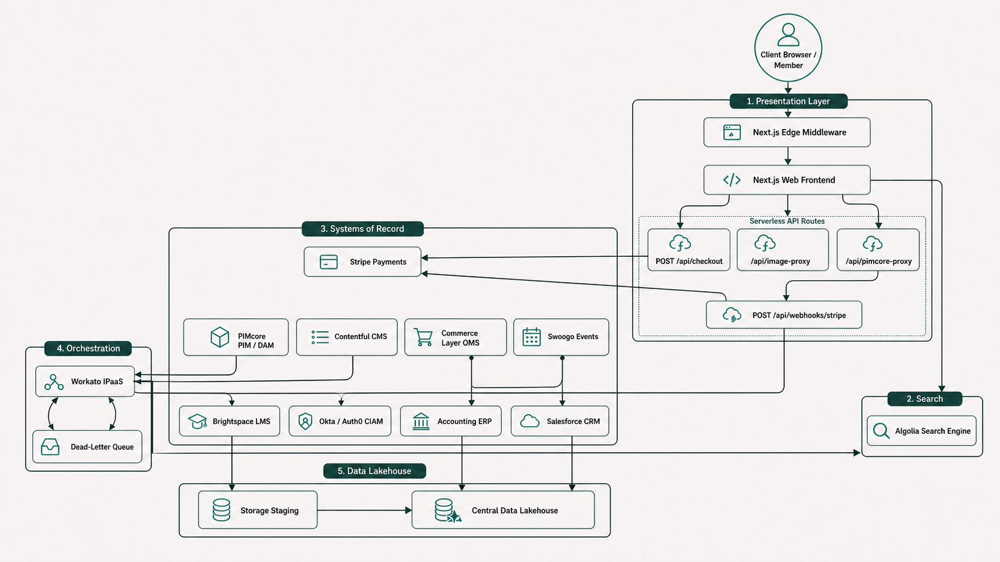

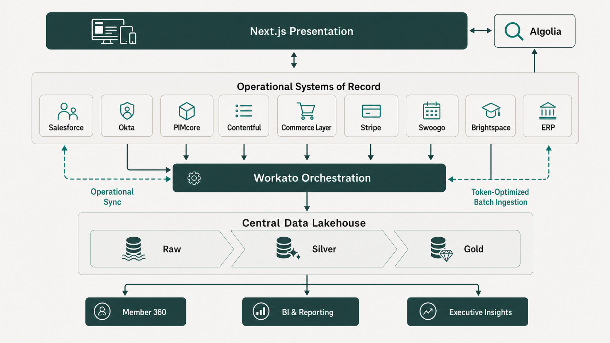

As part of the Digital Transformation Programme (PR2742), the British Small Animal Veterinary Association (BSAVA) is transitioning from legacy monolithic software — including heavily customised Salesforce Fonteva and fragmented spreadsheets — to a modern, composable **MACH** architecture.

In a composable ecosystem, no single application acts as an all-encompassing database. Instead, specialised best-of-breed platforms own specific data domains. To maintain data integrity, security, regulatory compliance (UK GDPR), and high performance at the edge, BSAVA strictly enforces the **Single Source of Truth (SoR)** principle:

> **The Single Source of Truth Rule:** *Every business record type and data entity must have exactly one authoritative operational system of record. Downstream platforms may consume, cache, or analyse this data, but they must never act as dual masters.*

This principle is grounded in established enterprise architecture theory. As Gregor Hohpe and Bobby Woolf articulate in *Enterprise Integration Patterns*:

> *"Event-driven architectures (EDAs) are frequently pitched as loosely coupled, when compared to other forms of integration. Coupling is a multi-faceted and nuanced property, so as architects we should have a closer look."*
> — **Gregor Hohpe**, *Enterprise Integration Patterns: Event-driven = Loosely coupled? Not so fast!* (2024) [\[Source\]](https://www.enterpriseintegrationpatterns.com/ramblings/2024-06-20-event-driven-loose-coupling.html)

This document details every record type across BSAVA's business domains, identifies its designated System of Record, provides the technical and operational justifications for the selection, cites authoritative industry white papers and analyst publications, and illustrates system interactions with explanatory diagrams.

---

## 1. Theoretical Foundations & Architectural Principles

### 1.1 MACH Alliance — Composable Architecture

The MACH Alliance defines composable architecture as technology ecosystems that are Microservices-based, API-first, Cloud-native SaaS, and Headless:

> *"MACH stands for Microservices based, API-first, Cloud-native SaaS and Headless. MACH technologies support a composable enterprise in which every component is pluggable, replaceable, and can be continuously improved through agile development to meet evolving business requirements."*
> — **MACH Alliance**, *What is MACH Architecture?* (2020, updated 2023) [\[Source\]](https://machalliance.org/mach-architecture)

### 1.2 Domain-Driven Design & Bounded Contexts

The allocation of Systems of Record directly mirrors **Domain-Driven Design (DDD)** principles. Each operational platform owns a distinct Bounded Context:

> *"Bounded Context is a central pattern in Domain-Driven Design. It is the focus of DDD's strategic design section which is all about dealing with large models and teams. DDD deals with large models by dividing them into different Bounded Contexts and being explicit about their interrelationships."*
> — **Martin Fowler**, *Bounded Context* (martinfowler.com, 2014) [\[Source\]](https://martinfowler.com/bliki/BoundedContext.html)

> *"Explicitly define the context within which a model applies. Explicitly set boundaries in terms of team organization, usage within specific parts of the application, and physical manifestations such as code bases and database schemas. Keep the model strictly consistent within these boundaries, but don't be distracted or confused by issues outside."*
> — **Eric Evans**, *Domain-Driven Design: Tackling Complexity in the Heart of Software* (Addison-Wesley, 2003) [\[Source\]](https://www.domainlanguage.com/ddd/)

Applied to BSAVA:
- **Product Catalog & Entitlements** reside strictly within **PIMcore** (Catalog Bounded Context).
- **Constituent Relationships & Committee Roles** reside strictly within **Salesforce** (CRM Bounded Context).
- **Identity Credentials & Sessions** reside strictly within **Okta/Auth0** (Identity Bounded Context).
- **Carts, Orders & Subscriptions** reside strictly within **Commerce Layer** (Commerce Bounded Context).

### 1.3 Gartner — Composable Business Strategy

Gartner's strategic research further validates the modular approach:

> *"A Composable Business is architected for real-time adaptability and resilience in the face of uncertainty... Success and innovation requires that the capabilities delivered by applications are modular, rapidly and safely assembled, disassembled and recomposed as business, customer and market needs shift."*
> — **Daryl Plummer & Yefim Natis (Gartner)**, *Gartner Keynote: Composable Business Strategy* (2020) [\[Source\]](https://www.gartner.com/en/newsroom/press-releases/2020-10-19-gartner-keynote-composable-business-strategy)

---

## 2. System of Record Topology & High-Level Architecture

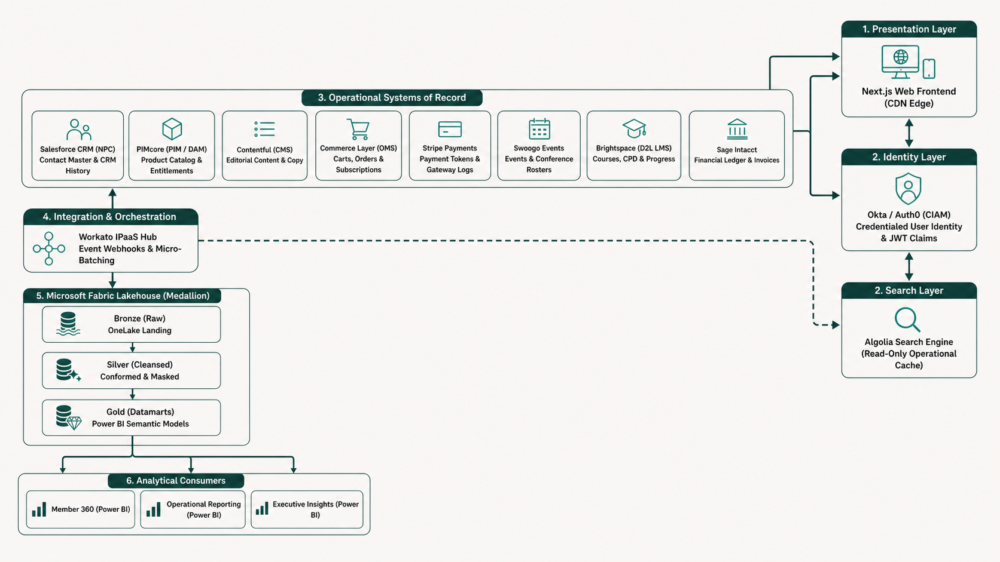

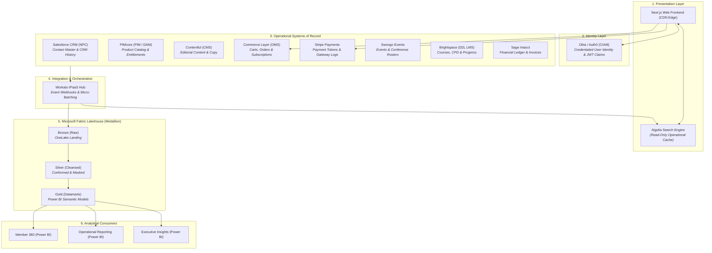

---

## 3. Master Record Type & System of Record Ownership Matrix

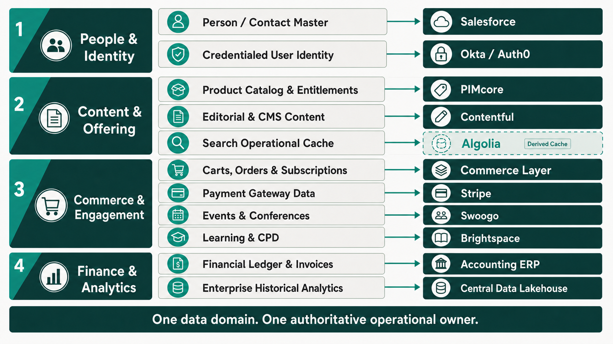

| # | Record Type / Data Domain | System of Record (SoR) | Primary Key | Key Attributes Owned | Downstream Consumers |
| :--- | :--- | :--- | :--- | :--- | :--- |
| **1** | Person / Contact Master | **Salesforce CRM (NPC)** | `Contact ID` (`003...`) | Demographics, Contact Details, Committee Roles, CRM Interaction History | CIAM, Commerce Layer, Swoogo, Brightspace, Microsoft Fabric |
| **2** | Credentialed User Identity | **Okta / Auth0 (CIAM)** | `User UID` (`usr_...`) | Password Hashes, MFA Tokens, SSO Sessions, Edge JWT Claims, Security Audit Logs | Next.js Frontend, Brightspace (SSO), Swoogo (SSO) |
| **3** | Product Catalog & Entitlements | **PIMcore (PIM / DAM)** | `SKU` / `Product ID` | Book Catalog, Membership SKUs, Digital Assets, Entitlement Definitions & Access Rules, Pricing Tiers | Next.js Frontend, Algolia, Commerce Layer, Salesforce |
| **4** | Editorial & CMS Content | **Contentful (CMS)** | `Content Entry ID` | News Articles, Clinical Guidelines, Landing Pages, Editorial Metadata, Navigation Trees | Next.js Frontend, Algolia |
| **5** | Carts, Orders & Subscriptions | **Commerce Layer (OMS)** | `Order ID` (`ord_...`) | Active Cart State, Membership Tiers, Subscription States, Line Items, Discounts, Delivery Status | Salesforce, Stripe, PIMcore, Workato, Sage Intacct, Microsoft Fabric |
| **6** | Payment Gateway Data | **Stripe** | `PaymentIntent ID` (`pi_...`) | Credit Card Tokens, Payment Intents, Charges, Refunds, 3DS Verification | Commerce Layer, Sage Intacct, Microsoft Fabric |
| **7** | Events & Conferences | **Swoogo** | `Event ID` / `Attendee ID` | Event Schedules, Ticket Allocations, Delegate Rosters, Speaker Profiles, Check-ins | PIMcore (via Workato), Salesforce, Microsoft Fabric |
| **8** | Learning Management & CPD | **Brightspace (D2L LMS)** | `Course ID` / `Student ID` | Course Catalog, Module Enrolments, Progress %, Quiz Scores, CPD Credit Hours | PIMcore (via Workato), Salesforce, Algolia, Microsoft Fabric |
| **9** | Financial Ledger & Invoices | **Sage Intacct** | `Invoice ID` / `Journal ID` | Dimensional General Ledger, Chart of Accounts, Statutory Tax Invoices, VAT Compliance, Fund Accounting | Microsoft Fabric, Power BI Executive Reporting |
| **10** | Search Operational Cache | **Algolia** *(Cache Only)* | `ObjectID` | Search Indexes, Facets, Filter Attributes, Ranking Rules | Next.js Frontend |
| **11** | Enterprise Historical Analytics | **Microsoft Fabric (OneLake)** | `Member_360_ID` | Historical Telemetry, Cross-Domain BI, Trend Analysis, Executive KPIs | Power BI Dashboards, Sage Intacct Financial Reporting |

---

## 4. Detailed Architectural Justification by Record Type

### 4.1 Person / Contact Master — Salesforce CRM (Nonprofit Cloud)

**System of Record**: Salesforce CRM (Nonprofit Cloud / NPC)
**Primary Identifier**: `Contact ID` (`003...`)

#### Industry Evidence

Salesforce Nonprofit Cloud is purpose-built for constituent management:

> *"Salesforce Nonprofit Cloud is a purpose-built solution that unites fundraising, program management, grantmaking, and volunteer coordination onto a single platform... providing a unified 360-degree view of every constituent — whether donor, volunteer, or program beneficiary."*
> — **Salesforce, Inc.**, *Nonprofit Cloud Product Overview* (2023) [\[Source\]](https://www.salesforce.com/products/nonprofit/)

Gartner reinforces the CRM's role as the contact system of record:

> *"A CRM Customer Engagement Center (CEC) is a cohesive software suite... To qualify as a CEC, a solution must be anchored in a customer system of record to enable the control of customer master data during interactions."*
> — **Gartner Research**, *Magic Quadrant for CRM Customer Engagement Center* (2021–2024) [\[Source\]](https://www.gartner.com/en/documents/3889025)

> *"Salesforce continues to serve as the core enterprise customer system of record, anchoring customer interactions, account management, and cross-channel engagement workflows across front-office operations."*
> — **Forrester Research**, *The Forrester Wave: Customer Relationship Management (CRM)* (2023–2024)

#### Architectural Justification

1. **Core Constituent Management**: Salesforce NPC provides native Person Account objects, Actionable Relationship Center (ARC), and Party Relationship Groups designed specifically for complex non-profit constituent relationships — committee structures, volunteer roles, and multi-household mapping.

2. **Decoupled Identity**: Decoupling contact management from authentication (CIAM) prevents CRM governor limits and API costs from impacting frontend page rendering speeds. Salesforce documentation explicitly warns:

   > *"Salesforce operates in a multi-tenant environment where governor limits strictly enforce runtime constraints on SOQL queries, heap size, DML operations, and CPU execution time... Best practices dictate keeping core constituent master data in Salesforce while offloading high-frequency or high-volume transactional data to external data stores."*
   > — **Salesforce Developer Network**, *Best Practices for Deployments with Large Data Volumes* (2022–2025) [\[Source\]](https://developer.salesforce.com/docs/atlas.en-us.salesforce_large_data_volumes_bp.meta/salesforce_large_data_volumes_bp/)

3. **360-Degree Operational View**: Serves as the administrative home for internal BSAVA membership staff — recording committee appointments, engagement transcripts, and CPD completion histories — while leaving transactional e-commerce state to Commerce Layer and web login state to CIAM.

---

### 4.2 Credentialed User Identity & Sessions — Okta / Auth0 (CIAM)

**System of Record**: Okta / Auth0 or Microsoft Entra External ID (CIAM)
**Primary Identifier**: `User UID` (`usr_...`)

#### Industry Evidence

Auth0/Okta architecture documentation makes a clear case for decoupling identity from CRM databases:

> *"Customer identity should not exist in a siloed CRM or monolith database. Decoupling the identity layer allows the Identity Provider (IdP) to serve as the single source of truth for authentication, credential lifecycle, and consent management. Modern CIAM platforms collect data at the root during authentication and feed clean, consent-driven identity events into CRMs and CDPs via APIs and webhooks, without exposing credentials or bogging down origin CRM databases."*
> — **Auth0 by Okta**, *Identity Architecture Guide: Establishing Identity as a Single Source of Truth* (2024) [\[Source\]](https://auth0.com/docs/get-started/identity-fundamentals)

NIST establishes the formal standard for credential management:

> *"A credential is an association of a specific individual and their identifying attributes with one or more authenticators... The Credential Service Provider (CSP) SHALL establish and maintain an authoritative binding between a subscriber's account and the authenticator(s)."*
> — **NIST**, *Special Publication 800-63B: Digital Identity Guidelines — Authentication and Lifecycle Management* (2020, updated 2025) [\[Source\]](https://pages.nist.gov/800-63-3/sp800-63b.html)

Forrester and Gartner classify CIAM as a dedicated market category:

> *"Customer Identity and Access Management (CIAM) has evolved beyond simple user registration into a mandatory data orchestration and security layer. Dedicated CIAM platforms provide specialized capabilities — such as progressive profiling, adaptive risk-based authentication, FAPI compliance, and data orchestration — that general-purpose CRMs and legacy business application suites cannot match."*
> — **Forrester Research**, *The Forrester Wave: CIAM Solutions, Q4 2024* [\[Source\]](https://www.forrester.com/report/the-forrester-wave-customer-identity-and-access-management-solutions-q4-2024/RES180907)

NIST Zero Trust Architecture reinforces edge-native verification:

> *"Zero Trust assumes there is no implicit trust granted to assets or user accounts based solely on their physical or network location... Edge-native authentication pushes Policy Enforcement Points (PEPs) to the network perimeter, verifying identity signatures and JWT claims at the edge before requests ever touch backend systems or origin data stores."*
> — **NIST**, *Special Publication 800-207: Zero Trust Architecture* (2020) [\[Source\]](https://csrc.nist.gov/publications/detail/sp/800-207/final)

#### Architectural Justification

1. **Edge-Native Authentication**: High-performance JWT issuance with short lifespans (15 minutes) enables Next.js Edge Middleware to validate requests in under 5ms without database hops.

2. **Security & GDPR Isolation**: Storing password hashes and MFA credentials in a specialised CIAM platform shields CRM objects from sensitive security attack vectors and reduces blast radius.

3. **Dynamic Entitlement Claims**: Auth0 Actions inject real-time membership tier claims into signed JWT tokens during the authentication pipeline:

   > *"Auth0 Actions are secure, tenant-isolated JavaScript functions that execute at specific triggers within the Auth0 authentication pipeline. Developers can inspect incoming requests, execute external API integrations (such as querying or updating external CRM state), and modify JWT access and ID tokens via `api.idToken.setCustomClaim()` before tokens are cryptographically signed and issued to the client."*
   > — **Auth0 by Okta**, *Documentation: Auth0 Actions & Extensibility Pipeline* (2024) [\[Source\]](https://auth0.com/docs/customize/actions/actions-overview)

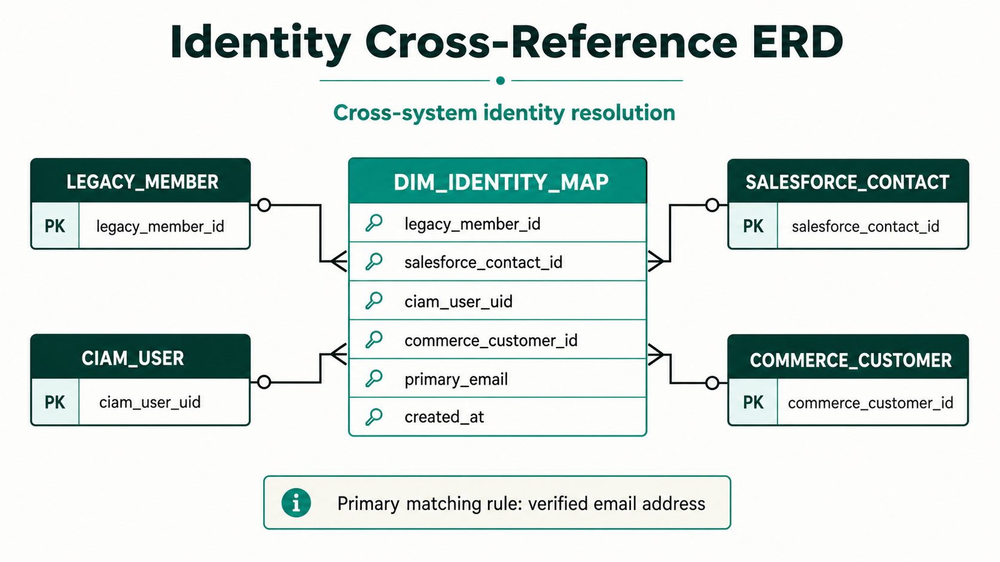

---

### 4.3 Product Catalog, Digital Assets & Entitlements — PIMcore (PIM / DAM)

**System of Record**: PIMcore (PIM / DAM)
**Primary Identifier**: `SKU` / `Product ID`

#### Industry Evidence

Gartner defines PIM as the central product data repository:

> *"Product information management (PIM) solutions enable product, commerce and marketing leaders to manage, enrich and govern product information. PIM provides a central repository to aggregate product data, digital assets and customer feedback to create a single trusted source of product information for multichannel commerce and data exchange."*
> — **Gartner**, *Information Technology Glossary: Product Information Management (PIM)* (2024) [\[Source\]](https://www.gartner.com/en/information-technology/glossary/product-information-management-pim)

Forrester reinforces PIM's role in omnichannel syndication:

> *"An enterprise's single source of truth has pivoted from singular B2B or B2C e-commerce experiences to syndication of holistic product records and thousands of online distribution channels and retailers."*
> — **Amanda LeClair, Allen Bonde et al. / Forrester Research**, *The Forrester Wave: Product Information Management, Q4 2023* [\[Source\]](https://www.forrester.com/report/the-forrester-wave-product-information-management-q4-2023/RES179532)

The distinction between PIM and CMS is architecturally critical:

> *"A CMS is built for managing web pages, blogs, and unstructured editorial content, while a PIM handles structured, relational data (SKUs, technical specs, localized attributes). Attempting to use a CMS as a product catalog leads to data fragmentation, lack of governance, and poor omnichannel scalability."*
> — **inRiver**, *PIM vs. CMS: Understanding the Difference in Digital Commerce Architecture* (2024) [\[Source\]](https://www.inriver.com/blog/pim-vs-cms/)

Akeneo positions PIM as the heartbeat of composable commerce:

> *"In a composable architecture, the Product Information Management (PIM) system serves as the heartbeat of the tech stack — acting as the single source of truth for product content and attributes, aggregating data from ERPs, and orchestrating rich product experiences across every digital touchpoint via API-first integrations."*
> — **Akeneo**, *PIM as the Heartbeat of Composable Commerce* (2023) [\[Source\]](https://www.akeneo.com/blog/composable-commerce-pim/)

#### Architectural Justification

1. **Elimination of Distributed Spreadsheets**: Replaces legacy, error-prone Excel files ("Final_Prices_v3.xlsx") with a centralised, schema-enforced product engine. PIMcore's class-based object definitions enforce data integrity at the platform level:

   > *"Pimcore Data Objects are structured PHP objects. They allow you to model any structured data in your system (products, categories, customers, orders, etc.). Class definitions define the structure of Data Objects... specifying attributes, layout, and relational data structures."*
   > — **Pimcore GmbH**, *Platform Documentation: Data Objects & Object Classes* (2024) [\[Source\]](https://pimcore.com/docs/platform/Pimcore/Data_Objects/index.html)

2. **Heterogeneous Catalog Support**: BSAVA sells diverse product types — physical books (ISBN, edition), digital manuals, tiered memberships, event tickets, and online courses. PIMcore's class hierarchy handles complex taxonomy and multi-tier member/non-member pricing logic natively.

3. **Centralised Entitlement Governance**: Entitlement rules belong in the product master where access criteria are defined once and syndicated to Commerce Layer, Contentful, and Algolia:

   > *"Entitlement management establishes a centralized system of record between the product catalog and runtime enforcement... ensuring access rules and rights are managed at the product tier level rather than hard-coded within application business logic."*
   > — **Revenera**, *Software Entitlement Management: Building the Single Source of Truth for Feature Access* (2023) [\[Source\]](https://www.revenera.com/blog/software-monetization/entitlement-management-system-of-record/)

---

### 4.4 Editorial Copy & Marketing Content — Contentful (CMS)

**System of Record**: Contentful (CMS)
**Primary Identifier**: `Content Entry ID`

#### Industry Evidence

> *"Contentful brings all your content together in a single content platform, providing a single source of truth for editorial teams to manage, structure, and orchestrate content across channels independently of presentation logic."*
> — **Contentful**, *Content Platform: A Single Source of Truth for Content* (2022) [\[Source\]](https://www.contentful.com/blog/content-platform-single-source-of-truth/)

#### Architectural Justification

1. **Storytelling vs. Commerce Separation**: Contentful is purpose-built for non-technical editors to manage unstructured and semi-structured marketing content ("Who, What, and Why"). PIMcore handles the "How Much, What Kind, and Under What Terms" of product specification.

2. **API-First Performance**: Delivered via Contentful's Content Delivery API (CDA) with global CDN edge caching, enabling Next.js Static Site Generation (SSG) and Incremental Static Regeneration (ISR).

3. **Non-Transactional Integrity**: Restricting Contentful to editorial copy prevents editors from breaking transaction flows, pricing rules, or entitlement definitions.

---

### 4.5 Carts, Orders & Subscription States — Commerce Layer (OMS)

**System of Record**: Commerce Layer (OMS)
**Primary Identifier**: `Order ID` (`ord_...`) / `Subscription ID` (`sub_...`)

#### Industry Evidence

> *"Commerce Layer is an API-first commerce engine that lets you add global shopping capabilities to any website, mobile app, wearable, voice application, or IoT device, with ease... It serves as an order management system (OMS) that handles the entire transactional lifecycle of an order — from cart creation and payment authorization through to fulfillment and post-purchase management."*
> — **Commerce Layer**, *Documentation: Core Concepts & Order Management* (2024) [\[Source\]](https://commercelayer.io/docs)

Gartner validates the composable commerce approach:

> *"By 2023, organizations that have adopted a Composable Commerce approach will outpace competition by 80% in the speed of new feature implementation. In a composable architecture, modular Packaged Business Capabilities (PBCs) act as dedicated systems of record for specific domains — such as order management — ensuring high agility without compromising backend data integrity."*
> — **Gartner (Mike Lowndes, Yefim Natis et al.)**, *Composable Commerce Must Be Adopted for the Future of Applications* (2020, updated 2023) [\[Source\]](https://www.gartner.com/en/documents/3986598)

The architectural boundary between OMS and CRM is critical:

> *"In a composable architecture, the commerce engine or Order Management System (OMS) must serve as the real-time transactional source of truth for cart and order states. While a CRM maintains historical customer relationships and profiles, managing active cart calculations, inventory locks, and order state transitions inside a CRM introduces severe performance bottlenecks, data latency, and tight coupling."*
> — **commercetools**, *Composable Commerce Integration Patterns: Commerce Engine vs. CRM Responsibilities* (2023) [\[Source\]](https://commercetools.com/architecture)

#### Architectural Justification

1. **High-Concurrency Transaction Engine**: Commerce Layer provides sub-second API responses for cart updates, promotion code evaluations, and multi-currency tax calculations.

2. **CRM Protection**: Handling shopping carts in Commerce Layer protects Salesforce from millions of ephemeral cart creation and abandonment records, avoiding database bloat and API quota exhaustion.

3. **Event-Driven Fulfilment**: Emits structured webhooks (`order.placed`, `subscription.updated`) to Workato to trigger downstream workflows (Salesforce order creation, Swoogo registration confirmation, Brightspace course enrolment).

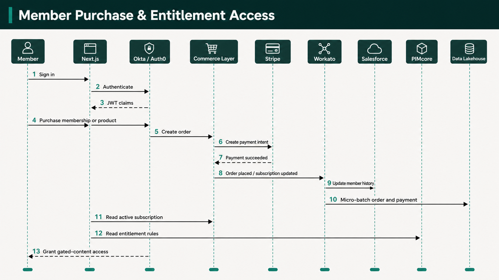

---

### 4.6 Payment Gateway Tokens & Charges — Stripe

**System of Record**: Stripe
**Primary Identifier**: `PaymentIntent ID` (`pi_...`), `Charge ID` (`ch_...`)

#### Industry Evidence

Stripe's tokenisation architecture eliminates PCI scope from BSAVA's infrastructure:

> *"Tokenization replaces sensitive card details (like a 16-digit credit card number) with a non-sensitive surrogate value (a token) that cannot be mathematically reverse-engineered... By using Stripe's hosted fields or prebuilt checkout pages (such as Stripe Checkout or Stripe Elements), sensitive payment data is transmitted directly from the client browser to Stripe without touching your server, significantly reducing your PCI DSS compliance scope to Self-Assessment Questionnaire A (SAQ A)."*
> — **Stripe**, *Security & PCI Compliance Documentation* (2024) [\[Source\]](https://stripe.com/docs/security)

The PCI Security Standards Council validates scope reduction through tokenisation:

> *"Tokenization solutions do not eliminate the need to maintain and validate PCI DSS compliance, but they may simplify a merchant's validation efforts by reducing the number of system components for which PCI DSS requirements apply."*
> — **PCI Security Standards Council**, *Information Supplement: PCI DSS Tokenization Guidelines* (2011) [\[Source\]](https://www.pcisecuritystandards.org/documents/Tokenization_Guidelines_Info_Supp.pdf)

Stripe's webhook architecture enables reliable event-driven integration:

> *"Stripe uses HTTPS to send webhook events to your app as a JSON payload that includes an Event object. Receiving webhook events helps you respond to asynchronous events, such as when a customer's bank confirms a payment, a customer disputes a charge, or a recurring payment succeeds."*
> — **Stripe**, *Receive Stripe Events in Your Webhook Endpoint* (2024) [\[Source\]](https://stripe.com/docs/webhooks)

#### Architectural Justification

1. **Zero-PCI Compliance Scope**: Cardholder Primary Account Numbers (PANs) and CVVs never touch BSAVA servers, passing directly from browser client SDKs to Stripe. This reduces BSAVA's compliance scope to SAQ A.

2. **Robust Webhook Ecosystem**: Stripe provides reliable webhooks with automatic retries for instant order confirmation and automated subscription billing management.

3. **Gateway Settlement Reconciliation**: Detailed transaction metadata (`PaymentIntent`, `Charge`, `Refund` objects) allows daily automated financial balancing against Commerce Layer orders and Sage Intacct general ledger journals.

---

### 4.7 Events, Conferences & Delegate Registrations — Swoogo

**System of Record**: Swoogo
**Primary Identifier**: `Attendee ID` / `Event ID`

#### Industry Evidence

> *"Event management platforms act as the specialized system of record for an organization's Total Event Program. While the CRM remains the master record for customer accounts, platforms like Cvent, Swoogo, and Bizzabo serve as the authoritative system of record for attendee registration, session engagement, session check-ins, and event spend, seamlessly syncing aggregated engagement data downstream to CRMs and MAPs."*
> — **Cvent**, *Platform Enterprise Architecture & SEC Form S-1 Filing* (2023) [\[Source\]](https://www.sec.gov/Archives/edgar/data/1410428/000119312521295287/d188720ds1.htm)

#### Architectural Justification

1. **Specialised Event Operations**: Manages complex veterinary congresses, workshop seat limits, multi-track session schedules, speaker profiles, and badge printing requirements that cannot be handled by standard e-commerce or CRM platforms.

2. **Bi-Directional Workato Sync**: Workato automatically syncs Minimal Viable Event (MVE) product records from Swoogo into PIMcore for public sale, and returns completed attendance records to Salesforce for member history enrichment.

---

### 4.8 Learning Courses, CPD Accreditations & Progress — Brightspace (D2L LMS)

**System of Record**: Brightspace (D2L LMS)
**Primary Identifier**: `Student ID` / `Course ID`

#### Industry Evidence

D2L positions Brightspace as the authoritative platform for CPD tracking:

> *"My CPD Records is a tool within Brightspace that allows users to set professional development targets and track their progress toward them... It acts as a single source of truth for documenting an individual's professional learning, including structured and unstructured learning activities... Administrators can also configure categories, targets, and permissions to align with organizational accreditation requirements."*
> — **D2L (Desire2Learn)**, *Brightspace Knowledge Base: About My CPD Records* (2024) [\[Source\]](https://community.d2l.com/brightspace/kb/articles/4518)

The boundary between LMS and CRM is well-established in learning architecture:

> *"While a CRM is the system of record for customer relationships, pipeline, and account data, the LMS must serve as the authoritative system of record for learning data, including granular course progress, module-level assessment scores, compliance completions, and accredited certifications. Attempting to manage course logic or completion data inside a CRM undermines learning compliance, audit trails, and pedagogical tracking."*
> — **Absorb LMS**, *LMS vs. CRM Integration Strategies: Defining Systems of Record for Learning* (2024) [\[Source\]](https://www.absorblms.com/blog/lms-vs-crm-integration)

#### Architectural Justification

1. **Veterinary Accreditation Standard**: Purpose-built LMS handling interactive veterinary e-learning, prerequisites, SCORM/LTI content, and mandatory Continuing Professional Development (CPD) credit rules.

2. **Operational Decoupling**: Progress tracking and quiz evaluation occur inside Brightspace. Only completed CPD credits and certificates are pushed to Salesforce via Workato for member transcripts.

---

### 4.9 Financial Ledger & Tax Invoices — Sage Intacct

**System of Record**: Sage Intacct (Cloud Financial Management)
**Primary Identifier**: `Invoice ID` / `Journal ID`

#### Industry Evidence

Sage Intacct is purpose-built as a cloud-native financial system of record, with particular strength in the nonprofit and association sector:

> *"Sage Intacct uses a dimensional general ledger structure that allows nonprofits to tag transactions with attributes like grant, fund, program, location, or department without creating a complex, unwieldy chart of accounts. This makes it easier to track restricted vs. unrestricted funds and report on specific mission outcomes."*
> — **Sage Intacct**, *Cloud Financial Management for Nonprofits* (2024) [\[Source\]](https://www.sageintacct.com/solutions/nonprofit-accounting-software)

> *"An ERP system serves as the definitive financial system of record, maintaining the General Ledger, revenue recognition rules, and audit controls. Operating e-commerce transaction data separately from the core financial ledger prevents manual reconciliation errors, ensures statutory compliance, and preserves auditability through strict segregation of duties and automated posting controls."*
> — **Oracle NetSuite**, *Understanding Enterprise System of Record Architecture* (2024) [\[Source\]](https://www.netsuite.com/portal/resource/articles/erp/system-of-record.shtml)

#### Architectural Justification

1. **Dimensional General Ledger**: Sage Intacct's multi-dimensional GL enables BSAVA to tag every transaction by fund, programme, department, and cost centre without inflating the chart of accounts — critical for a membership association managing restricted funds, event revenue, and publication income streams.

2. **Native Nonprofit Fund Accounting**: Automates fund balancing and separate closes for different revenue sources (membership dues, event registrations, publication sales), ensuring transparency and accountability for the BSAVA board and auditors.

3. **Statutory Financial Governance**: Implements immutable double-entry bookkeeping and compliance with UK financial and tax regulations (VAT returns, Making Tax Digital, period-end close).

4. **Separation from E-Commerce**: Keeps operational shopping cart mutations in Commerce Layer separated from Sage Intacct's accounting ledgers until formal order completion and payment capture via Workato orchestration.

5. **Built-in Financial Reporting**: Sage Intacct provides native real-time financial reporting dashboards alongside the data flowing into Microsoft Fabric / Power BI for cross-domain analytical views.

---

### 4.10 Search Operational Index — Algolia (Operational Cache)

**System of Record**: Algolia *(Operational Read Cache — Not a persistent SoR)*
**Primary Identifier**: `ObjectID`

#### Industry Evidence

> *"Algolia's Distributed Search Network (DSN) automatically replicates your search indices across global server clusters, serving requests from the nearest geographic location. Search indices are held in RAM to eliminate disk I/O bottlenecks and maintain sub-50ms search response times worldwide."*
> — **Algolia**, *Documentation: Distributed Search Network (DSN) & Infrastructure Architecture* (2022) [\[Source\]](https://www.algolia.com/doc/guides/scaling/distributed-search-network-dsn/)

#### Architectural Justification

1. **Sub-50ms Global Search**: Delivers instant search-as-you-type UX across products, articles, guidelines, and courses.

2. **Cache Topology**: Algolia contains no unique persistent data; it is an operational cache continuously updated via Workato webhooks from PIMcore, Contentful, and Brightspace. If the search engine experiences an outage, the Next.js frontend gracefully falls back to direct PIMcore/Contentful queries without data loss.

---

### 4.11 Enterprise Historical Analytics & BI — Microsoft Fabric (OneLake)

**System of Record**: Microsoft Fabric (OneLake Lakehouse)
**Primary Identifier**: Unified `Member_360_ID`
**Reporting Layer**: Power BI (Direct Lake mode connected to OneLake Gold datamarts)

#### Industry Evidence

Microsoft Fabric implements the Medallion Architecture natively on OneLake using the Delta Lake open format:

> *"A medallion architecture is a data design pattern that is used to logically organize data in a lakehouse, with the goal of incrementally and progressively improving the structure and quality of data as it flows through each layer of the architecture (from Bronze to Silver to Gold tables)."*
> — **Databricks**, *Documentation: What is the Medallion Lakehouse Architecture?* (2023) [\[Source\]](https://docs.databricks.com/en/lakehouse/medallion.html)

Microsoft Fabric brings this pattern into a unified SaaS analytics platform:

> *"OneLake acts as the unified data lake for Fabric. You can implement the medallion architecture using separate Lakehouses for each layer (Bronze, Silver, Gold) or a combination of Lakehouses and Fabric Warehouses. Fabric utilises the Delta Lake format by default across all layers, enabling efficient ACID transactions and schema enforcement, helping to eliminate data silos and duplication."*
> — **Microsoft**, *Microsoft Fabric Documentation: Implement a Medallion Lakehouse Architecture* (2024) [\[Source\]](https://learn.microsoft.com/en-us/fabric/onelake/onelake-medallion-lakehouse-architecture)

PII masking within the Medallion layers is architecturally mandated:

> *"In a medallion architecture (Bronze, Silver, Gold), the Bronze layer acts as the raw, immutable system of record. To handle PII securely and maintain compliance, dynamic data masking and column-level encryption are applied in the Silver and Gold layers. For regulatory erasure (e.g., GDPR), complete deletion should begin in the Bronze layer and propagate down to Silver and Gold."*
> — **Databricks / Microsoft Azure Architecture Center**, *Handle PII and Data Masking in Delta Lakehouse* (2024) [\[Source\]](https://docs.databricks.com/en/data-governance/unity-catalog/column-masking.html)

#### Architectural Justification

1. **Unified Microsoft Ecosystem**: Microsoft Fabric consolidates data engineering (Data Factory, Spark Notebooks), data warehousing, and Power BI reporting into a single SaaS capacity — eliminating the need to manage separate Snowflake/Databricks subscriptions alongside Power BI. OneLake provides a single-copy storage layer in Azure UK South.

2. **Power BI Direct Lake Mode**: Gold-layer datamarts connect to Power BI via Direct Lake mode, enabling sub-second dashboard rendering directly from OneLake Parquet/Delta files without data duplication into Power BI import models.

3. **Avoidance of CRM Storage & API Limits**: Storing high-frequency logs in Salesforce causes exorbitant storage fees and governor limit breaches. Microsoft Fabric ingests raw JSON/CSV data efficiently via Workato micro-batching into OneLake Bronze tables.

4. **UK GDPR Compliance**: Enforces Silver/Gold zone field-level masking (e.g., hashing DOBs to year-only, masking email addresses as `j***@domain.co.uk`) to allow cross-system analytical queries while strictly protecting PII. All Fabric workspaces are provisioned in **Azure UK South** to guarantee data residency.

5. **Sage Intacct Financial Integration**: Sage Intacct general ledger extracts are loaded nightly into the Bronze layer, cleansed in Silver, and joined with Commerce Layer order data in Gold datamarts for unified revenue reconciliation dashboards in Power BI.

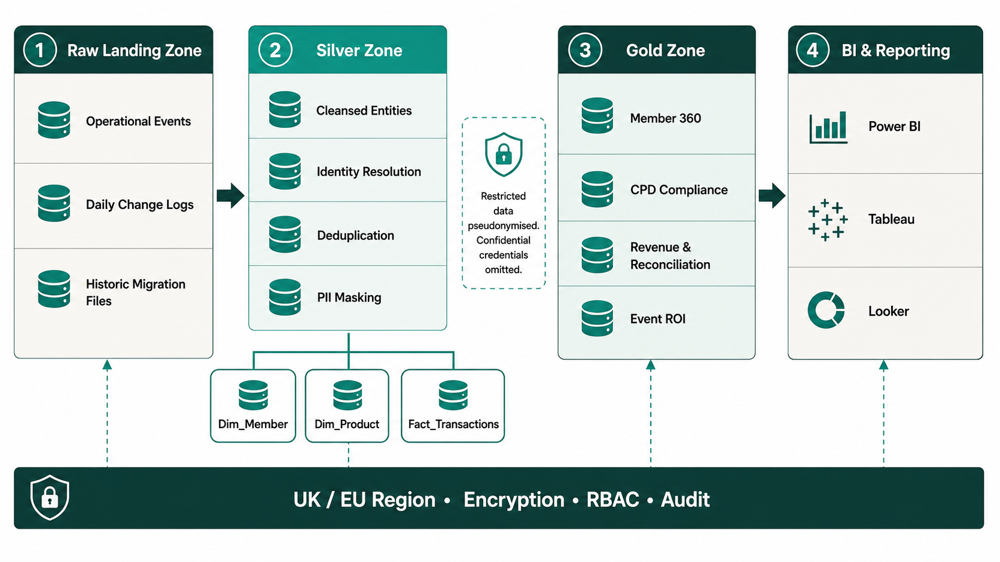

---

## 5. Integration & Data Orchestration Strategy (Workato)

Workato acts as the central **Integration Platform as a Service (IPaaS)** connecting the SoRs. MuleSoft articulates the API-led connectivity model that governs this layer:

> *"API-led connectivity is a methodical way to connect data to applications through reusable and purposeful APIs. These APIs are developed and categorized into three distinct layers: System APIs, Process APIs, and Experience APIs, allowing decentralized access to data while maintaining governance."*
> — **MuleSoft (Salesforce)**, *What is API-Led Connectivity?* (2021) [\[Source\]](https://www.mulesoft.com/resources/api/what-is-api-led-connectivity)

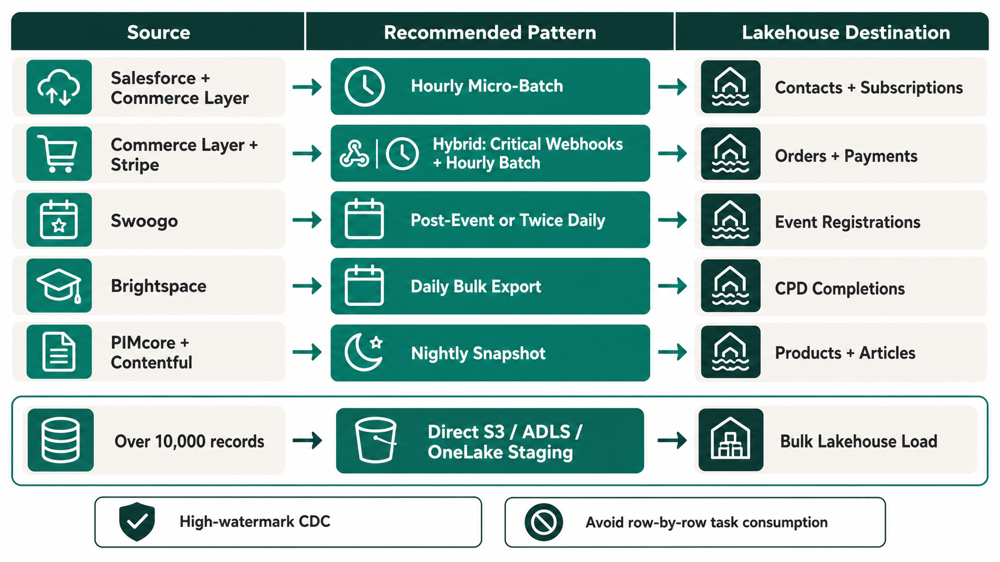

### Token Governance & Processing Patterns

To adhere to BSAVA's commercial quota of **1,000,000 Workato tasks/year**, integrations are strictly governed by three execution patterns:

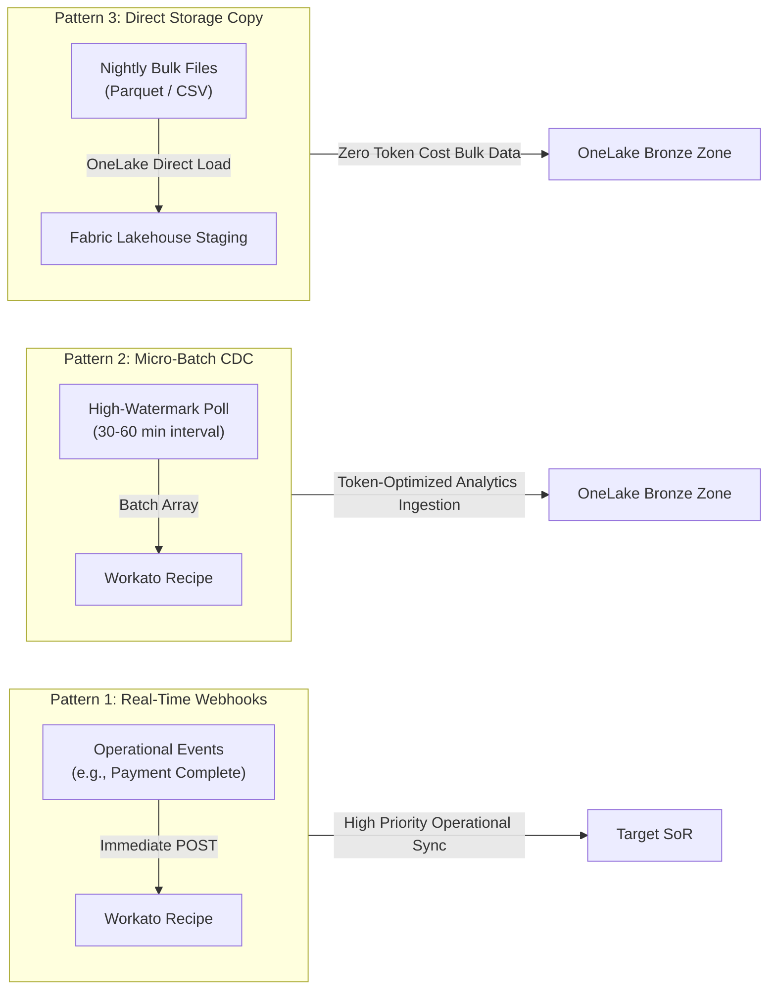

1. **Real-Time Operational Webhooks**: Reserved exclusively for critical user-facing transactions (e.g. payment confirmations, instant CRM profile updates).

   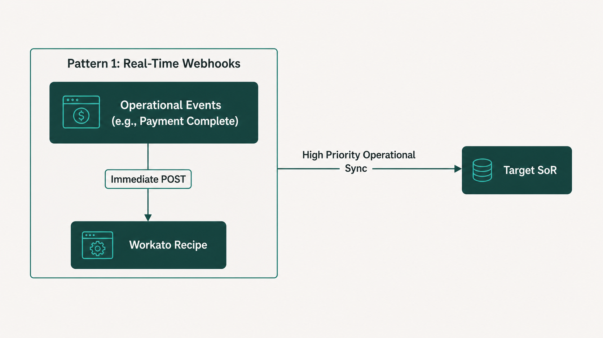

2. **Scheduled Micro-Batching (Hourly CDC)**: Used for analytical data ingestion into the Lakehouse. Collects all modified records in 60-minute arrays (processing up to thousands of records in 1 Workato task).

   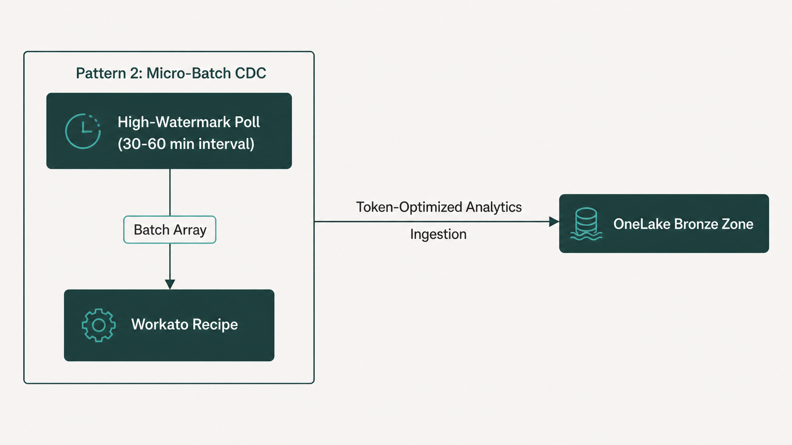

3. **Daily Direct Storage Staging**: Large datasets (> 10,000 records) bypass row-by-row processing, pushing bulk Parquet/CSV files directly into **OneLake** (Microsoft Fabric's unified storage layer) for native Lakehouse loading.

   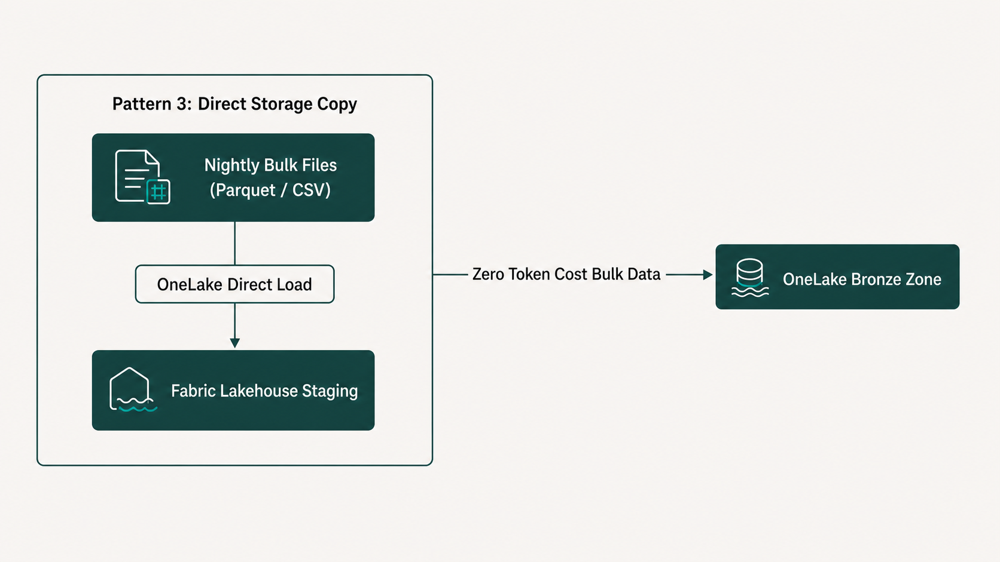

---

## 6. UK GDPR & Data Governance Framework

### 6.1 Data Protection by Design

The UK Information Commissioner's Office (ICO) mandates privacy-by-design:

> *"Data protection by design means thinking about privacy and data protection from start to end. Under Article 25 of the UK GDPR, controllers must implement appropriate technical and organisational measures, such as pseudonymisation, which are designed to implement data-protection principles into processing activities effectively and integrate necessary safeguards."*
> — **UK Information Commissioner's Office (ICO)**, *Guide to Data Protection: Data Protection by Design and Default* (2024) [\[Source\]](https://ico.org.uk/for-organisations/uk-gdpr-guidance-and-resources/accountability-and-governance/data-protection-by-design-and-default/)

The GDPR regulation text itself mandates this approach:

> *"Taking into account the state of the art, the cost of implementation and the nature, scope, context and purposes of processing as well as the risks... the controller shall, both at the time of the determination of the means for processing and at the time of the processing itself, implement appropriate technical and organisational measures, such as pseudonymisation, which are designed to implement data-protection principles, such as data minimisation, in an effective manner."*
> — **European Parliament and Council**, *GDPR Article 25: Data Protection by Design and by Default* (2016) [\[Source\]](https://gdpr-info.eu/art-25-gdpr/)

### 6.2 Cloud Region Binding

All operational Systems of Record and the Microsoft Fabric capacity (including OneLake storage) must be provisioned exclusively within **Azure UK South**. Unmasked personal data must never cross outside certified UK/EU boundaries.

### 6.3 Data Classification & Masking Rules

| Sensitivity Tier | Associated Data Domains | Access Controls | Lakehouse Masking Policy |
| :--- | :--- | :--- | :--- |
| **Public** | Editorial Content (Contentful), Product Catalogs (PIMcore), Public Event Schedules (Swoogo) | Open Read Access | Ingested unmasked into Silver and Gold layers |
| **Internal** | General Ledger Accounts (Sage Intacct), Aggregate Course Analytics (Brightspace) | Internal RBAC; Encrypted at rest | Available for Power BI reporting and Sage Intacct financial dashboards |
| **Restricted** | Member Contacts (Salesforce), Subscriptions (Commerce Layer), CPD Transcripts (Brightspace) | Strict RBAC; AES-256 at rest | **Pseudonymised**: Email masked (`j***@domain.co.uk`); DOB truncated to birth year in Silver. Unmasked in Gold via role-gated policies |
| **Confidential** | CIAM Passwords/Hashes (Okta), Payment Tokens (Stripe), Safeguarding Notes | Cryptographically Isolated; Strict Least Privilege | **Strictly Omitted**: Passwords/tokens never loaded into Lakehouse. Sensitive notes SHA-256 hashed or excluded |

---

## 7. Summary Matrix & Governance Checklist

To maintain architectural integrity post-launch, the IT Steering Committee must enforce the following compliance checklist:

- [x] **Single Operational Master**: No record type has more than one operational SoR.
- [x] **No Direct Frontend DB Writing**: The Next.js frontend calls dedicated API endpoints or Commerce Layer/CIAM SDKs — never direct database connections.
- [x] **Edge Security**: Sensitive authentication credentials reside in CIAM; passwords/tokens are never passed to CRM or analytics layers.
- [x] **UK GDPR Data Residency**: All operational SoRs and Microsoft Fabric capacity are pinned to **Azure UK South**.
- [x] **Workato Token Budgeting**: Batch array processing and direct storage staging are enforced to stay under 1,000,000 tasks/year.

---

## 8. Bibliography & References

| # | Source | Publication | Year | URL |
| :--- | :--- | :--- | :--- | :--- |
| 1 | MACH Alliance | *What is MACH Architecture?* | 2020 | [machalliance.org](https://machalliance.org/mach-architecture) |
| 2 | Martin Fowler | *Bounded Context* (martinfowler.com Bliki) | 2014 | [martinfowler.com](https://martinfowler.com/bliki/BoundedContext.html) |
| 3 | Eric Evans | *Domain-Driven Design: Tackling Complexity in the Heart of Software* | 2003 | [domainlanguage.com](https://www.domainlanguage.com/ddd/) |
| 4 | Gregor Hohpe | *Enterprise Integration Patterns* | 2024 | [enterpriseintegrationpatterns.com](https://www.enterpriseintegrationpatterns.com/) |
| 5 | Gartner | *Composable Business Strategy Keynote* | 2020 | [gartner.com](https://www.gartner.com/en/newsroom/press-releases/2020-10-19-gartner-keynote-composable-business-strategy) |
| 6 | Gartner | *Magic Quadrant for CRM Customer Engagement Center* | 2021–2024 | [gartner.com](https://www.gartner.com/en/documents/3889025) |
| 7 | Gartner | *Composable Commerce Must Be Adopted for the Future of Applications* | 2020 | [gartner.com](https://www.gartner.com/en/documents/3986598) |
| 8 | Forrester Research | *The Forrester Wave: CRM* | 2023–2024 | [forrester.com](https://www.forrester.com) |
| 9 | Forrester Research | *The Forrester Wave: Product Information Management, Q4 2023* | 2023 | [forrester.com](https://www.forrester.com/report/the-forrester-wave-product-information-management-q4-2023/RES179532) |
| 10 | Forrester Research | *The Forrester Wave: CIAM Solutions, Q4 2024* | 2024 | [forrester.com](https://www.forrester.com/report/the-forrester-wave-customer-identity-and-access-management-solutions-q4-2024/RES180907) |
| 11 | Salesforce | *Nonprofit Cloud Product Overview* | 2023 | [salesforce.com](https://www.salesforce.com/products/nonprofit/) |
| 12 | Salesforce Developer Network | *Best Practices for Large Data Volumes* | 2022–2025 | [developer.salesforce.com](https://developer.salesforce.com/docs/atlas.en-us.salesforce_large_data_volumes_bp.meta/salesforce_large_data_volumes_bp/) |
| 13 | Auth0 by Okta | *Identity Architecture Guide* | 2024 | [auth0.com](https://auth0.com/docs/get-started/identity-fundamentals) |
| 14 | Auth0 by Okta | *Auth0 Actions & Extensibility Pipeline* | 2024 | [auth0.com](https://auth0.com/docs/customize/actions/actions-overview) |
| 15 | NIST | *SP 800-63B: Digital Identity Guidelines* | 2020 | [nist.gov](https://pages.nist.gov/800-63-3/sp800-63b.html) |
| 16 | NIST | *SP 800-207: Zero Trust Architecture* | 2020 | [nist.gov](https://csrc.nist.gov/publications/detail/sp/800-207/final) |
| 17 | Microsoft | *Entra External ID: CIAM Overview* | 2024 | [microsoft.com](https://learn.microsoft.com/en-us/entra/external-id/customers/overview-customers-ciam) |
| 18 | Pimcore GmbH | *Data Objects & Object Classes Documentation* | 2024 | [pimcore.com](https://pimcore.com/docs/platform/Pimcore/Data_Objects/index.html) |
| 19 | Akeneo | *PIM as the Heartbeat of Composable Commerce* | 2023 | [akeneo.com](https://www.akeneo.com/blog/composable-commerce-pim/) |
| 20 | inRiver | *PIM vs. CMS: Understanding the Difference* | 2024 | [inriver.com](https://www.inriver.com/blog/pim-vs-cms/) |
| 21 | Revenera | *Entitlement Management: Single Source of Truth for Feature Access* | 2023 | [revenera.com](https://www.revenera.com/blog/software-monetization/entitlement-management-system-of-record/) |
| 22 | Contentful | *Content Platform: A Single Source of Truth for Content* | 2022 | [contentful.com](https://www.contentful.com/blog/content-platform-single-source-of-truth/) |
| 23 | Commerce Layer | *Documentation: Core Concepts & Order Management* | 2024 | [commercelayer.io](https://commercelayer.io/docs) |
| 24 | commercetools | *Composable Commerce Integration Patterns* | 2023 | [commercetools.com](https://commercetools.com/architecture) |
| 25 | Stripe | *Security & PCI Compliance Documentation* | 2024 | [stripe.com](https://stripe.com/docs/security) |
| 26 | Stripe | *Webhook Events Documentation* | 2024 | [stripe.com](https://stripe.com/docs/webhooks) |
| 27 | PCI SSC | *Tokenization Guidelines Information Supplement* | 2011 | [pcisecuritystandards.org](https://www.pcisecuritystandards.org/documents/Tokenization_Guidelines_Info_Supp.pdf) |
| 28 | D2L | *Brightspace: About My CPD Records* | 2024 | [community.d2l.com](https://community.d2l.com/brightspace/kb/articles/4518) |
| 29 | Absorb LMS | *LMS vs. CRM Integration Strategies* | 2024 | [absorblms.com](https://www.absorblms.com/blog/lms-vs-crm-integration) |
| 30 | Cvent / SEC | *Platform Enterprise Architecture (S-1 Filing)* | 2023 | [sec.gov](https://www.sec.gov/Archives/edgar/data/1410428/000119312521295287/d188720ds1.htm) |
| 31 | Oracle NetSuite | *Understanding Enterprise System of Record Architecture* | 2024 | [netsuite.com](https://www.netsuite.com/portal/resource/articles/erp/system-of-record.shtml) |
| 32 | Sage Intacct | *Cloud Financial Management for Nonprofits* | 2024 | [sageintacct.com](https://www.sageintacct.com/solutions/nonprofit-accounting-software) |
| 33 | Databricks | *What is the Medallion Lakehouse Architecture?* | 2023 | [databricks.com](https://docs.databricks.com/en/lakehouse/medallion.html) |
| 34 | Microsoft | *Microsoft Fabric: Implement a Medallion Lakehouse Architecture* | 2024 | [microsoft.com](https://learn.microsoft.com/en-us/fabric/onelake/onelake-medallion-lakehouse-architecture) |
| 35 | Databricks / Azure | *Handle PII and Data Masking in Delta Lakehouse* | 2024 | [databricks.com](https://docs.databricks.com/en/data-governance/unity-catalog/column-masking.html) |
| 36 | Algolia | *Distributed Search Network (DSN) Documentation* | 2022 | [algolia.com](https://www.algolia.com/doc/guides/scaling/distributed-search-network-dsn/) |
| 37 | MuleSoft | *What is API-Led Connectivity?* | 2021 | [mulesoft.com](https://www.mulesoft.com/resources/api/what-is-api-led-connectivity) |
| 38 | UK ICO | *Data Protection by Design and Default Guidance* | 2024 | [ico.org.uk](https://ico.org.uk/for-organisations/uk-gdpr-guidance-and-resources/accountability-and-governance/data-protection-by-design-and-default/) |
| 39 | European Parliament | *GDPR Article 25: Data Protection by Design and by Default* | 2016 | [gdpr-info.eu](https://gdpr-info.eu/art-25-gdpr/) |

---

*End of BSAVA Systems of Record Enhanced Whitepaper — v2.0.0*
