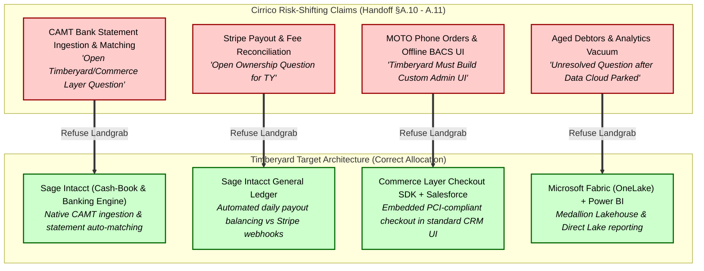
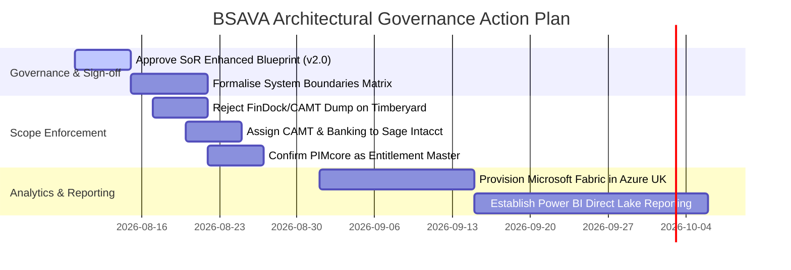

# Strategic Architectural Briefing: Analysis of Cirrico Handover Documents vs. Timberyard MACH Target Architecture

| Document Metadata | Details |
| :--- | :--- |
| **Client** | British Small Animal Veterinary Association (BSAVA) |
| **Author** | Timberyard Solutions Architecture & Advisory Team |
| **Version** | v1.0.0 — Executive Briefing & Landgrab Analysis |
| **Date** | August 2026 |
| **Status** | Strategic Advisory & Steering Committee Briefing |
| **Reviewed Rival Documents** | 1. `BSAVA - Timberyard Handoff and Discovery Compendium` (v3.8, 31st July 2026) 2. `BSAVA - Capability to Object Mapping` (v1.1, 31st July 2026) 3. `BSAVA - Fonteva-to-NPC Automation Inventory` (v1.0, 31st July 2026) |
| **Benchmark Standard** | [`BSAVA_Systems_of_Record_Justifications_Enhanced.md`](file:///home/timbowden/dev/bsava-com/documents/architecture/BSAVA_Systems_of_Record_Justifications_Enhanced.md) (v2.0.0) |

---

## Executive Summary

Following the alignment call between **Timberyard**, **BSAVA**, and **Cirrico** on 27th July 2026, Cirrico updated their discovery compendium and handover artifacts (v3.8 Handoff Compendium, v1.1 Object Mapping, and v1.0 Automation Inventory). 

These documents mark a formal pivot by Cirrico away from their original monolithic design — which attempted to centralise e-commerce, event management, portals, payment processing, and analytics inside Salesforce (via NPSP, Fonteva, FinDock, Data Cloud, Agentforce, and Experience Cloud) — toward Timberyard’s recommended **Headless Composable MACH Architecture** (Contentful, Commerce Layer, PIMcore, Stripe, Swoogo, Brightspace, Okta, Next.js/Vercel, Workato, Sage Intacct, and Microsoft Fabric).

However, a detailed forensic review of Cirrico's 3 handover documents reveals significant **architectural landgrabs, defensive risk-shifting, and structural gaps**:

1. **Strategic Pivot Compliance**: Cirrico concedes that Salesforce is now *downstream* of transactional operations, with Timberyard’s chosen best-of-breed platforms acting as authoritative Systems of Record (SoRs).
2. **Defensive Risk-Shifting (The "FinDock Vacuum")**: Having failed to deliver financial reconciliation via FinDock, Cirrico dumped **13 open finance questions** (CAMT bank statement processing, Barclays statement auto-matching, payout reconciliation, MOTO phone orders, offline BACS) onto Timberyard, falsely claiming these are "Timberyard scope items" or require custom frontend development.
3. **Entitlement & Catalog Landgrab**: Cirrico attempted to build a competing entitlement model directly inside Salesforce NPC sandbox (`bsava-develop`) to retain Salesforce as an access gatekeeper, contradicting PIMcore's position as the single Product and Entitlement Master.
4. **Integration Layer Erasure**: Cirrico’s *Automation Inventory* evaluates 59 legacy Fonteva automations through a rigid binary lens (Salesforce vs. Frontend UXL), completely ignoring **Workato** and dedicated headless microservices (Commerce Layer, PIMcore, Stripe).

This briefing equips BSAVA leadership and the IT Steering Committee with a detailed breakdown of where Cirrico’s documentation **agrees**, where it **disagrees**, and the **critical architectural gaps** that must be shut down to prevent project bloat, cost overruns, and scope erosion.

---

## 1. Executive Summary Table: Architectural Alignment & Gap Summary

| Data Domain / Architecture | Timberyard SoR Blueprint (v2.0) | Cirrico Handover Position (v3.8) | Alignment Status | Strategic Risk / Gap in Cirrico Position |
| :--- | :--- | :--- | :--- | :--- |
| **Order Management (OMS)** | **Commerce Layer** (Authoritative SoR for carts, orders, subscriptions, refunds) | Agrees: Commerce Layer is authoritative for orders; Salesforce sits downstream. | ✅ **Agreed** | Cirrico attempts to retain summary Sales Order creation in Salesforce, risking data duplication. |
| **Product & Entitlements** | **PIMcore** (Single master for catalog, SKUs, digital assets, VAT/GL codes, entitlement rules) | Concedes PIMcore is PIM/DAM master, but built competing entitlement models in Salesforce NPC sandbox. | ⚠️ **Partial Disagreement** | Cirrico attempted a Salesforce-side entitlement landgrab; access rules belong strictly in PIMcore. |
| **Content & Editorial** | **Contentful** (Authoritative CMS for articles, guidelines, pages) | Agrees: Contentful is the CMS (superseding earlier Sanity / Salesforce Knowledge assumptions). | ✅ **Agreed** | Fully aligned. |
| **Payments & PCI Scope** | **Stripe** (Authoritative gateway; client-side tokenisation reduces PCI to SAQ A) | Agrees: Stripe handles card payments inside Commerce Layer stack; FinDock on hold. | ✅ **Agreed** | Cirrico shifts Stripe payout reconciliation and MOTO phone order workflows onto Timberyard as open gaps. |
| **Events & Conferences** | **Swoogo** (Authoritative SoR for schedules, rosters, delegate check-ins) | Agrees: Swoogo retained; Blackthorn removed; Timberyard delivers UX. | ✅ **Agreed** | Fully aligned. |
| **Learning & CPD** | **Brightspace (D2L)** (LMS master for courses, progress, quiz scores, CPD credits) | Agrees: Brightspace owns learning tracking; Salesforce holds transcript references. | ✅ **Agreed** | Fully aligned. |
| **User Identity & CIAM** | **Okta / Auth0** (Edge JWT issuance, MFA, credential lifecycle) | Agrees: Okta is CIAM provider; Experience Cloud portals eliminated. | ✅ **Agreed** | Fully aligned. |
| **Financial Ledger & Tax** | **Sage Intacct** (Dimensional General Ledger, VAT, fund accounting, cash book) | Acknowledges Sage Intacct target, but dumps CAMT bank reconciliation and payout matching onto Timberyard. | ❌ **Disagrees / Gap** | **Major Landgrab**: Cirrico dumped 13 FinDock finance gaps onto Timberyard instead of routing to Sage. |
| **Enterprise Analytics** | **Microsoft Fabric (OneLake)** + **Power BI** (Medallion Lakehouse in Azure UK South) | Data Cloud parked; leaves aged debtors and BI analytics as an "unresolved open question". | ❌ **Critical Gap** | Cirrico left an analytics vacuum after Data Cloud failure; resolved by Timberyard's Fabric architecture. |
| **Integration Middleware** | **Workato** (Event webhooks & scheduled CDC micro-batching <1M tasks/yr) | Confirms Workato as middleware, but ignores it completely in the Automation Inventory. | ⚠️ **Partial Alignment** | Cirrico's Automation Inventory forces a binary Salesforce-vs-UXL choice, hiding Workato's orchestration role. |

---

## 2. Where Cirrico Agrees with Timberyard's Target Architecture

Cirrico's latest handover documentation (v3.8) contains formal concessions that validate Timberyard’s architectural strategy:

1. **Salesforce is Downstream of Operational Transactions**: Cirrico explicitly states:
   > *"Salesforce sits downstream of transactions: Commerce Layer is authoritative for orders and refunds; Swoogo is authoritative for events; PIMCore is authoritative for product data and entitlement rules... Salesforce carries the customer record with lightweight downstream references to activity in the specialist systems."* (Handoff §2, p. 5)

2. **Removal of Monolithic Product Stack**: Cirrico confirms the removal or parking of several bloated Salesforce add-on modules:
   * **FinDock**: On hold (licence active, usage paused; payment processing moved to Stripe/Commerce Layer).
   * **Data Cloud**: Parked (abandoned as the unified analytics layer).
   * **Agentforce / AI**: Parked.
   * **Experience Cloud Portals**: Eliminated (Timberyard delivers all member and customer-facing portal UX).
   * **Blackthorn Events**: Removed in favour of Swoogo.
   * **Sanity CMS**: Replaced by Contentful.
   * **Shopify**: Replaced by Commerce Layer.

3. **Confirmation of Timberyard Core Stack**: Cirrico's Handoff Compendium (§5) explicitly lists and accepts all 10 components of Timberyard’s composable stack:
   - **Contentful** (CMS)
   - **Commerce Layer** (OMS & e-commerce engine)
   - **PIMcore** (PIM/DAM product master)
   - **Stripe** (Payment acquirer)
   - **Swoogo** (Events management)
   - **Brightspace** (LMS integration)
   - **Okta** (CIAM user identity)
   - **Workato** (Integration IPaaS)
   - **Next.js on Vercel + React Native PWA** (User Experience Layer)
   - **Algolia** (Operational search cache)

---

## 3. Where Cirrico Disagrees or Pushes Back Against Timberyard's Blueprint

Despite agreeing to the high-level stack names, Cirrico’s detailed text pushes back on several core domain boundaries, attempting to preserve Salesforce-centric control:

### 3.1 Entitlement Model Ownership (PIMcore vs. Salesforce NPC)
* **Timberyard SoR Blueprint**: PIMcore is the single source of truth for **Entitlement Definitions & Access Rules** (defining which products, memberships, or subscription tiers unlock specific digital manuals, clinical guidelines, or event discounts). Access criteria are defined once in PIMcore and syndicated to Commerce Layer, Contentful, and Okta JWT claims.
* **Cirrico Pushback**: In Handoff §5.3 (P3186), Cirrico admits:
  > *"Entitlement model deep-dive — Cirrico built a data model in sandbox and paused pending Timberyard / BSAVA alignment."*
  Cirrico attempted to build a custom entitlement engine inside Salesforce NPC (`bsava-develop` sandbox). They continue to argue that Salesforce should evaluate entitlement rules dynamically via API calls during user sessions.
* **Rebuttal**: Dynamic runtime queries to Salesforce for entitlement checks breach governor limits, introduce 300ms+ API latency on page loads, and re-couple presentation to CRM uptime. Entitlements belong natively in **PIMcore** and must be evaluated at the edge via **Okta JWT claims** and **Commerce Layer**.

### 3.2 Master Data Synchronization Path (Sage ↔ Salesforce ↔ PIMcore)
* **Timberyard SoR Blueprint**: Workato orchestrates reference data directly between **Sage Intacct** and **PIMcore**. Tax rates (VAT by country), nominal ledger codes, department codes, and cost centres are pulled from Sage Intacct and updated in PIMcore as first-class product attributes.
* **Cirrico Pushback**: In Handoff §A.10.5 (P3721), Cirrico suggests:
  > *"Adrian raised on 1 December the idea of syncing code creation from Sage to Salesforce via the API... Workato needs to pull the reference list from Sage on a defined cadence and refresh PIMCore's picklists."*
  Cirrico attempts to route financial master data into Salesforce first before passing it downstream to PIMcore.
* **Rebuttal**: Salesforce is not a middleman for product metadata. Routing Sage tax/GL codes through Salesforce adds unnecessary API hops, custom fields, and Workato token consumption. PIMcore is the Product Master and connects directly to Sage Intacct via Workato.

---

## 4. In-Depth Analysis of Gaps, Risks & Landgrab Attempts in Cirrico's Documents

Cirrico’s 3 handover documents contain several strategic maneuvers designed to shift technical risk onto Timberyard, create false scope dependencies, or cover up gaps left by their failed original architecture.

### Landgrab 1: Shifting FinDock / Banking Reconciliation onto Timberyard (§A.10.1 & §A.11)
When BSAVA paused FinDock, Cirrico lost their planned engine for bank reconciliation, CAMT statement ingestion, and payout matching. Rather than routing this capability to **Sage Intacct** (where it natively belongs), Cirrico dumped **13 open finance questions** into Appendix A.10/A.11 of the Handoff document, labeling them as "open Timberyard ownership questions":

* **Cirrico Claim (§A.10.1, P3689)**: *"CAMT file parsing and bank statement ingestion — Open architectural gap: not Commerce Layer's job, not Stripe's job, not Sage's current inbound flow. Workato is a plausible pipeline... Timberyard to confirm."*
* **Cirrico Claim (§A.10.1, P3698)**: *"Stripe payout reconciliation — Open: Commerce Layer already knows the transactions; matching payout amount minus fees against transactions could live in Commerce Layer..."*
* **Timberyard Rebuttal & Correct Architecture**:
  1. **CAMT Statement Ingestion**: Bank statement reconciliation (ISO 20022 CAMT XML files from Barclays) is a core **ERP / Accounting function**. It belongs inside **Sage Intacct's Bank Reconciliation Engine** or Donna's existing cash-book workflow—**NEVER in the e-commerce storefront or frontend middleware**.
  2. **Stripe Payout Reconciliation**: Stripe payout settlement logs (payout amount minus processing fees) reconcile against **Sage Intacct General Ledger journals**. Commerce Layer emits order events; Sage Intacct reconciles bank deposits. Timberyard will not build custom banking reconciliation software inside Commerce Layer or Workato.

### Landgrab 2: MOTO & Offline Payment Administrative Overreach (§A.10.6 & §A.10.7)
* **Cirrico Claim (§A.10.6, P3724-3729)**: Cirrico asserts that because Fonteva Rapid Order Entry (ROE) is being decommissioned, Timberyard must build a custom staff-facing "MOTO Tool" (phone card orders) and "Offline BACS Entry Tool" inside Timberyard's user-experience layer:
  > *"Timberyard needs a staff-facing MOTO tool that lets staff act on behalf of a customer... This may be an internal admin UI over Commerce Layer..."*
* **Timberyard Rebuttal & Correct Architecture**: 
  BSAVA Membership Services (MSC) staff operate inside **Salesforce CRM**. Staff taking phone orders do not need a custom-built web application from Timberyard. They require a lightweight **Salesforce Lightning Web Component (LWC)** that securely embeds **Commerce Layer’s PCI-compliant Checkout SDK (Stripe Elements)**. Card details pass directly from the staff browser to Stripe, preserving SAQ A PCI compliance without building a bespoke admin portal.

### Landgrab 3: The Automation Inventory Binary Trap (Salesforce vs. UXL)
Cirrico produced a 62,000-character document titled *BSAVA Fonteva-to-NPC Automation Inventory*. It audits 59 legacy Fonteva Apex classes, flows, and workflow rules.

* **The Critical Flaw**: Cirrico categorises every single legacy automation into one of two target columns: **Salesforce NPC (Back Office)** or **Timberyard (UXL / Front End)**.
* **Keyword Analysis of Cirrico's Inventory**:
  - `Salesforce`: 12 occurrences
  - `Timberyard`: 25 occurrences
  - `Fonteva`: 59 occurrences
  - `Commerce Layer`: 3 occurrences
  - `PIMcore`: 1 occurrence
  - `Contentful`: 1 occurrence
  - **`Workato`: 0 occurrences**
* **Strategic Risk**: By completely ignoring **Workato** and dedicated headless microservices, Cirrico creates a false binary trap. If an automation cannot sit in Salesforce NPC, Cirrico automatically labels it "Timberyard UXL Responsibility". This conceals the fact that business logic (such as membership renewal triggers, renewal notifications, or CPD credit calculations) should be orchestrated by **Workato** or handled natively by **Commerce Layer** / **Brightspace**—not coded as custom frontend JavaScript by Timberyard.

### Landgrab 4: The Data Cloud Analytics Vacuum (§A.11, Item 7)
* **Cirrico Failure**: During discovery, Cirrico advocated for Salesforce Data Cloud + Tableau for aged debtors, constituent 360 analytics, and Rover AI usage tracking. Following the 27-July alignment call, Data Cloud was parked due to prohibitive licensing costs and complexity.
* **Cirrico Vacuum**: In Handoff §A.11 (Item 7), Cirrico writes:
  > *"Aged debtors reporting target. Data Cloud + Tableau was the plan. Data Cloud parked. Replacement path is [VERIFY]."*
  Cirrico leaves BSAVA with zero solution for enterprise analytics, historical member reporting, or financial aging.
* **Timberyard Resolution**: Timberyard’s target architecture ([`BSAVA_Systems_of_Record_Justifications_Enhanced.md`](file:///home/timbowden/dev/bsava-com/documents/architecture/BSAVA_Systems_of_Record_Justifications_Enhanced.md), §4.11) solves this exact vacuum using **Microsoft Fabric (OneLake)** and **Power BI**. Nightly extracts from Sage Intacct, Commerce Layer, and Salesforce land in OneLake (Azure UK South) in Medallion format (Bronze/Silver/Gold), giving BSAVA instant, cost-effective aged debtors and Member 360 reporting via Power BI Direct Lake mode.

### Landgrab 5: B2B Corporate Account Purchasing ("Practice Manager" Pattern)
* **Cirrico Claim (Handoff §A.11, Item 12)**: Cirrico identifies the corporate purchasing model ("a practice manager buys 50 memberships for 50 vets across 50 branches") as an unresolved design risk, implying it requires complex custom object relationships in Salesforce.
* **Timberyard Resolution**: In a modern composable architecture, B2B corporate order bundling is a native **Commerce Layer** capability (parent/child orders with line-item allocation to beneficiaries), backed by **PIMcore** entitlement SKUs. Salesforce simply receives the resulting individual contact entitlement links downstream.

---

## 5. Strategic Recommendations & Action Plan for BSAVA Steering Committee

To protect the PR2742 Digital Transformation Programme from scope creep, budget inflation, and technical misalignment, Timberyard advises the BSAVA IT Steering Committee to execute the following decisions:

1. **Formally Adopt [`BSAVA_Systems_of_Record_Justifications_Enhanced.md`](file:///home/timbowden/dev/bsava-com/documents/architecture/BSAVA_Systems_of_Record_Justifications_Enhanced.md) as the Binding Architectural Contract**:
   Establish the 11-domain Single Source of Truth matrix as the authoritative benchmark for all vendors (Timberyard, Cirrico, BSAVA internal IT).

2. **Reject Cirrico’s Financial Risk-Shifting**:
   Instruct Cirrico that **CAMT bank statement ingestion**, **Barclays auto-matching**, and **Stripe payout fee reconciliation** are **Sage Intacct / ERP functional responsibilities**. Timberyard’s scope is strictly limited to capturing transactions in Commerce Layer and passing clean webhook events to Sage Intacct and Stripe.

3. **Mandate PIMcore as the Sole Entitlement Master**:
   Shut down Cirrico’s legacy sandbox work on Salesforce-side entitlement objects (`bsava-develop`). Mandate that all access rules, tier permissions, and digital resource entitlements reside exclusively in **PIMcore** and are enforced at the edge via **Okta JWT claims**.

4. **Streamline MOTO Orders via Standard Commerce Layer SDK**:
   Reject any requirement for Timberyard to build a bespoke "MOTO Admin Web Application". Confirm that MSC phone orders will be placed by staff inside Salesforce using embedded **Commerce Layer PCI-compliant checkout components**.

5. **Re-Classify the Automation Inventory via Workato**:
   Reject Cirrico's binary *Automation Inventory* (Salesforce vs. UXL). Re-audit the 59 legacy automations using a 3-way classification: **Salesforce NPC**, **Workato IPaaS Orchestration**, and **Commerce Layer / PIMcore Native Engines**.

6. **Confirm Microsoft Fabric + Power BI as the Analytics Target**:
   Fill Cirrico’s Data Cloud analytics vacuum by formalising **Microsoft Fabric (OneLake)** as the Medallion Data Lakehouse in Azure UK South, with **Power BI Direct Lake mode** serving aged debtors, financial reconciliation, and Member 360 dashboards.

---

*End of Strategic Architectural Briefing — Timberyard Solutions Architecture Team*
