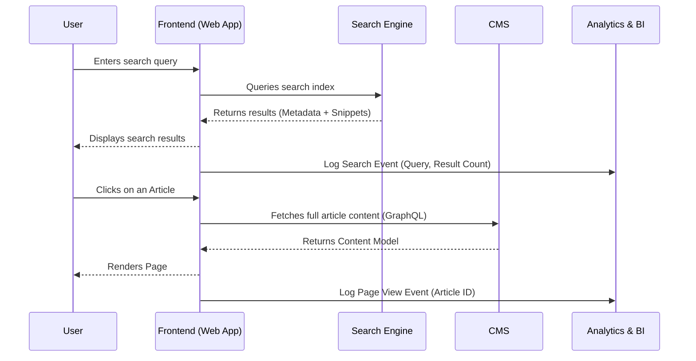
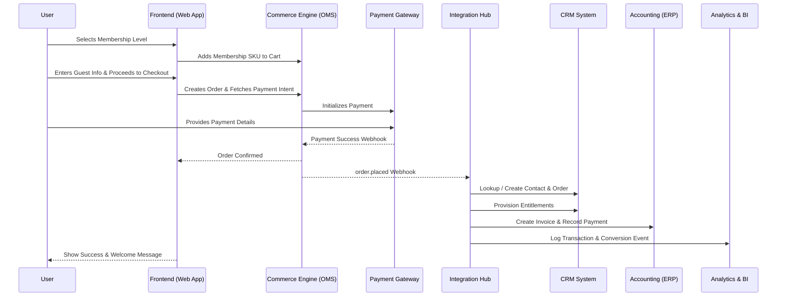
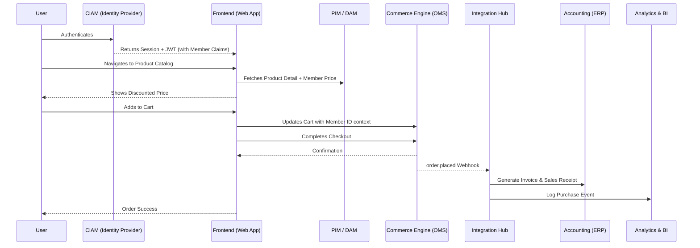
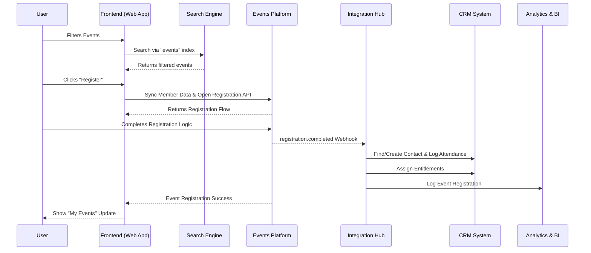
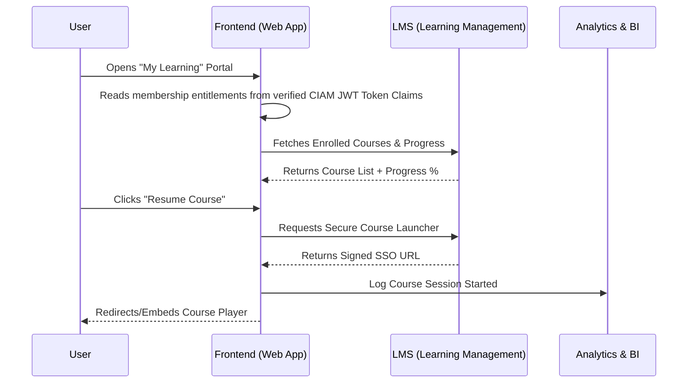

# Headless Composable MACH Architecture (Abstracted Target)

| Metadata | Value |
| --- | --- |
| **Author** | Timberyard Architect Team |
| **Version** | v1.2.0 |
| **Date** | 2026-07-14 |
| **Status** | Under Review / Updated with completeness review feedback |
| **Target Audience** | Engineering, QA & Business Stakeholders |

This document provides a comprehensive overview of the generic, headless, composable architecture design for the platform. It is split into two sections: the **Abstract Target Architecture** (the full target ecosystem) and the **Current Implementation Status** (what is currently integrated).

---

## 1. Abstract Target Architecture
This diagram outlines the complete ecosystem of headless services. It highlights the decoupled nature of composable services and the central role of **CIAM** and **CRM** in managing user identities and entitlements, while integrating **Accounting** and **Analytics** downstream.

```mermaid
flowchart TB
    %% Nodes
    User((User / Browser))
    
    subgraph Presentation ["Presentation Layer (Headless Frontend)"]
        direction TB
        Frontend["Frontend (Web App)"]
        Edge["Edge Compute / CDN"]
        Frontend --- Edge
    end

    subgraph Identity ["Identity & CRM (The Core)"]
        direction TB
        CRM["CRM"]
        CIAM["CIAM"]
        CRM -->|Syncs Member Data| CIAM
    end

    subgraph Content ["Content & Asset Management"]
        CMS["CMS"]
        PIM["PIM / DAM"]
    end

    subgraph Commerce ["Commerce & Transactions"]
        CommerceEngine["Commerce Engine (OMS)"]
        PaymentGateway["Payment Gateway"]
        Events["Events Platform"]
        LMS["LMS"]
    end

    subgraph Discovery ["Search & Analytics"]
        Search["Search Engine"]
        Analytics["Analytics & BI"]
    end

    subgraph Integration ["Integration & Orchestration"]
        IntegrationHub["Integration Hub"]
    end

    subgraph Finance ["Finance & Operations"]
        Accounting["Accounting (ERP)"]
    end

    %% Interactions
    User -- "Browses / Searches" --> Frontend
    User -- "Authenticates" --> CIAM
    
    Frontend -- "Cart & Order API" --> CommerceEngine
    Frontend -- "GraphQL / REST" --> CMS
    Frontend -- "GraphQL / REST" --> PIM
    Frontend -- "Validates JWT Token" --> CIAM
    Frontend -- "Instant Search" --> Search
    Frontend -- "Track Events" --> Analytics
    Frontend -- "Registration API" --> Events
    CommerceEngine -- "Triggers Payment" --> PaymentGateway
    Frontend -- "Learn / Progress" --> LMS

    %% Sync Flows (via Integration Hub)
    CMS -- "Webhooks" --> IntegrationHub
    PIM -- "Webhooks" --> IntegrationHub
    Events -- "Webhooks" --> IntegrationHub
    CommerceEngine -- "Webhooks" --> IntegrationHub
    LMS -- "Events/Webhooks" --> IntegrationHub

    IntegrationHub -- "Sync Content/Products/Courses" --> Search
    IntegrationHub -- "Sync Events/Courses" --> PIM
    IntegrationHub -- "Provision Orders/CPD" --> CRM
    IntegrationHub -- "Confirm Registration" --> Events
    IntegrationHub -- "Enrol Members" --> LMS
    IntegrationHub -- "Price/Stock Sync" --> CommerceEngine
    
    %% Finance & Analytics Sync
    IntegrationHub -- "Post Journal / Invoice" --> Accounting
    IntegrationHub -- "Stream Business Data" --> Analytics

    %% Styling
    classDef presentation fill:#000,stroke:#333,stroke-width:2px,color:#fff
    classDef identity fill:#00A1E0,stroke:#333,stroke-width:2px,color:#fff
    classDef content fill:#1798c1,stroke:#333,stroke-width:2px,color:#fff
    classDef commerce fill:#635BFF,stroke:#333,stroke-width:2px,color:#fff
    classDef search fill:#5468FF,stroke:#333,stroke-width:2px,color:#fff
    classDef integration fill:#F58220,stroke:#333,stroke-width:2px,color:#fff
    classDef finance fill:#8c5baf,stroke:#333,stroke-width:2px,color:#fff
    
    class Frontend,Edge presentation
    class CRM,CIAM identity
    class CMS,PIM content
    class CommerceEngine,PaymentGateway,Events,LMS commerce
    class Search,Analytics search
    class IntegrationHub integration
    class Accounting finance
```

### Key Components:
- **Presentation**: Decoupled framework-based frontend (e.g. Next.js) hosted on a CDN / Edge Hosting platform.
- **Identity & CRM**: **CIAM** serves as the central identity platform, handling secure user authentication, session management, and issuing JWT tokens at the edge. **CRM** remains the core customer relationship manager and single source of truth for member records and master data, syncing status to the CIAM platform.
- **Integration**: **Integration Hub** (IPaaS) acts as the central integration engine, managing all backend synchronization, event indexing, and back-office automated workflows.
- **PIM & DAM**: **PIM / DAM** manages structured product data, including books, memberships, and digital assets.
- **CMS**: **CMS** manages marketing pages, news, and editorial content.
- **Commerce & Transactions**: **Commerce Engine** handles the shopping cart, order management (OMS), and fulfilment logic. 
- **Payment Gateway**: **Payment Gateway** handles secure payment processing.
- **Search**: **Search Engine** provides high-performance, low-latency search across both content and products.
- **Learning Management System**: **LMS** serves as the learning management system, delivering educational content and tracking user progress.
- **Events Management**: **Events Platform** serves as the events management system, handling event registration and attendee management.
- **Accounting**: **Accounting (ERP)** handles financial ledger entries, invoicing, reconciliation, tax compliance, and overall financial reporting.
- **Reporting & Analytics**: **Analytics & BI** platform aggregates event streams and transaction data to perform business intelligence, user behavior analysis, and executive reporting.

### Integration Reliability & Orchestration Strategy
* **Delivery Guarantees**: The Integration Hub implements at-least-once delivery for webhook events.
* **Idempotency**: All downstream sync consumers (CRM, Accounting, Search Engine) enforce idempotency checks using unique event IDs or transaction hash signatures.
* **Retry Policy**: Transient network or system errors trigger exponential backoff with jitter (max 5 retries).
* **Failure Handling**: Undeliverable messages after maximum retries are routed to a Dead-Letter Queue (DLQ) for alerting, monitoring, and manual operations intervention.

### Auth & Identity Lifecycle Management
* **CRM-to-CIAM Sync**: Profile changes and membership statuses updated in the CRM are pushed to the CIAM in near real-time via webhooks (< 5s latency). A nightly batch job reconciles out-of-sync profiles.
* **Token Lifecycle**: Access tokens (JWT) carry a 15-minute lifespan. Refresh tokens are secured via `httpOnly` secure cookies with a 14-day validity.
* **Session Revocation**: A backchannel logout API allows global session invalidation directly from the CRM/CIAM interface, forcing client apps to perform re-authentication.

---

## 2. Current Implementation Status
This diagram highlights the generic roles that have been implemented and connected in the current codebase. Active integrations are highlighted in color, while future/planned integrations (including Finance, CRM, and Analytics systems) are shown in grayscale.

```mermaid
flowchart TB
    %% Nodes
    User((User))
    
    subgraph Frontend ["Implemented Frontend"]
        direction TB
        FrontendApp["Frontend Web App"]
        Hosting["Hosting Infrastructure"]
    end

    subgraph Implemented ["Active Integrations"]
        direction TB
        CMS["CMS (Articles/Pages)"]
        PIM["PIM / DAM (Products/Assets)"]
        Search["Search Engine (Live Search)"]
        PaymentGateway["Payment Gateway (Checkout Integration)"]
    end

    subgraph Future ["Future Integrations"]
        direction TB
        CommerceEngine["Commerce Engine (OMS)"]
        CRM["CRM"]
        CIAM["CIAM"]
        Events["Events Platform"]
        LMS["LMS"]
        IntegrationHub["Integration Hub"]
        Accounting["Accounting (ERP)"]
        Analytics["Analytics & BI"]
    end

    %% Interactions
    User --> FrontendApp
    FrontendApp -- "Queries" --> CMS
    FrontendApp -- "Queries" --> PIM
    FrontendApp -- "Client SDK" --> Search
    FrontendApp -- "Server API" --> PaymentGateway

    %% Future Links
    FrontendApp -.-> CommerceEngine
    FrontendApp -.-> CIAM
    FrontendApp -.-> Events
    FrontendApp -.-> LMS
    FrontendApp -.-> Analytics
    IntegrationHub -.-> CRM
    IntegrationHub -.-> Events
    IntegrationHub -.-> LMS
    IntegrationHub -.-> CommerceEngine
    IntegrationHub -.-> Accounting
    IntegrationHub -.-> Analytics

    %% Styling
    classDef active fill:#00A859,stroke:#333,stroke-width:2px,color:#fff
    classDef core fill:#6B3D99,stroke:#333,stroke-width:2px,color:#fff
    classDef future stroke-dasharray: 5 5, fill:#f9f9f9,stroke:#999,color:#999
    
    class FrontendApp,Hosting active
    class CMS,PIM,Search,PaymentGateway core
    class CommerceEngine,CRM,CIAM,Events,LMS,IntegrationHub,Accounting,Analytics future
```

### Component Status Matrix:
| Component | Status | Notes |
| --- | --- | --- |
| **Frontend Web App** | **Implemented** | Built with App Router; UI and pages styled. |
| **Hosting Infrastructure** | **Implemented** | Edge routing and build pipelines configured. |
| **CMS** | **Implemented** | Connected via `src/lib/cms.ts` fetching utility. |
| **PIM / DAM** | **Implemented** | Connected via GraphQL schema queries `src/lib/pim.ts`. |
| **Search Engine** | **Implemented** | Connected via Search SDK in frontend components. |
| **Payment Gateway** | **Implemented** | Backend checkout session endpoints verified. |
| **Commerce Engine (OMS)** | *In Design* | Shifting cart state logic from frontend cache to OMS APIs. |
| **CRM** | *In Design* | Designing integration schema for membership objects. |
| **CIAM** | *In Design* | Finalizing authentication callbacks and edge JWT verification. |
| **Events Platform** | *In Design* | Coordinating webhook registrations. |
| **LMS** | *In Design* | Configuring SSO launcher schema. |
| **Integration Hub** | *In Design* | Mapping field transformations for primary recipes. |
| **Accounting (ERP)** | *Not Started* | Pending definition of chart of accounts. |
| **Analytics & BI** | *Not Started* | Pending definition of dashboard KPIs. |

### Index Sync & Degraded Mode Behavior
* **Search Index Sync**: CMS and PIM write events trigger webhook-based re-indexing. Target indexing propagation latency is < 2 minutes.
* **Degraded Mode Fallback**: If the Search Engine service becomes unavailable, the Frontend Web App gracefully falls back to displaying local search caches or query options pointing directly to the CMS/PIM database. Users are shown a temporary "search indexing lagging" notice if the index is reporting delays.

---

## 3. User Journeys & Interaction Flows

### A. Visitor Searches for Information
A visitor searches the site for resources or news.

#### Exception Paths:
* **Zero Results**: The Frontend displays popular topics and suggests spelling corrections or alternative tags.
* **Search Timeout / Service Down**: The search bar falls back to direct, uncached queries against the CMS database, showing a degraded-search indicator.

---

### B. Visitor Purchases Membership
A visitor signs up for a platform membership to access gated benefits.

#### Exception Paths:
* **Payment Decline**: The Payment Gateway returns a decline status. The checkout UI preserves cart details, displays a retry option with descriptive feedback, and limits rapid checkout requests to prevent abuse.
* **Duplicate Webhook Delivery**: The Integration Hub checks the incoming payment/order ID signature. Duplicate events are silently discarded, preventing multiple accounts or invoices from being generated.
* **Identity Resolution**: Matching is performed against the primary email address. Duplicate contact handling follows the rules detailed in Section 4.

---

### C. Member Buys a Product
An authenticated member purchases a physical publication using member pricing.

#### Exception Paths:
* **JWT Expiry**: If the JWT token expires during the session, the Frontend silently triggers a refresh request via the CIAM secure `httpOnly` cookie. If the user session has completely expired, the cart is cached locally and the user is redirected to re-authenticate.
* **Downstream Accounting Sync Failure**: If the Accounting ERP integration fails post-checkout, the Integration Hub stores the payload in a persistent error queue. An automated background worker attempts retries. If unsuccessful after 24 hours, it flags the transaction for manual entry. The user-facing confirmation is not impacted.

---

### D. Member Books an Event
An existing member registers for an event or conference.

#### Exception Paths:
* **Sold-Out / Capacity Exceeded**: The Frontend queries event tickets in real-time. If zero tickets remain, the "Register" button is replaced by a "Join Waitlist" workflow.
* **CRM Match/Update Failure**: If the CRM cannot resolve the user during registration log syncing, the integration issues an administrative alert to CRM operations to manually link the event attendance record.

---

### E. Member Studies a Course
A member accesses their learning dashboard to continue an online course.

#### Exception Paths:
* **Entitlement Sync Lag**: If a user logs in immediately after buying a membership, they might have stale JWT entitlements. The Frontend provides a "Refresh Access" button that triggers a backchannel claims refresh against the CIAM.
* **LMS SSO Gateway Downtime**: In case of LMS service failure or invalid SSO signatures, the Frontend catches the error, displays an error screen ("Course portal is currently unavailable"), and logs the event to operations.

---

## 4. Unified Identity & Data Entity Model

To resolve cross-system customer matching and avoid duplicate records, the platform relies on the following identity schema mapping:

| Entity | Identifier (ID) | System of Record (SoR) | Downstream Sync Systems |
| --- | --- | --- | --- |
| **Person / Contact** | Contact ID | CRM | CIAM, Commerce Engine, LMS, Events, Analytics |
| **Credentialed User** | User UID | CIAM | Frontend Web App, LMS, Events |
| **Transaction Customer**| Customer ID | Commerce Engine | CRM, Payment Gateway, Accounting (ERP) |
| **Event Registrant** | Attendee ID | Events Platform | CRM (via Integration Hub) |
| **Course Learner** | Student ID | LMS | CRM (via Integration Hub) |

### Identity Resolution Rules:
1. **Primary Matching Key**: The verified email address serves as the unique identifier across all systems.
2. **Lookup Workflow**: When the Integration Hub receives an external webhook (e.g. checkout, event booking), it performs an email lookup in the CRM.
3. **Deduplication Rules**:
   - If a match is found, the transaction/activity is linked to the existing Contact ID.
   - If no match is found, the Integration Hub generates a new Contact record in the CRM.
   - If multiple duplicate email records are flagged, the transaction is associated with the most recently active account and flagged for administrative merge.

---

## 5. Non-Functional & Governance Requirements (NFRs)

### Availability & Performance SLAs
* **Frontend Application & CDN**: 99.9% availability target. Page load times < 1.5s for static pages.
* **CIAM & Payment Gateway**: 99.99% availability targets.
* **Core API Integrations (CRM, Commerce, LMS, CMS)**: 99.9% uptime.

### Disaster Recovery (DR) & Backup
* **Active-Passive Redundancy**: Multi-zone edge deployments ensure frontends remain active during regional CDN outages.
* **Database Backups**: Core configuration data (PIM, CMS schemas) undergo daily snapshot backups with 30-day retention. Customer records in the CRM follow automated Salesforce backup schedules.

### Security, Privacy & PCI Scope
* **Data Residency**: Customer PII is stored in databases residing within UK/EU jurisdictions to comply with GDPR/UK-GDPR data sovereignty requirements.
* **PCI-DSS Compliance Scope**: The Frontend Web App and CMS/PIM databases remain entirely out of scope for PCI compliance. Credit card data is collected via hosted elements (iframes/secure scripts) pointing directly to the Payment Gateway.

### API Governance
* **Versioning**: All custom service API interfaces must utilize semantic versioning in URI patterns (e.g., `/api/v1/...`).
* **Rate Limiting**: Public API routes are limited to 100 requests per minute per IP address. Downstream systems enforce API token quotas to prevent service exhaustion.
