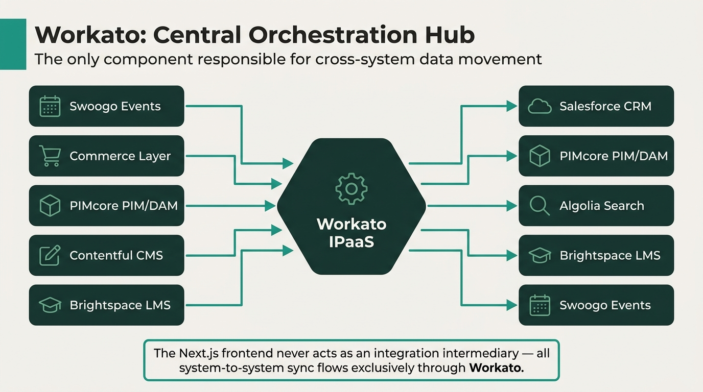
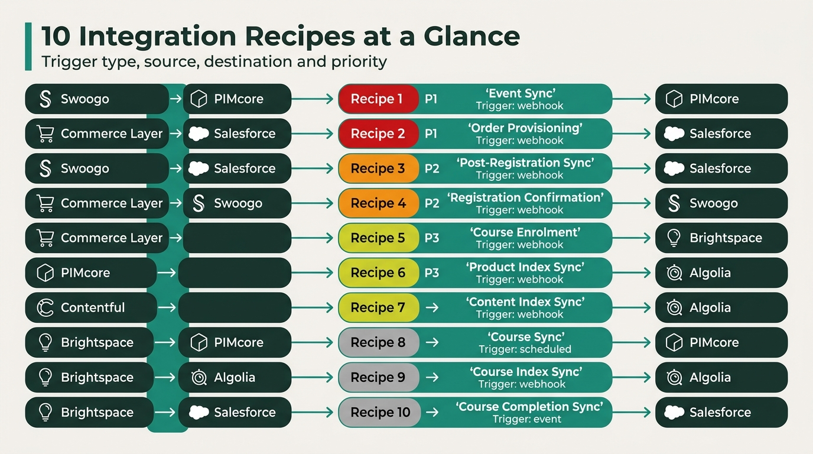
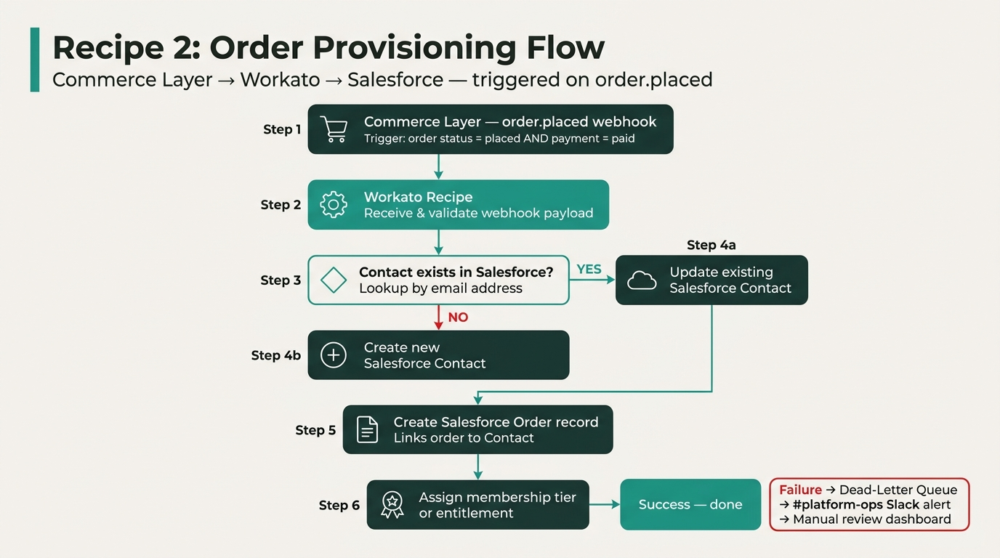
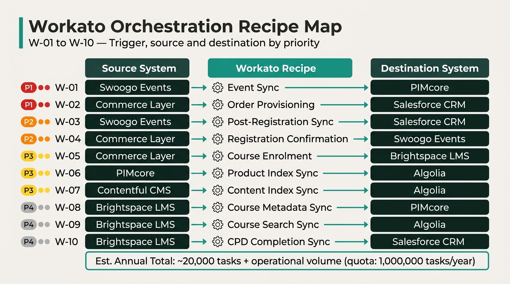
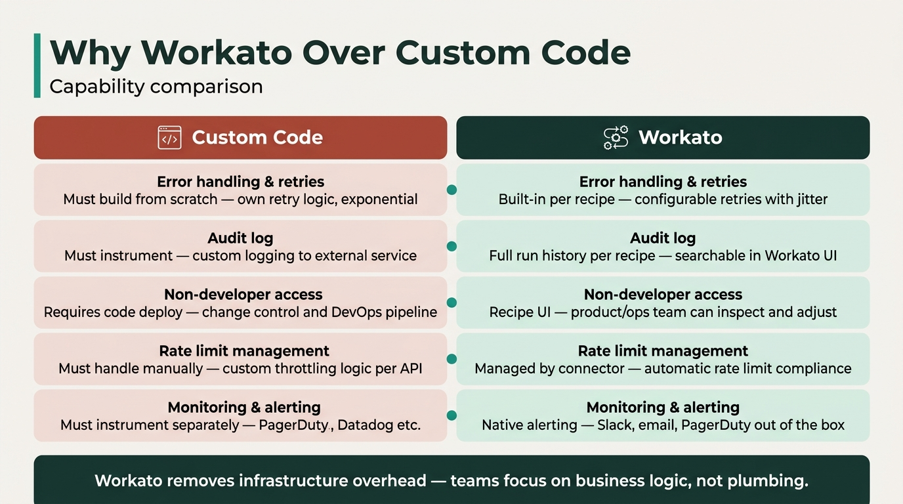

# BSAVA Workato Integration Recipes

Workato acts as the **central orchestration hub** for all back-office, system-to-system data flows in the BSAVA MACH architecture. It implements the sync arrows in the architecture diagram without bespoke glue code in the Next.js frontend.

---

## Architecture Role

Workato is the **only component** responsible for cross-system data movement. The Next.js frontend never acts as an integration intermediary.

---

## Recipes

### 1. Swoogo → PIMcore: Event Sync

**Purpose**: Automatically creates or updates event records in PIMcore when an event reaches Minimal Viable Event (MVE) status in Swoogo.

| Field | Detail |
|---|---|
| Trigger | Swoogo `event.created` / `event.updated` webhook |
| Condition | Event has title, start/end date, and ≥1 ticket type (MVE threshold) |
| Action | `POST` / `PUT` to PIMcore REST API — creates/updates event product record |
| Error Handling | Retry 3× on failure; alert `#platform-ops` Slack channel |

**Data Mapping**

| Swoogo Field | PIMcore Field |
|---|---|
| `event_name` | `name` |
| `start_date` / `end_date` | `eventStartDate` / `eventEndDate` |
| `location` | `venue` |
| `ticket_types[].price` | `pricing.basePrice` |
| `capacity` | `stockQuantity` |

---

### 2. Commerce Layer → Salesforce: Order Provisioning

**Purpose**: Creates or updates the Salesforce member record after any purchase (membership, book, or event).

| Field | Detail |
|---|---|
| Trigger | Commerce Layer `order.placed` webhook |
| Condition | Order status = `placed` and payment = `paid` |
| Action | Lookup Salesforce Contact by email → create if not found → create `Order` record → assign membership/entitlement |
| Error Handling | Dead-letter queue for failed upserts; manual review dashboard |

---

### 3. Swoogo → Salesforce: Post-Registration Sync

**Purpose**: Logs event attendance and triggers downstream entitlements (e.g., Brightspace access) in Salesforce after a delegate completes registration.

| Field | Detail |
|---|---|
| Trigger | Swoogo `registration.completed` webhook |
| Action | Find/create Salesforce Contact → log attendance record → assign entitlements |
| Downstream Effect | Entitlement assignment may trigger Recipe 5 (Commerce Layer → Brightspace) |

---

### 4. Commerce Layer → Swoogo: Registration Confirmation

**Purpose**: Marks a Swoogo delegate registration as confirmed once payment has been captured, closing the payment↔registration loop.

| Field | Detail |
|---|---|
| Trigger | Commerce Layer `order.placed` webhook (or Stripe `payment_intent.succeeded`) |
| Action | Call Swoogo API — update registration status to `confirmed` |
| Prevents | Orphaned registrations where payment succeeded but Swoogo status was never updated |

---

### 5. Commerce Layer → Brightspace: Course Enrolment

**Purpose**: Automatically enrols a customer in the relevant Brightspace course after purchasing a course-linked product.

| Field | Detail |
|---|---|
| Trigger | Commerce Layer `order.placed` webhook |
| Condition | Order line item has `courseId` metadata set in PIMcore |
| Action | Call Brightspace Enrolment API — create enrolment for the customer |

---

### 6. PIMcore → Algolia: Product Index Sync

**Purpose**: Keeps the Algolia product/event search index in sync with PIMcore without custom indexing jobs.

| Field | Detail |
|---|---|
| Trigger | PIMcore webhook on product `create` / `update` / `delete` |
| Action | Transform PIMcore product object → upsert or delete Algolia record in `products` index |
| Handles | Sold-out status changes (e.g., `stockQuantity = 0` → sets `status: sold_out` in Algolia) |

---

### 7. Contentful → Algolia: Content Index Sync

**Purpose**: Keeps the Algolia content index in sync with published Contentful articles and pages.

| Field | Detail |
|---|---|
| Trigger | Contentful `publish` / `unpublish` webhook |
| Action | Upsert or delete Algolia record in `content` index |
| Handles | Unpublishing (removes stale records from search results) |

---

### 8. Brightspace → PIMcore: Course Sync

**Purpose**: Ensures that course records in PIMcore reflect the latest metadata from Brightspace (title, description, syllabus, CPD credits).

| Field | Detail |
|---|---|
| Trigger | Brightspace `course.updated` event or nightly scheduled job |
| Action | Update corresponding PIMcore product with latest course metadata |

---

### 9. Brightspace → Algolia: Course Index Sync

**Purpose**: Makes Brightspace courses discoverable in site search alongside events and products.

| Field | Detail |
|---|---|
| Trigger | Brightspace `course.created` / `course.updated` webhook |
| Action | Upsert Algolia record in `content` index with course title, description, and CPD credit info |

---

### 10. Brightspace → Salesforce: Course Completion Sync

**Purpose**: Records CPD completions on the Salesforce member record and triggers renewal or follow-up automations.

| Field | Detail |
|---|---|
| Trigger | Brightspace `course.completed` event |
| Action | Update Salesforce Contact with completion record (date, course name, CPD credits) |
| Downstream Effect | May trigger Salesforce Flow for renewal reminders or certificate issuance |

---

## Implementation Priority

| Priority | Recipe | Reason |
|---|---|---|
| 🔴 P1 | Swoogo → PIMcore | Unblocks product team; core of event lifecycle |
| 🔴 P1 | Commerce Layer → Salesforce | Closes membership purchase loop |
| 🟠 P2 | Swoogo → Salesforce | Completes event entitlement tracking |
| 🟠 P2 | Commerce Layer → Swoogo | Prevents orphaned registrations |
| 🟡 P3 | Commerce Layer → Brightspace | Enables automated course enrolment |
| 🟡 P3 | PIMcore → Algolia | Removes custom indexing code |
| 🟡 P3 | Contentful → Algolia | Removes custom indexing code |
| 🟢 P4 | Brightspace → PIMcore | Course metadata enrichment |
| 🟢 P4 | Brightspace → Algolia | Course discoverability in search |
| 🟢 P4 | Brightspace → Salesforce | CPD record keeping and renewals |

---

## Why Workato Over Custom Code

| Concern | Custom Code | Workato |
|---|---|---|
| Error handling & retries | Must build | Built-in per recipe |
| Audit log | Must build | Full run history per recipe |
| Non-developer access | Requires code deploy | Recipe UI for ops/product team |
| Rate limit management | Must handle manually | Managed by connector |
| Monitoring & alerting | Must instrument | Native alerting |
