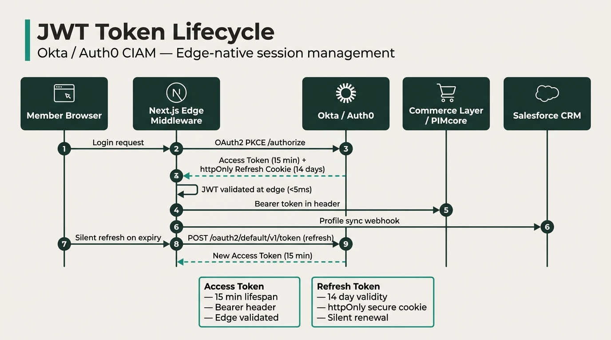
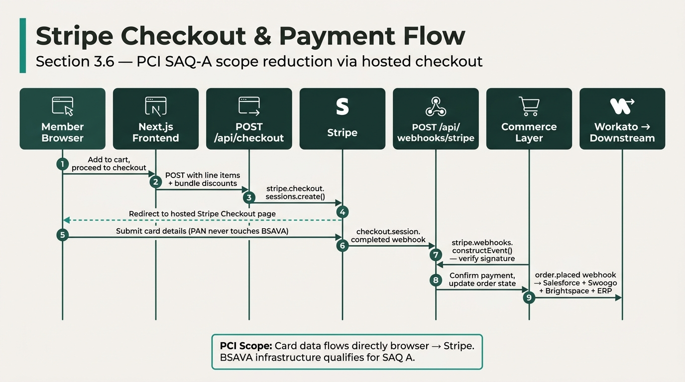
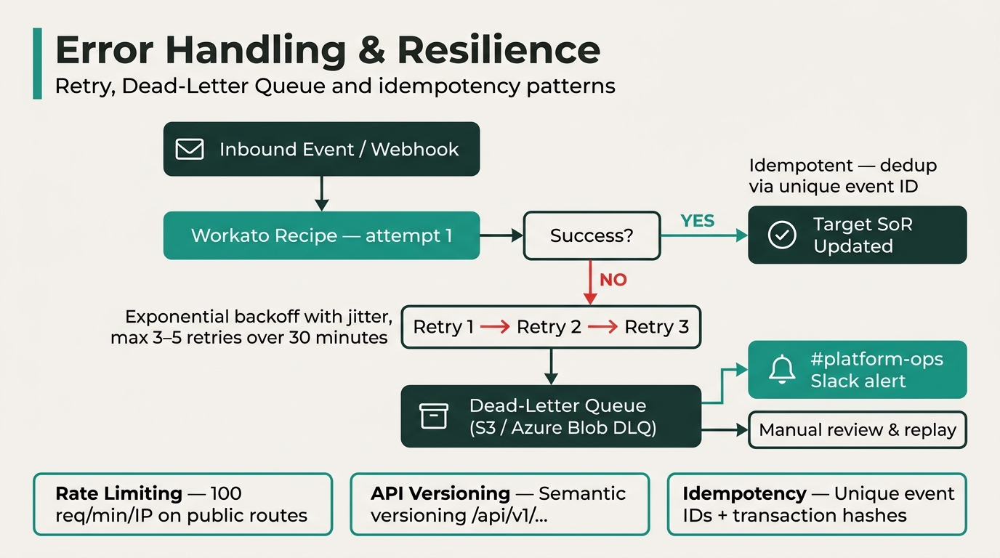
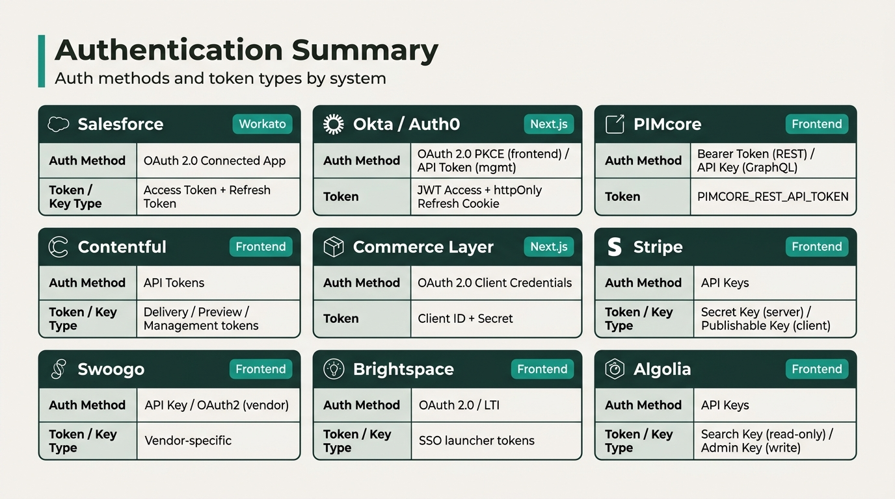

# BSAVA API Architecture & Interface Specification

| Document Metadata | Details |
| :--- | :--- |
| **Client** | British Small Animal Veterinary Association (BSAVA) |
| **Author** | Timberyard Architecture & Engineering Team |
| **Version** | v1.0.0 |
| **Date** | August 2026 |
| **Status** | Technical Baseline |
| **Target Architecture** | Composable MACH Ecosystem |

---

## 1. Purpose & Scope

This document catalogues every API endpoint, webhook, integration call, and data flow required by the BSAVA MACH platform, organised by **System of Record (SoR)**. It serves as the definitive interface contract for frontend engineers, backend integrators, and Workato recipe developers.

### Core Architectural Principles

1. **Single Source of Truth (SoR):** Every data domain is owned by exactly one operational platform.
2. **Token-Governed Orchestration:** Workato recipe executions adhere to a **1,000,000 task/year** quota via micro-batching and direct storage staging.
3. **Edge Security & Privacy:** Next.js Edge Middleware handles JWT authentication and CORS. All PII storage complies with UK GDPR in UK/EU cloud regions.

---

## 2. High-Level System Topology

---

## 3. API Specification by System of Record

---

### 3.1 Salesforce (CRM) — Contact & Member SoR

| # | API / Endpoint | Method | Consumer | Purpose |
|---|---|---|---|---|
| SF-01 | REST API — `/services/data/vXX.0/sobjects/Contact` | `GET` / `PATCH` | Workato | Query and upsert member contact records |
| SF-02 | REST API — `/services/data/vXX.0/sobjects/Account` | `GET` / `PATCH` | Workato | Query and upsert organisation accounts |
| SF-03 | REST API — `/services/data/vXX.0/sobjects/Committee_Role__c` | `GET` / `POST` | Workato | Manage committee role assignments |
| SF-04 | REST API — `/services/data/vXX.0/sobjects/Order` | `POST` | Workato | Create order records from Commerce Layer webhooks |
| SF-05 | REST API — `/services/data/vXX.0/query/?q=SELECT...` | `GET` | Workato | Hourly micro-batch query (`WHERE LastModifiedDate > {last_run}`) for lakehouse ingestion |
| SF-06 | Bulk API 2.0 — `/services/data/vXX.0/jobs/ingest` | `POST` | Workato | Mass data load during historic migration (Phase 3) |
| SF-07 | SOAP API | `POST` | Legacy | Legacy integration support (migration period only) |
| SF-08 | CDC (ChangeEvent) — `/data/ContactChangeEvent` | Stream | Workato (optional) | Real-time change data capture (high token cost — under review) |

**Authentication:** OAuth 2.0 (Connected App) with refresh token rotation.

**Outbound Webhooks from Salesforce:**
- CRM-to-CIAM profile sync push to Okta (< 5s latency) on Contact field changes
- Nightly batch reconciliation job for out-of-sync profiles

**Lakehouse Ingestion:** Hourly scheduled micro-batch → `raw_salesforce_contacts` (est. 8,760 tasks/year)

---

### 3.2 Okta / Auth0 (CIAM) — Identity & Session SoR

| # | API / Endpoint | Method | Consumer | Purpose |
|---|---|---|---|---|
| OK-01 | Authentication API — `/api/v1/authn` | `POST` | Next.js Frontend | User login, MFA challenge |
| OK-02 | Token Endpoint — `/oauth2/default/v1/token` | `POST` | Next.js Frontend | OAuth2 token exchange, refresh (15-min access / 14-day refresh) |
| OK-03 | Authorize Endpoint — `/oauth2/default/v1/authorize` | `GET` | Next.js Frontend | SSO redirect flow initiation |
| OK-04 | Management API — `/api/v1/users` | `GET` / `POST` / `PUT` | Workato | User CRUD, profile sync from Salesforce |
| OK-05 | System Log API — `/api/v1/logs` | `GET` | Workato | Security audit log streaming to Data Lakehouse |
| OK-06 | Backchannel Logout — `/api/v1/sessions` | `DELETE` | Salesforce / Admin | Global session revocation forcing re-authentication |
| OK-07 | UserInfo Endpoint — `/oauth2/default/v1/userinfo` | `GET` | Next.js Frontend | Fetch user profile claims |

**Authentication:** API Token (Management API), OAuth 2.0 PKCE (Frontend flows).

**JWT Token Lifecycle:**
- Access tokens: 15-minute lifespan, carried as Bearer tokens
- Refresh tokens: httpOnly secure cookie, 14-day validity
- Edge Middleware validates JWT on every request; silent refresh on expiry

**Lakehouse Ingestion:** System Log API polled daily → security monitoring tables

---

### 3.3 PIMcore (PIM / DAM) — Product Catalog & Entitlements SoR

| # | API / Endpoint | Method | Consumer | Purpose |
|---|---|---|---|---|
| PM-01 | GraphQL Data Hub — `/pimcore-graphql-webservices/bsava?apikey={key}` | `POST` | Next.js Frontend | Multi-class product listing queries (`getBookListing`, `getEbookListing`, `getEventListing`, `getCourseListing`, `getMembershipTierListing`) |
| PM-02 | GraphQL Data Hub — `getProduct(id)` | `POST` | Next.js Frontend | Single product detail fetch with inline fragments (`Book`, `Ebook`, `Event`, `Course`, `MembershipTier`) |
| PM-03 | GraphQL Data Hub — legacy `getProductListing` | `POST` | Next.js Frontend | Fallback query if multi-class schema unavailable |
| PM-04 | REST API — `/api/products` | `POST` / `PUT` | Workato | Create/update event product records (Swoogo → PIMcore sync) |
| PM-05 | REST API — `/api/products` | `POST` / `PUT` | Workato | Create/update course product records (Brightspace → PIMcore sync) |
| PM-06 | REST API — `/api/entitlements` | `GET` | Workato / Commerce Layer | Query entitlement definitions and access rules |
| PM-07 | REST API — Asset endpoint | `GET` | Next.js (via `/api/image-proxy`) | Serve product images and digital assets |

**Authentication:** Bearer Token (`PIMCORE_REST_API_TOKEN`) for REST; API Key query parameter for GraphQL Data Hub.

**Outbound Webhooks from PIMcore:**

| Event | Destination | Purpose |
|---|---|---|
| `product.created` | Workato → Algolia | Index new product in search |
| `product.updated` | Workato → Algolia | Update search index record |
| `product.deleted` | Workato → Algolia | Remove from search index |

**Lakehouse Ingestion:** Nightly cron at 01:00 UTC → `snap_pimcore_products` (365 tasks/year)

---

### 3.4 Contentful (CMS) — Editorial Content SoR

| # | API / Endpoint | Method | Consumer | Purpose |
|---|---|---|---|---|
| CF-01 | Content Delivery API (CDA) — `getEntries` (content_type: `article`) | `GET` | Next.js Frontend | Fetch articles by slug, latest articles, all articles for indexing |
| CF-02 | CDA — `getEntries` (content_type: `header`) | `GET` | Next.js Frontend | Fetch site header navigation |
| CF-03 | CDA — `getEntries` (content_type: `footer`) | `GET` | Next.js Frontend | Fetch site footer content |
| CF-04 | CDA — `getEntries` (content_type: `author`) | `GET` | Next.js Frontend | Fetch author profiles and author-article associations |
| CF-05 | Content Preview API — `preview.contentful.com` | `GET` | Next.js Frontend | Draft content preview |
| CF-06 | Content Management API (CMA) | `PUT` / `POST` | Editorial team | Content authoring (not consumed by frontend) |

**Authentication:** Delivery Token (CDA), Preview Token (Preview API), Management Token (CMA).

**Outbound Webhooks from Contentful:**

| Event | Destination | Purpose |
|---|---|---|
| `publish` | Workato → Algolia | Upsert article into `content` search index |
| `unpublish` | Workato → Algolia | Remove stale article from search index |

**Lakehouse Ingestion:** Nightly cron at 01:00 UTC → `snap_contentful_articles` (365 tasks/year)

---

### 3.5 Commerce Layer (OMS) — Cart, Order & Membership Tier SoR

| # | API / Endpoint | Method | Consumer | Purpose |
|---|---|---|---|---|
| CL-01 | REST API — `/api/orders` | `POST` | Next.js Frontend | Create order from cart |
| CL-02 | REST API — `/api/line_items` | `POST` / `DELETE` | Next.js Frontend | Add/remove cart items |
| CL-03 | REST API — `/api/orders/{id}` | `PATCH` | Next.js Frontend | Update order (apply discounts, customer context) |
| CL-04 | REST API — `/api/customers` | `GET` / `POST` | Workato | Customer record lookup/creation |
| CL-05 | REST API — `/api/subscriptions` | `GET` | Workato | Query membership subscription tier states |
| CL-06 | REST API — `/api/orders?filter[updated_at_gt]={ts}` | `GET` | Workato | Hourly micro-batch order extraction for lakehouse |

**Authentication:** OAuth 2.0 Client Credentials (API credentials).

**Outbound Webhooks from Commerce Layer:**

| Event | Destination | Purpose |
|---|---|---|
| `order.placed` | Workato → Salesforce | Create/update CRM contact and order record |
| `order.placed` | Workato → Swoogo | Confirm delegate registration status |
| `order.placed` | Workato → Brightspace | Enrol customer in purchased course |
| `order.placed` | Workato → ERP | Generate invoice and record payment |
| `subscription.updated` | Workato → Salesforce | Sync membership tier changes |

**Lakehouse Ingestion:** Hourly micro-batch → `raw_commerce_orders` + `raw_commercelayer_subscriptions` (est. 8,760 tasks/year)

---

### 3.6 Stripe — Payment Processing SoR

| # | API / Endpoint | Method | Consumer | Purpose |
|---|---|---|---|---|
| ST-01 | Checkout Sessions — `stripe.checkout.sessions.create()` | `POST` | Next.js `/api/checkout` | Create hosted checkout session with line items, bundle discounts, promotion codes |
| ST-02 | PaymentIntents API | `POST` | Commerce Layer | Initialise payment from OMS order |
| ST-03 | Webhook Signature — `stripe.webhooks.constructEvent()` | — | Next.js `/api/webhooks/stripe` | Verify inbound webhook authenticity |

**Authentication:** Secret Key (server-side), Publishable Key (client-side elements).

**Inbound Webhooks handled by BSAVA:**

| Event | Handler | Purpose |
|---|---|---|
| `checkout.session.completed` | Next.js `/api/webhooks/stripe` | Trigger fulfilment logic, log payment |
| `payment_intent.succeeded` | Workato | Confirm payment for Commerce Layer order |
| `charge.succeeded` | Workato | Financial reconciliation logging |

**Lakehouse Ingestion:** Hourly micro-batch → `raw_stripe_payments` (combined with Commerce Layer recipe)

---

### 3.7 Swoogo — Events & Conferences SoR

| # | API / Endpoint | Method | Consumer | Purpose |
|---|---|---|---|---|
| SW-01 | REST API — Event query | `GET` | Workato | Fetch event details and ticket types |
| SW-02 | REST API — Registration update | `PUT` | Workato | Mark registration as `confirmed` after payment |
| SW-03 | REST API — Delegate roster query | `GET` | Workato | Twice-daily scheduled poll for delegate registration arrays (lakehouse) |

**Authentication:** API Key / OAuth2 (vendor-specific).

**Outbound Webhooks from Swoogo:**

| Event | Destination | Purpose |
|---|---|---|
| `event.created` | Workato → PIMcore | Create event product record (MVE threshold) |
| `event.updated` | Workato → PIMcore | Update event product metadata |
| `registration.completed` | Workato → Salesforce | Find/create contact, log attendance, assign entitlements |

**Data Mapping (Swoogo → PIMcore):**

| Swoogo Field | PIMcore Field |
|---|---|
| `event_name` | `name` |
| `start_date` / `end_date` | `eventStartDate` / `eventEndDate` |
| `location` | `venue` |
| `ticket_types[].price` | `pricing.basePrice` |
| `capacity` | `stockQuantity` |

**Lakehouse Ingestion:** Twice-daily poll → `raw_swoogo_registrations`

---

### 3.8 Brightspace / D2L (LMS) — Learning & CPD SoR

| # | API / Endpoint | Method | Consumer | Purpose |
|---|---|---|---|---|
| BS-01 | Enrolment API | `POST` | Workato | Create course enrolment after product purchase |
| BS-02 | Data Hub — Bulk CSV export | `GET` | Workato | Daily pull of course completions and CPD credit files |
| BS-03 | Course API — Enrolled courses | `GET` | Next.js Frontend | Fetch member's enrolled courses and progress % |
| BS-04 | SSO Launcher | `GET` | Next.js Frontend | Generate signed SSO URL for course player redirect |
| BS-05 | Course Metadata API | `GET` | Workato | Fetch course title, description, syllabus, CPD credits for PIMcore sync |

**Authentication:** OAuth 2.0 / LTI (Learning Tools Interoperability) for SSO.

**Outbound Events from Brightspace (ENS):**

| Event | Destination | Purpose |
|---|---|---|
| `course.created` | Workato → Algolia | Index new course in search |
| `course.updated` | Workato → PIMcore | Update course product metadata |
| `course.updated` | Workato → Algolia | Update course search record |
| `course.completed` | Workato → Salesforce | Record CPD completion, trigger renewal flows |

**Lakehouse Ingestion:** Daily Data Hub CSV → S3/ADLS staging → `raw_brightspace_completions` (365 tasks/year)

---

### 3.9 Accounting ERP — Financial Ledger SoR

| # | API / Endpoint | Method | Consumer | Purpose |
|---|---|---|---|---|
| ERP-01 | REST API — Invoice creation | `POST` | Workato | Create invoice and record payment from Commerce Layer order |
| ERP-02 | REST API — Journal entry | `POST` | Workato | Post general ledger journal entries |
| ERP-03 | REST API / Scheduled export — GL query | `GET` | Workato | Extract GL entries and monthly trial balances for lakehouse |

**Authentication:** API Key / OAuth2 (vendor-specific).

**Lakehouse Ingestion:** Nightly scheduled export → S3/ADLS staging → `raw_erp_gl_entries`

---

### 3.10 Algolia — Search Index (Operational Cache)

| # | API / Endpoint | Method | Consumer | Purpose |
|---|---|---|---|---|
| AL-01 | Search Client SDK — `products` index | `GET` | Next.js Frontend (client-side) | Instant product and event search |
| AL-02 | Search Client SDK — `content` index | `GET` | Next.js Frontend (client-side) | Instant article and editorial search |
| AL-03 | Admin API — Upsert record | `POST` / `PUT` | Workato | Add/update product, event, course, or article in search index |
| AL-04 | Admin API — Delete record | `DELETE` | Workato | Remove unpublished or deleted records from index |

**Authentication:** Search API Key (client-side, read-only), Admin API Key (server-side, write).

**Index Sources:**

| Index | Source System | Sync Trigger |
|---|---|---|
| `products` | PIMcore | Webhook on product create/update/delete |
| `content` | Contentful | Webhook on publish/unpublish |
| `content` (courses) | Brightspace | Webhook on course create/update |

---

### 3.11 Data Lakehouse — Enterprise Analytics

| # | API / Endpoint | Method | Consumer | Purpose |
|---|---|---|---|---|
| LH-01 | Bulk stage loading (Snowpipe / ADLS connector) | `PUT` | Workato | Land JSON/CSV/Parquet batches from operational systems |
| LH-02 | Direct storage copy (S3 / ADLS / OneLake) | File transfer | Workato | Bulk file landing for datasets > 10,000 records |
| LH-03 | SQL endpoint (JDBC / ODBC) | `SELECT` | Power BI / Tableau | BI queries against Silver/Gold zone tables |

**Target Tables:**

| Table | Source | Ingestion Pattern |
|---|---|---|
| `raw_salesforce_contacts` | Salesforce | Hourly micro-batch |
| `raw_commercelayer_subscriptions` | Commerce Layer | Hourly micro-batch |
| `raw_commerce_orders` | Commerce Layer | Hourly micro-batch |
| `raw_stripe_payments` | Stripe | Hourly micro-batch |
| `raw_swoogo_registrations` | Swoogo | Twice-daily poll |
| `raw_brightspace_completions` | Brightspace | Daily CSV via Data Hub |
| `raw_erp_gl_entries` | ERP | Nightly export |
| `snap_pimcore_products` | PIMcore | Nightly snapshot (01:00 UTC) |
| `snap_contentful_articles` | Contentful | Nightly snapshot (01:00 UTC) |

---

## 4. Next.js Frontend API Routes (Implemented)

| # | Route | Method | Purpose | Upstream System |
|---|---|---|---|---|
| FE-01 | `/api/checkout` | `POST` | Create Stripe checkout session with line items and bundle discounts | Stripe |
| FE-02 | `/api/webhooks/stripe` | `POST` | Handle `checkout.session.completed` webhook, verify signature | Stripe |
| FE-03 | `/api/pimcore-proxy` | `POST` | Proxy GraphQL queries to PIMcore Data Hub | PIMcore |
| FE-04 | `/api/image-proxy` | `GET` | Proxy PIMcore asset images to frontend | PIMcore |

---

## 5. Workato Orchestration Recipes Summary

| # | Recipe | Trigger | Source → Destination | Priority |
|---|---|---|---|---|
| W-01 | Event Sync | `event.created` / `event.updated` webhook | Swoogo → PIMcore | P1 |
| W-02 | Order Provisioning | `order.placed` webhook | Commerce Layer → Salesforce | P1 |
| W-03 | Post-Registration Sync | `registration.completed` webhook | Swoogo → Salesforce | P2 |
| W-04 | Registration Confirmation | `order.placed` webhook | Commerce Layer → Swoogo | P2 |
| W-05 | Course Enrolment | `order.placed` webhook (if `courseId` metadata) | Commerce Layer → Brightspace | P3 |
| W-06 | Product Index Sync | Product webhook | PIMcore → Algolia | P3 |
| W-07 | Content Index Sync | `publish` / `unpublish` webhook | Contentful → Algolia | P3 |
| W-08 | Course Metadata Sync | `course.updated` / nightly job | Brightspace → PIMcore | P4 |
| W-09 | Course Search Sync | `course.created` / `course.updated` webhook | Brightspace → Algolia | P4 |
| W-10 | CPD Completion Sync | `course.completed` event | Brightspace → Salesforce | P4 |

### Estimated Annual Token Budget

| Recipe Group | Pattern | Est. Tasks/Year |
|---|---|---|
| Member Profile & Subscription Ingestion | Hourly micro-batch | ~8,760 |
| Financial Transaction & Order Ingestion | Hourly micro-batch | ~8,760 |
| Event Delegate Analytics | Twice-daily poll | ~730 |
| Learning & CPD Credit Ingestion | Daily bulk pull | ~365 |
| Product & Content Catalog Snapshots | Nightly cron | ~730 |
| Operational webhook recipes (W-01 to W-10) | Event-driven | Variable |
| **Estimated Total** | | **~20,000 + operational volume** |

---

## 6. Error Handling & Resilience

| Pattern | Detail |
|---|---|
| **Retry Policy** | Exponential backoff with jitter, max 3–5 retries over 30 minutes |
| **Dead-Letter Queue** | Failed payloads written to S3/Azure Blob DLQ; `#platform-ops` Slack alert |
| **Idempotency** | All consumers enforce dedup via unique event IDs / transaction hashes |
| **Rate Limiting** | Public API routes: 100 req/min/IP. Downstream systems enforce API token quotas |
| **API Versioning** | All custom service interfaces use semantic versioning (`/api/v1/...`) |

---

## 7. Authentication Summary

| System | Auth Method | Token/Key Type |
|---|---|---|
| Salesforce | OAuth 2.0 Connected App | Access Token + Refresh Token |
| Okta / Auth0 | OAuth 2.0 PKCE (frontend), API Token (management) | JWT Access + httpOnly Refresh Cookie |
| PIMcore | Bearer Token (REST), API Key (GraphQL) | `PIMCORE_REST_API_TOKEN` |
| Contentful | API Tokens | Delivery, Preview, Management tokens |
| Commerce Layer | OAuth 2.0 Client Credentials | Client ID + Secret |
| Stripe | API Keys | Secret Key (server), Publishable Key (client) |
| Swoogo | API Key / OAuth2 | Vendor-specific |
| Brightspace | OAuth 2.0 / LTI | SSO launcher tokens |
| Algolia | API Keys | Search Key (read), Admin Key (write) |

---

*End of API Architecture Document.*