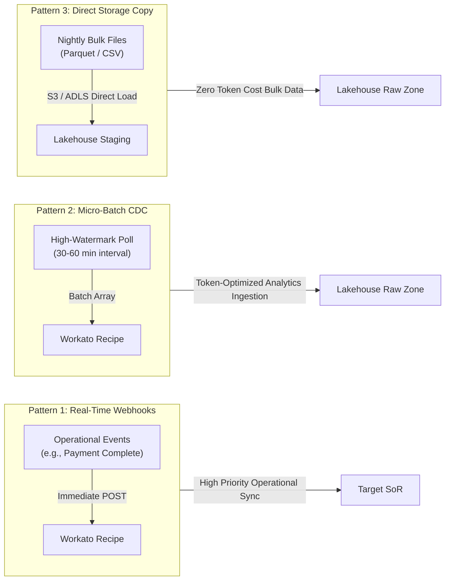

# BSAVA Architecture: Systems of Record (SoR) & Selection Justifications

| Document Metadata | Details |
| :--- | :--- |
| **Client** | British Small Animal Veterinary Association (BSAVA) |
| **Author** | Timberyard Architecture & Advisory Team |
| **Version** | v1.0.0 |
| **Date** | August 2026 |
| **Status** | Approved Reference Document |
| **Target Architecture** | Headless Composable MACH (Microservices, API-first, Cloud-native, Headless) |

---

## Executive Summary

As part of the Digital Transformation Programme (PR2742), the British Small Animal Veterinary Association (BSAVA) is transitioning from legacy monolithic software (including legacy Salesforce Fonteva customisations and fragmented spreadsheets) to a modern, composable **MACH** architecture. 

In a composable ecosystem, no single application acts as an all-encompassing database. Instead, specialized best-of-breed platforms own specific data domains. To maintain data integrity, security, regulatory compliance (UK GDPR), and high performance at the edge, BSAVA strictly enforces the **Single Source of Truth (SoR)** principle:

> **The Single Source of Truth Rule:** *Every business record type and data entity must have exactly one authoritative operational system of record. Downstream platforms may consume, cache, or analyze this data, but they must never act as dual masters.*

This document details every record type across BSAVA's business domains, identifies its designated System of Record, provides the technical and operational justifications for the selection, and illustrates system interactions with explanatory diagrams.

---

## 1. System of Record Topology & High-Level Architecture

```mermaid
flowchart TB
    subgraph Presentation ["Presentation Layer"]
        NextJS["Next.js Web Frontend (CDN Edge)"]
    end

    subgraph CIAM_Layer ["Identity Layer"]
        CIAM["Okta / Auth0 or Entra ID (CIAM)<br/><i>User Identity & JWT Claims</i>"]
    end

    subgraph Operational_SoRs ["Operational Systems of Record (SoRs)"]
        Salesforce["Salesforce CRM (NPC)<br/><i>Contact Master & CRM History</i>"]
        PIMcore["PIMcore (PIM / DAM)<br/><i>Product Catalog & Entitlements</i>"]
        Contentful["Contentful (CMS)<br/><i>Editorial Content & Copy</i>"]
        CommerceLayer["Commerce Layer (OMS)<br/><i>Carts, Orders & Subscriptions</i>"]
        Stripe["Stripe Payments<br/><i>Payment Tokens & Gateway Logs</i>"]
        Swoogo["Swoogo Events<br/><i>Event Schedules & Registrations</i>"]
        Brightspace["Brightspace (D2L LMS)<br/><i>Courses, CPD & Progress</i>"]
        ERP["Accounting ERP<br/><i>Financial Ledger & Invoices</i>"]
    end

    subgraph Operational_Cache ["Operational Cache Layer"]
        Algolia["Algolia Search<br/><i>Read-Only Search Index Cache</i>"]
    end

    subgraph Orchestration_Layer ["Integration & Data Pipeline"]
        Workato["Workato IPaaS<br/><i>Event Webhooks & Micro-Batching</i>"]
    end

    subgraph Analytical_Layer ["Analytical Layer"]
        Lakehouse["Central Data Lakehouse<br/><i>Enterprise Member 360 & BI</i>"]
    end

    NextJS --> CIAM
    NextJS --> Algolia
    NextJS --> CommerceLayer
    NextJS --> Stripe
    
    Workato <--> Operational_SoRs
    Workato --> Algolia
    Workato --> Lakehouse

    classDef identity fill:#00A1E0,stroke:#333,stroke-width:2px,color:#fff;
    classDef sor fill:#635BFF,stroke:#333,stroke-width:2px,color:#fff;
    classDef cache fill:#5468FF,stroke:#333,stroke-width:2px,color:#fff;
    classDef lakehouse fill:#2C3E50,stroke:#333,stroke-width:2px,color:#fff;
    
    class CIAM identity;
    class Salesforce,PIMcore,Contentful,CommerceLayer,Stripe,Swoogo,Brightspace,ERP sor;
    class Algolia cache;
    class Lakehouse lakehouse;
```

---

## 2. Master Record Type & System of Record Ownership Matrix

The following table provides the definitive domain ownership matrix across all BSAVA record types:

| # | Record Type / Data Domain | System of Record (SoR) | Primary Key / Identifier | Key Attributes Owned | Downstream Consuming Systems |
| :--- | :--- | :--- | :--- | :--- | :--- |
| **1** | **Person / Contact Master** | **Salesforce CRM (NPC)** | `Contact ID` (`003...`) | Demographics, Contact Details, Committee Roles, CRM Interaction History, Engagement Transcripts | CIAM (Okta/Entra), Commerce Layer, Swoogo, Brightspace, Data Lakehouse |
| **2** | **Credentialed User Identity** | **Okta / Auth0 or Entra ID (CIAM)** | `User UID` (`usr_...`) | Password Hashes, MFA Tokens, SSO Sessions, Edge JWT Claims, Security Audit Logs | Next.js Frontend, Brightspace (SSO), Swoogo (SSO), Workato |
| **3** | **Product Catalog & Entitlements** | **PIMcore (PIM / DAM)** | `SKU` / `Product ID` | Book Catalog, Membership SKUs, Digital Assets, Entitlement Definitions & Access Rules, Pricing Tiers, Inventory Limits | Next.js Frontend, Algolia, Commerce Layer, Salesforce, Workato |
| **4** | **Editorial & CMS Content** | **Contentful (CMS)** | `Content Entry ID` | News Articles, Clinical Guidelines Copy, Landing Pages, Editorial Metadata, Navigation Trees | Next.js Frontend, Algolia |
| **5** | **Carts, Orders & Subscriptions** | **Commerce Layer (OMS)** | `Order ID` (`ord_...`) / `Sub ID` | Active Cart State, Membership Tiers & Subscription States, Order Line Items, Discounts, Delivery Status, Order History | Salesforce, Stripe, PIMcore, Workato, Accounting ERP, Data Lakehouse |
| **6** | **Payment Gateway Data** | **Stripe** | `PaymentIntent ID` (`pi_...`) | Credit Card Tokens, Payment Intents, Charges, Refunds, Gateway Payout Logs, 3DS Verification | Commerce Layer, Accounting ERP, Data Lakehouse |
| **7** | **Events & Conferences** | **Swoogo** | `Attendee ID` / `Event ID` | Event Schedules, Ticket Allocations, Delegate Rosters, Speaker Profiles, Attendee Check-ins | PIMcore (via Workato), Salesforce, Data Lakehouse |
| **8** | **Learning Management & CPD** | **Brightspace (D2L LMS)** | `Student ID` / `Course ID` | Course Catalog, Module Enrolments, Progress %, Quiz Scores, Earned CPD Credit Hours | PIMcore (via Workato), Salesforce, Algolia, Data Lakehouse |
| **9** | **Financial Ledger & Invoices** | **Accounting (ERP)** | `Invoice ID` / `Journal ID` | General Ledger, Chart of Accounts, Statutory Tax Invoices, Tax Compliance (VAT), Payout Reconciliation | Data Lakehouse, Executive Reporting |
| **10** | **Search Operational Cache** | **Algolia** *(Operational Cache)* | `ObjectID` | Search Indexes, Facets, Filter Attributes, Ranking Rules *(Cache only)* | Next.js Frontend |
| **11** | **Enterprise Historical Analytics** | **Central Data Lakehouse** | Unified `Member_360_ID` | Historical Member Telemetry, Cross-Domain BI, Trend Analysis, Executive KPIs | Power BI / Tableau, Executive Dashboards |

---

## 3. Detailed Architectural Justification by Record Type

### 3.1 Person / Contact Master
* **System of Record**: **Salesforce CRM (Nonprofit Cloud / NPC)**
* **Primary Identifier**: `Contact ID` (`003...`)
* **Key Attributes**: Demographic details, postal/email addresses, committee memberships, volunteer roles, legacy transaction history, engagement timeline.
* **Architectural Justification**:
  1. **Core Constituent Management**: Salesforce NPC provides an out-of-the-box non-profit schema designed specifically for contact relationships, committee structures, and constituent lifecycles.
  2. **Decoupled Identity**: Decoupling contact management from authentication (CIAM) prevents CRM governor limits and API costs from impacting frontend page rendering speeds.
  3. **360-Degree Operational View**: Serves as the administrative home for internal BSAVA membership staff while leaving transactional e-commerce state to Commerce Layer and web login state to CIAM.

---

### 3.2 Credentialed User Identity & Sessions
* **System of Record**: **Okta / Auth0 or Microsoft Entra External ID (CIAM)**
* **Primary Identifier**: `User UID` (`usr_...`)
* **Key Attributes**: Hashed credentials (BCrypt/Argon2), MFA registration, OAuth tokens, active session states, edge JWT claims.
* **Architectural Justification**:
  1. **Edge-Native Authentication**: High-performance JSON Web Token (JWT) issuance with short lifespans (15 minutes) enables Next.js Edge Middleware to validate requests in under 5ms without database hops.
  2. **Security & GDPR Isolation**: Storing password hashes and authentication credentials in a specialized CIAM platform shields internal databases and CRM objects from sensitive security attack vectors.
  3. **Dynamic Entitlement Claims**: CIAM pipeline rules (e.g., Auth0 Actions or Entra Extensions) fetch the user's active membership tier from Salesforce/Commerce Layer upon login and embed it directly into the signed JWT token. Downstream services read this token to unlock gated clinical content without making repeated queries to Salesforce.

---

### 3.3 Product Catalog, Digital Assets & Entitlements
* **System of Record**: **PIMcore (PIM / DAM)**
* **Primary Identifier**: `SKU` / `Product ID`
* **Key Attributes**: Publication metadata (ISBN, edition, authors), membership package definitions, **Entitlement Definitions & Access Rules** (which digital publications or gated resources each tier/product unlocks), digital media assets (PDFs, images), tiered pricing structures.
* **Architectural Justification**:
  1. **Elimination of Distributed Spreadsheets**: Replaces legacy, error-prone Excel files ("Final_Prices_v3.xlsx") with a centralized, schema-enforced product engine.
  2. **Heterogeneous Catalog Support**: BSAVA sells diverse product types (physical books, digital manuals, subscriptions, event tickets, online courses). PIMcore’s class-based object hierarchy handles complex taxonomy and multi-tier member/non-member pricing logic natively.
  3. **Centralized Entitlement Governance**: Entitlement rules belong in the product master where access criteria are defined once and syndicated to Commerce Layer, Contentful, and Algolia, avoiding fragmented access logic across frontend code or CMS models.

---

### 3.4 Editorial Copy & Marketing Content
* **System of Record**: **Contentful (CMS)**
* **Primary Identifier**: `Content Entry ID`
* **Key Attributes**: Clinical articles, news posts, editorial copy, banner media, structured page layouts, site header/footer models.
* **Architectural Justification**:
  1. **Storytelling vs. Commerce Separation**: Contentful is purpose-built for non-technical editors to manage unstructured and semi-structured marketing content ("Who, What, and Why"). 
  2. **API-First Performance**: Delivered via Contentful's Content Delivery API (CDA) with global CDN edge caching, enabling Next.js Static Site Generation (SSG) and Incremental Static Regeneration (ISR).
  3. **Non-Transactional Integrity**: Restricting Contentful to editorial copy prevents editors from breaking transaction flows, pricing rules, or entitlement definitions.

---

### 3.5 Carts, Orders & Subscription States
* **System of Record**: **Commerce Layer (OMS)**
* **Primary Identifier**: `Order ID` (`ord_...`) / `Subscription ID` (`sub_...`)
* **Key Attributes**: Active cart line items, checkout session states, active membership subscription tiers, discount codes, shipping addresses, fulfillment status.
* **Architectural Justification**:
  1. **High-Concurrency Transaction Engine**: Commerce Layer provides sub-second API responses for cart updates, promotion code evaluations, and multi-currency tax calculations.
  2. **CRM Protection**: Handling shopping carts in Commerce Layer protects Salesforce from millions of ephemeral cart creation and abandonment records, avoiding database bloat and API quota exhaustion.
  3. **Event-Driven Fulfillment**: Emits structured webhooks (`order.placed`, `subscription.updated`) to Workato to trigger downstream workflows (Salesforce order creation, Swoogo registration confirmation, Brightspace course enrolment).

---

### 3.6 Payment Gateway Tokens & Charges
* **System of Record**: **Stripe**
* **Primary Identifier**: `PaymentIntent ID` (`pi_...`), `Charge ID` (`ch_...`)
* **Key Attributes**: Credit card tokens, 3D Secure verification status, payment intent states, refund logs, gateway payout reconciliation logs.
* **Architectural Justification**:
  1. **Zero-PCI Compliance Scope**: Cardholder Primary Account Numbers (PANs) and CVVs never touch BSAVA servers, passing directly from browser client SDKs to Stripe.
  2. **Robust Webhook Ecosystem**: Stripe provides reliable webhooks for instant order confirmation and automated subscription billing retries.
  3. **Gateway Settlement Reconciliation**: Detailed transaction metadata allows daily automated financial balancing against Commerce Layer orders and Accounting ERP journals.

---

### 3.7 Events, Conferences & Delegate Registrations
* **System of Record**: **Swoogo**
* **Primary Identifier**: `Attendee ID` / `Event ID`
* **Key Attributes**: Event session schedules, venue details, speaker profiles, ticket capacity limits, delegate registration rosters, attendance timestamps.
* **Architectural Justification**:
  1. **Specialized Event Operations**: Manages complex veterinary congresses, workshop seat limits, and badge printing requirements that cannot be handled by standard e-commerce or CRM platforms.
  2. **Bi-Directional Workato Sync**: Workato automatically syncs Minimal Viable Event (MVE) product records from Swoogo into PIMcore for public sale, and returns completed attendance records to Salesforce for member history.

---

### 3.8 Learning Courses, CPD Accreditations & Progress
* **System of Record**: **Brightspace (D2L LMS)**
* **Primary Identifier**: `Student ID` / `Course ID`
* **Key Attributes**: Course modules, SCORM/LTI content, user progress %, quiz scores, earned CPD credit hours, completion certificates.
* **Architectural Justification**:
  1. **Veterinary Accreditation Standard**: Purpose-built LMS handling interactive veterinary e-learning, prerequisites, and mandatory Continuing Professional Development (CPD) credit rules.
  2. **Operational Decoupling**: Progress tracking and quiz evaluation occur inside Brightspace. Only completed CPD credits and certificates are pushed to Salesforce via Workato for member transcripts.

---

### 3.9 Financial Ledger & Tax Invoices
* **System of Record**: **Accounting ERP (e.g. Microsoft Dynamics 365 Business Central / Sage)**
* **Primary Identifier**: `Invoice ID` / `Journal ID`
* **Key Attributes**: Chart of accounts, general ledger entries, formal tax invoices, VAT returns, financial period closing balances.
* **Architectural Justification**:
  1. **Statutory Financial Governance**: Implements immutable double-entry bookkeeping and compliance with UK financial and tax regulations.
  2. **Separation from E-Commerce**: Keeps operational shopping cart changes separated from accounting ledgers until formal order completion.

---

### 3.10 Search Operational Index (Operational Cache)
* **System of Record**: **Algolia** *(Operational Read Cache — Not a persistent SoR)*
* **Primary Identifier**: `ObjectID`
* **Key Attributes**: Inverted search indices, searchable attributes, custom ranking rules, typo tolerance, faceted filtering arrays.
* **Architectural Justification**:
  1. **Sub-50ms Global Search**: Delivers instant search-as-you-type UX across products, articles, guidelines, and courses.
  2. **Cache Topology**: Algolia contains no unique data; it is an operational cache continuously updated via Workato webhooks from PIMcore, Contentful, and Brightspace.

---

### 3.11 Enterprise Historical Analytics & BI
* **System of Record**: **Central Data Lakehouse (Snowflake / Microsoft Fabric / Databricks)**
* **Primary Identifier**: Unified `Member_360_ID`
* **Key Attributes**: Multi-year transactional history, website clickstreams, course progress telemetry, cross-domain Member 360 data, executive BI metrics.
* **Architectural Justification**:
  1. **Avoidance of CRM Storage & API Limits**: Storing high-frequency logs in Salesforce causes exorbitant storage fees and governor limit breaches. The Lakehouse ingests raw JSON/CSV data efficiently via Workato batching.
  2. **UK GDPR Compliance**: Enforces Silver/Gold zone field-level masking (e.g. hashing DOBs, masking email addresses) to allow cross-system analytical queries while strictly protecting PII.

---

## 4. Integration & Data Orchestration Strategy (Workato)

Workato acts as the central **Integration Platform as a Service (IPaaS)** connecting the SoRs.

### Token Governance & Processing Patterns
To adhere to BSAVA's commercial quota of **1,000,000 Workato tasks/year**, integrations are strictly governed by three execution patterns:

1. **Real-Time Operational Webhooks**: Reserved exclusively for critical user-facing transactions (e.g. payment confirmations, instant CRM profile updates).
2. **Scheduled Micro-Batching (Hourly CDC)**: Used for analytical data ingestion into the Lakehouse. Collects all modified records in 60-minute arrays (processing up to thousands of records in 1 Workato task).
3. **Daily Direct Storage Staging**: Large datasets (> 10,000 records) bypass row-by-row processing, pushing bulk Parquet/CSV files directly into cloud storage (S3/ADLS/OneLake) for native Lakehouse loading.

---

## 5. Summary Matrix & Governance Checklist

To maintain architectural integrity post-launch, the IT Steering Committee must enforce the following compliance checklist:

- [x] **Single Operational Master**: No record type has more than one operational SoR.
- [x] **No Direct Frontend DB Writing**: The Next.js frontend calls dedicated API endpoints or Commerce Layer/CIAM SDKs—never direct database connections.
- [x] **Edge Security**: Sensitive authentication credentials reside in CIAM; passwords/tokens are never passed to CRM or analytics layers.
- [x] **UK GDPR Data Residency**: All operational SoRs and Lakehouse clusters are pinned to **UK South (Azure)** or **AWS London (`eu-west-2`)** regions.
- [x] **Workato Token Budgeting**: Batch array processing and direct storage staging are enforced to stay under 1,000,000 tasks/year.
